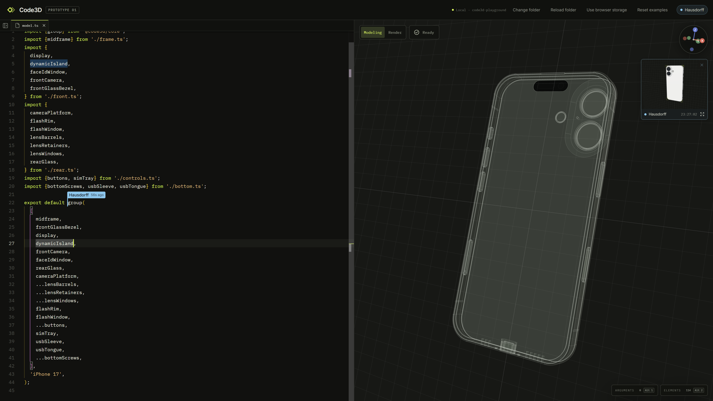

# Code3D

The expressive power of code, with the immediacy of direct manipulation.

[Open App](https://www.code3d.org/app/) · [Website](https://www.code3d.org/) ·
[Documentation](https://www.code3d.org/docs/) · [Modeling agent instructions](docs/agents.md)

Code3D is a solid modeler where TypeScript and the viewport form one continuous
interface. Use code to define precise, reusable models, and interact directly
with the geometry whenever space is easier to work with visually.

The viewport is more than a preview: it understands source expressions,
runtime objects, and model topology. Interactive changes return as readable
TypeScript, so the model never splits into code and hidden UI state.



## Code and geometry, connected

- Build with ordinary TypeScript: parameters, functions, control flow, and
  modules.
- Move through source to inspect the exact object produced by each expression.
- Select topology, position parts, and adjust parameters directly in the
  viewport.
- Keep every durable change in source, ready to read, diff, test, and reuse.
- Install browser-compatible npm packages in browser storage, or work in your own local project folder.
- Export the model you are inspecting as STEP, STL, or 3MF.

Code3D evaluates precise B-Rep geometry with OpenCascade and exposes typed
points, edges, faces, bounds, and frames for reusable model APIs. Hollow solids
with [uniform walls and selected openings](https://www.code3d.org/docs/guides/shells/),
position parts with [directional bounds and explicit rotations](https://www.code3d.org/docs/guides/relations/),
and follow [topology source paths](https://www.code3d.org/docs/guides/topology/)
through derived geometry.

Each model has [local coordinates](https://www.code3d.org/docs/concepts/local-coordinates/).
Choose a shared origin to assemble parts directly with `group`, rotate around
local zero, or use relations for geometry-based placement. The [origin and rotation guide](https://www.code3d.org/docs/guides/origins-and-rotation/)
shows each step with the same editable source used by the App.

## Example

```ts
import {box, cylinder, group} from '@code3d/core';

const baseHeight = 4;
const postHeight = 14;

// Share an origin on the contact plane: the base below, the post above.
const base = box(36, baseHeight, 24)
  .fillet(1)
  .originOffset(0, baseHeight / 2, 0);
const post = cylinder(4, postHeight).originOffset(10, -postHeight / 2, 0);

export const model = group([base, post]);
```

`originOffset()` subtracts its offset from the geometry's coordinates. Here the
base's top and the post's bottom share Y = 0, with the post at X = −10. `group`
assembles them at their common origin. Place the cursor on `base`, `post`, or
`originOffset` to inspect and adjust that context; Code3D writes interactive
changes back to the same source.

## Run locally

To run the App on your machine, use Node.js 24 and npm:

```bash
git clone https://github.com/vilicvane/code3d.git
cd code3d
npm install
npm run dev
```

Open [localhost:3133](http://localhost:3133) in your browser.

For repository development, see the [development guide](./.agents/docs/development.md)
and [architecture documentation](./.agents/docs/README.md).

## Project status

Code3D is currently Prototype 01. APIs and project behavior are still evolving.
See the [current capabilities and limitations](https://www.code3d.org/docs/reference/limitations/)
before depending on it for an existing workflow.

## License

Code3D uses the [Interim Community License](./LICENSE). Community use and
ordinary commercial design are permitted; competing commercial software or
services require written permission. Third-party components retain their own
licenses.
