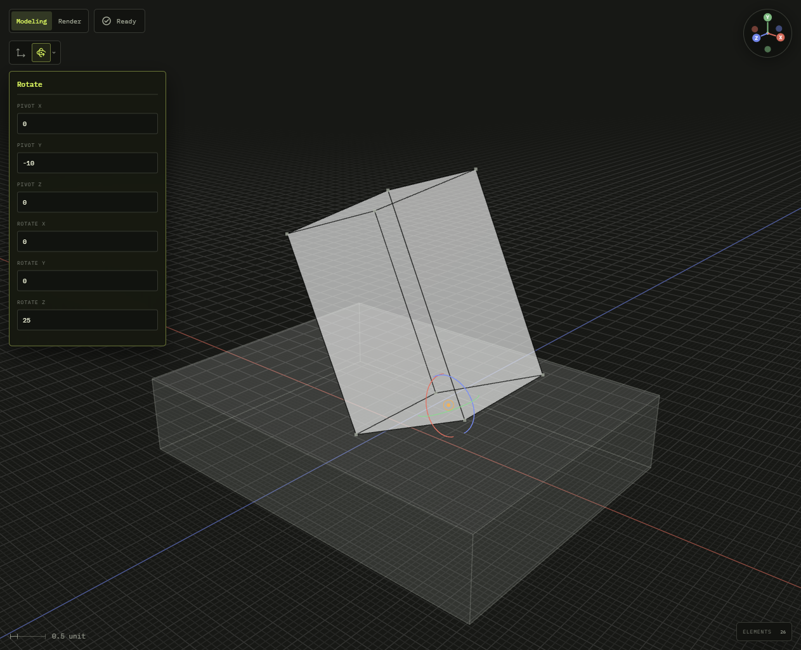

# @code3d/core

The TypeScript modeling runtime used by Code3D. Compose solids, profiles, curves,
points, and editable sketches; inspect their geometry and reuse the same models
in the App or a supported Node.js runtime.

## Installation

```sh
npm install @code3d/core
```

The App includes Core in its built-in modeling runtime. If a project declares
its own `@code3d/core`, the App uses that project's installed packages
and declarations instead. See [project package installation](../web/src/content/docs/docs/getting-started/files.md#install-packages-in-browser-storage).

## Example

Place a part on a base, offset it, and rotate it around a chosen pivot.

```ts
import {on, box, group, offset, pivot} from '@code3d/core';

const base = box(40, 8, 30);
const part = box(14, 20, 12).relate(() => [
  on(base.up), // Touch the base.
  offset(6, 0, 0),
  pivot([0, -10, 0]).rotate(0, 0, 25),
]);

export default group([base, part]);
```



The part is rotated 25° around Z. In the App, select `rotate(0, 0, 25)` to show
the rotation gizmo and parameter panel. Drag a ring or edit an angle to update
the code.

Complete example: [part placement and rotation](../app/examples/constraints/relate.ts).

## Usage notes

- Dimensions are in millimetres and angles are in degrees.
- Declare numeric form parameters with `input('Width', 40)`, or add `{min, max, step}` as a third argument for bounded controls and sliders. See [numeric inputs](docs/runtime.md#numeric-inputs).
- Models have local coordinate frames. Constructors choose the initial origin;
  derived operations inherit their main input frame. See [local coordinates](docs/local-coordinates.md).
- Use `frame()` for an independent coordinate reference and `group(parts, {frame: base, name: 'Assembly'})` to choose the assembly's coordinates. The frame adds no geometry. See [independent frames](docs/api.md#independent-coordinate-frames).
- Modeling operations return new values. Measurements such as `.length`, `.area`
  and `.volume` return numbers; select an expression in the App to inspect it.
- Node loads the modeling kernel automatically. Model authors do not initialize
  it or manage evaluation caches. See [runtime integration](docs/runtime.md).

## Documentation

- [Modeling API by task](docs/api.md#browse-by-task): primitives, operations, placement, materials and measurements.
- [Solid primitives](docs/api.md#solid-primitives): individual references for box, cylinder, sphere, ellipsoid, frustum, regularPrism, tube and coil.
- [Points, curves and profiles](docs/api.md#profiles-and-curves): point, line, arc, bezier, spline and four filled planar profile constructors.
- [Shape construction](docs/api/extrude.md): extrude, revolve, sweep, loft, wrap and thicken profiles.
- [Booleans and solid modifications](docs/api/union.md): union, cut, intersect, fillet, chamfer and shell.
- [Origins and local transforms](docs/api/origin-offset.md): choose local zero, rotate and scale geometry.
- [Groups and placement](docs/api/group.md): groups, exposed references, relations, transforms and rotation coupling.
- [Complete API export index](docs/api/exports.md): all public functions, types, members and integration entries.
- [Model types and capabilities](docs/api/model-types.md): model aliases, generics and supported members.
- [Independent frames](docs/api/frame.md): non-geometric assembly coordinate references.
- [Model metadata](docs/api/model-data.md): symbol-keyed snapshots for package-specific data.
- [Model values](docs/values.md): immutable values and geometry measurements.
- [Geometry measurements](docs/api/distance.md): clearance, length, area, volume, bounds and model-origin position.
- [Sketch API](docs/api/sketch.md): entity and constraint tuples, derived layers, finite regions and spatial placement.
- [Text and fonts](docs/api/text.md): text faces, local font files and Google Font selections.
- [Parameters, time and caching](docs/api/input.md): numeric inputs, playback offsets and reusable computations.
- [Materials and appearance](docs/api/material.md): captured colors, native materials, textures and Three.js integration.
- [Local coordinates](docs/local-coordinates.md): frames, origins and placement conventions.
- [Relations](docs/relations.mdx): position parts using bounds, geometry and frames.
- [Rotation coupling](docs/api.md#rotation-coupling): transmit cumulative angles through fixed-axis connections.
- [Origins and rotation](docs/origins-and-rotation.mdx): choose a pivot and adjust a part.
- [Shells](docs/shells.mdx): hollow solids and choose openings.
- [Topology references](docs/api/vertex.md): select vertices, edges and surfaces; [reference elements](docs/api/reference-elements.md) and [directional bounds](docs/api/directional-bounds.md) define placement interfaces.
- [Topology workflow](docs/topology.md): visual selection and stable IDs across modeling operations.
- [Editable sketches](docs/sketches.md): draw and constrain planar geometry, with construction curves for reference.
- [Text and fonts](docs/text.md): build planar or curved lettering.
- [Curved surface wrapping](docs/api.md#curved-surface-wrapping): wrap profiles and thicken along surface normals.
- [Reusable models](../web/src/content/docs/docs/guides/reusable-models.mdx): compose model functions.
- [Model tools](../web/src/content/docs/docs/guides/model-tools.mdx): add editing tools and argument presets.
- [Extension API](docs/api/define-primitive.md): native builders, package metadata, custom inspectors and annotations.
- [Custom primitives](docs/custom-primitives.mdx): extend modeling with Replicad geometry.
- [Tooling API](docs/api/tooling.md): host evaluation, resources, snapshots, caches, topology and inspection.
- [Runtime integration](docs/runtime.md): numeric inputs, time offsets, resources, materials and source inspection.
- [Current limitations](../web/src/content/docs/docs/getting-started/limitations.md): supported workflows and known boundaries.

## Source and development

- [Public API](src/library/index.ts): exported constructors and model interfaces.
- [Runtime tests](test/): geometry, value semantics and integration coverage.
- [Runtime development](docs/runtime.md#source-and-development): kernel integration and resource ownership.
- [Development guide](../../.agents/docs/development.md): repository setup and test commands.
