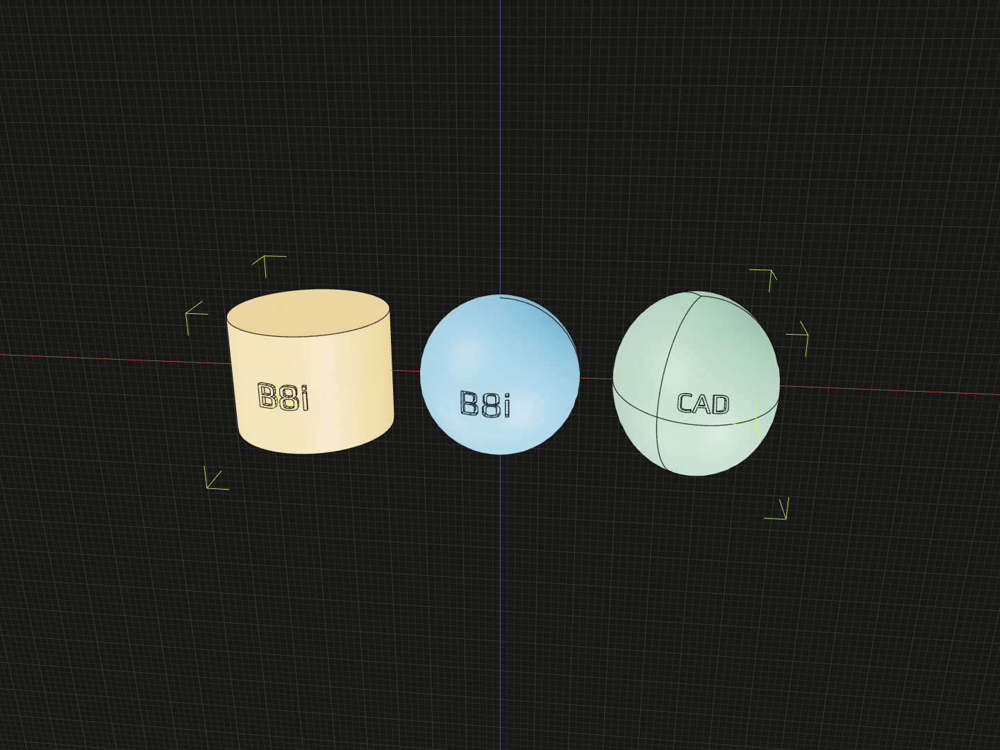

Construct geometry, combine models and query the result with the public Core
API. For a first runnable model, see the [Core example](../README.md#example).

Import these functions from `@code3d/core`. The editor's TypeScript signatures
provide exact overloads and inferred model interfaces.

Types used by the authoring API are also exported, including generic constraints,
named-element result types, and capability interfaces. Use `import type` from
`@code3d/core` for types such as `ElementKind`, `ModelKind`, `ModelForKind`, `TopologyKind`,
`NamedElements`, `ExposedElements`, `Bound`, and `TopologyId`. Replicad builder types such as `Shape3D`
are available from `@code3d/core/replicad` alongside `definePrimitive`.

Use `input('Width', 40, {min: 4, max: 100, step: 1})` for a
[numeric form parameter with a slider](runtime.md#numeric-inputs); the options
argument is optional.
It returns a number that can drive ordinary model code.

For time-dependent assembly motion, read `timeOffset()` and derive angles
or offsets with ordinary TypeScript. See [time offset](runtime.md#time-offset)
for playback and evaluation semantics.

## Solid primitives

| Function                                     | Meaning                           |
| -------------------------------------------- | --------------------------------- |
| `box(x, y, z)`                               | Box dimensions along X, Y, and Z  |
| `cylinder(radius, y)`                        | Cylinder with its axis along Y    |
| `sphere(radius)`                             | Sphere of the given radius        |
| `ellipsoid(xRadius, yRadius, zRadius)`       | Ellipsoid with three axis radii   |
| `frustum(bottomRadius, topRadius, y)`        | Truncated cone                    |
| `regularPrism(radius, y, sides, rotation?)`  | Regular polygonal prism           |
| `tube(outerRadius, innerRadius, y)`          | Straight tube with a through bore |
| `coil(coilRadius, wireRadius, pitch, turns)` | Circular-wire coil along Y        |

Ellipsoids are centered at the local origin. The three positive, finite radii
follow local X, Y and Z; `ellipsoid(7, 4, 5)` spans 14 × 8 × 10 units. Select a
radius in the editor and press Tab to edit it. Like other primitives, incomplete
calls have runtime editing defaults (5, 3 and 4); TypeScript requires all three.
See the [primitive example](../../app/examples/primitives/primitives.ts) or use
an ellipsoid as a target in the [wrapping example](../../app/examples/operations/wrap.ts).

Tubes are centered on Y; the inner radius must be smaller than the outer
radius. For coils, `coilRadius` is measured to the wire centerline and
`pitch` is the advance per turn. Fractional turns are supported; the wire
must fit inside the coil radius and neighboring turns must remain separated.
Use [`@code3d/screws`](../../screws/docs/assembly.mdx) for standard fasteners and matching hole tools.
Use [`@code3d/gears`](../../gears/README.md) for nominal spur, helical and internal gear parts.

To build a solid beyond these primitives, import `definePrimitive` and
`replicad` from `@code3d/core/replicad`. See
[custom primitives](custom-primitives.mdx) for a complete example.

## Profiles and curves

Planar profiles lie in the local XZ plane with a +Y normal.

| Function                                   | Meaning                                                                   |
| ------------------------------------------ | ------------------------------------------------------------------------- |
| `circle(radius)`                           | Circular face                                                             |
| `ellipse(xRadius, zRadius)`                | Elliptical face                                                           |
| `rectangle(x, z)`                          | Rectangular face                                                          |
| `regularPolygon(radius, sides, rotation?)` | Regular polygonal face                                                    |
| `point()` or `point([x, y, z])`            | Vertex model                                                              |
| `line([x, y, z])` or `line(start, end)`    | Straight edge                                                             |
| `arc(start, middle, end)`                  | Arc through three points                                                  |
| `bezier(points)`                           | Bézier curve                                                              |
| `spline(points)`                           | Interpolating spline                                                      |
| `loft(sections, options?)`                 | Solid through sections; optional curve spine                              |
| `extrude(faceOrFaces, distance)`           | Solid extruded along one face's local normal                              |
| `revolve(profile, axis, config)`           | Solid rotated about a straight directed axis, with optional axial advance |
| `sweep(profile, spine)`                    | Solid formed by carrying one face along an open curve                     |
| `wrap(profiles, target, options?)`         | Curved faces mapped from one planar layout onto a finite surface          |
| `thicken(faceOrFaces, thickness)`          | Solids offset along oriented surface normals                              |

See [local coordinates and placement](local-coordinates.md) for
the coordinate frame of a model, reference, or composition.

Position coordinates use arrays; dimensions, offsets and angles use scalar
arguments. `point([x, y, z])` equals `point().originOffset(-x, -y, -z)`.
`line([x, y, z])` starts at zero; the two-array form uses both supplied local
endpoints. Curve tangents do not redefine the model's XYZ axes.

Profiles and curves are model values that can be inspected and related to
other models.

Face models also support `face.extrude(distance)`. Both forms accept a finite,
non-zero signed distance and preserve the starting face's coordinates. For an
unrotated profile, positive distance extends along +Y; negative distance extends
along −Y. Rotating the face rotates its extrusion direction; changing its origin
does not recenter the result. The returned solid supports Boolean operations,
fillets, chamfers, and shells. `extrude(faces, distance)` accepts a readonly array
of profiles and returns a readonly array of solids in the same order, preserving
each face's placement. An empty input returns `[]`; a single face still returns
a single solid. Both overloads retain required TypeScript distances and use the
same runtime default of 10 while editing.

```ts
import {circle, extrude, rectangle} from '@code3d/core';

export const plate = rectangle(30, 20).extrude(3).fillet(0.5);
export const pin = extrude(circle(2), -10);
```

### Rotational solids

`revolve(profile, axis, config: RevolveConfig)` and
`profile.revolve(axis, config)` rotate one face about a straight directed axis.
`line(...)` can be passed directly; an existing straight edge or axis reference
also works.
`config.angle` is a required finite, non-zero angle in degrees. `config.advance`
is the signed total distance traveled along the directed axis during that angle;
it defaults to zero. A positive angle follows the axis's right-hand direction.
Reversing the axis reverses both the rotation sense and the direction of a positive
advance. With zero advance, the angle may cover at most one turn. With non-zero
advance, it may cover multiple turns to form a simple screw-motion solid.

```ts
import {circle, line, rectangle, revolve} from '@code3d/core';

const axis = line([0, -20, 0], [0, 20, 0]);
const ringSection = rectangle(4, 6).rotate(90, 0, 0).originOffset(-8, 0, 0);
export const ring = revolve(ringSection, axis, {angle: 360});

const wireSection = circle(1).rotate(90, 0, 0).originOffset(-8, 0, 0);
export const spring = wireSection.revolve(axis, {angle: 5 * 360, advance: 25});
```

The authoring signature requires `config`. While editing an incomplete call,
the App uses 360 degrees and zero advance so its parameter tool can add the
config object.

The result keeps the profile's local frame and is an ordinary `SolidModel`.
The axis participates in the same relation solve as the profile; its own model
placement is respected. A helical profile must have one outer boundary without
holes. Intersecting turns and profiles that cross the axis may fail to produce a
valid solid; leave clearance between turns and keep the profile off the axis.
For a multi-turn coil with round wire and automatic pitch clearance checks,
[`coil`](#solid-primitives) remains the shorter constructor.

### Path sweeps

`sweep(profile, spine)` and `profile.sweep(spine)` carry one planar face along a
continuous open `EdgeModel`, such as a line or Bézier curve. The face's local
origin must meet the path's start, and its normal must point along the starting
tangent. The operation respects the solved placement of both inputs and returns
a solid in the profile's local frame; it does not move or rotate the supplied
profile to fit the path.

```ts
import {bezier, circle, sweep} from '@code3d/core';

const profile = circle(2);
const spine = bezier([
  [0, 0, 0],
  [0, 8, 0],
  [5, 16, 0],
  [5, 24, 0],
]);
export const bentRod = sweep(profile, spine);
```

The path must be open with a non-zero starting tangent. The output is an ordinary
`SolidModel` that supports subsequent Boolean and finishing operations. Very
tight bends or self-intersections may prevent the kernel from producing a valid
solid. One through hole in the profile is supported; profiles with multiple
holes currently need explicit contour correspondence. Use the
[App example](../../app/examples/operations/sweep.ts) to inspect
the profile, path and result.

### Curved surface wrapping

`wrap(profiles, target, options?)` maps a planar face or a coplanar face array
onto one finite `Surface` (or face model). It returns a face array because a
periodic seam can split a profile. `thicken(faceOrFaces, thickness)` and
`face.thicken(thickness)` then create solids along the surface normals.

```ts
import {
  googleFont,
  originCenter,
  sphere,
  text,
  thicken,
  cut,
  wrap,
} from '@code3d/core';

const ball = sphere(20);
const profiles = originCenter(text('Code3D', await googleFont('Play'), 9)).map(
  face => face.originOffset(0, -26, 0),
);
const lettering = wrap(profiles, ball.surface(1));
export default cut(ball, thicken(lettering, -1));
```



[Open the complete cylinder, sphere and freeform example](../../app/examples/operations/wrap.ts).

Use `originCenter(profiles)` to center the whole layout. Position its plane
outside the target using origin, rotation and relation operations.
The profiles' **shared planar bounding rectangle** chooses the target
region; it includes glyph holes and the blank space between glyphs. Target
geometry outside the rectangle's normal projection does not participate in
localization or crossing checks. The closest target point corresponds to its
normal projection back onto the source plane. Source directions are carried to
the tangent plane by the smallest rotation, then distances from this anchor
follow surface geodesics. Surface UV coordinates do not determine text size.

All profiles share this mapping. Cylinder wrapping preserves developed lengths;
a sphere or other surface with double curvature generally distorts distances
between other points and changes area. This is a local mapping, not a promise
of distortion-free wrapping around an entire surface.

- Multiple closest points are accepted when their local maps agree within
  tolerance, including a cylinder's tangent generator. Distinct maps raise an
  error; competing anchors are not averaged.
- The finite source region may touch the target. A region spanning both sides
  of it raises a crossing error. Move or rotate the profiles outside the target.
- The complete mapped rectangle must fit the selected trimmed face, including
  its holes. Crossing to another topological face is not supported in this
  version. Periodic seams within the selected face are supported.
- Smooth analytic and B-spline surfaces are supported. Singular parameterizations,
  a perpendicular source plane, folds, a full periodic overlap, or a failed boundary fit raise errors. Reduce
  the region or reposition it when a regular local mapping cannot be found.
- `options.tolerance` is a positive length in model units (default `0.001`), used
  for numerical mapping, adaptive layout checks and boundary fitting. Checks
  refine where interpolation error or spline knot spans need more detail;
  nonconvergence or an exhausted validation budget raises an error.
- Wrap results are true curved faces and have no named `plane` reference.
  Extrusion, revolution and path sweep require planar inputs.
- Thickness is finite and non-zero. Its sign follows the selected face's
  orientation: positive is outward for an ordinary solid face. Use positive
  thickness with `union` for raised text and negative thickness with `cut` for
  engraving. Surface offsets can fail on tight curvature or intersecting walls;
  curvature-centre crossings detected by the offset check are rejected. Small
  lettering and thicknesses are the intended use. Curvature checks follow the
  trimmed face, including its holes, using a private tessellation and adaptive
  refinement. These numerical checks do not prove global injectivity or the
  absence of every possible self-intersection on arbitrary freeform surfaces.
- Wrap results inherit the first profile's coordinate frame and placement.
  Thicken preserves each input face's frame and placement. Empty arrays return
  empty arrays. Original profiles and targets remain unchanged.
  Replacing a named `plane` reference with `expose` does not change the source
  geometry's wrapping frame.

## Measurements

### Length and area

Read `edge.length` or `line(...).length` for a finite edge's actual arc length.
A straight edge uses its endpoint distance; a closed edge uses its circumference.
Read `surface.area` or `faceModel.area` for a finite face's area, including curved
surfaces and trimming holes. `solid.area` / `solidModel.area` includes every
boundary face, including inner walls and cavity faces.

These properties return ordinary numbers in model units (area in square model
units). They are read-only. Rotation, origin changes, placement and reversing an
edge or flipping a face preserve the result. `scaled(s)` multiplies lengths by
`s` and areas by `s²`; exposed references use the scale of their actual geometry.
`LineAnchor` and `FaceAnchor` can describe infinite references and have no length
or area. Groups have no aggregate area.

```ts
import {line, rectangle, box} from '@code3d/core';
const length = line([3, 4, 0]).length; // 5
const area = rectangle(4, 6).area; // 24
const surfaceArea = box(2, 3, 4).area; // 52
```

Select `.length` or `.area` in App to inspect the measured geometry and value.
Straight lengths use a dimension line; curves highlight their actual path with an
arc-length label. Area highlights the finite face or whole solid with an area
label. The read-only display does not create editable size constraints.
Try the [length example](../../app/examples/operations/length.ts) and
[area example](../../app/examples/operations/area.ts).

### Volume

Read `solid.volume` or `solidModel.volume` for the space occupied by the solid's
material. Holes and enclosed cavities are excluded. The result is a read-only
number in cubic model units. Rotation, origin changes and placement preserve it;
`scaled(s)` multiplies it by `s³`. Exposed solid references include the scale of
their actual geometry. Faces, edges, infinite references and groups have no volume
property.

```ts
import {box, tube} from '@code3d/core';
const blockVolume = box(2, 3, 4).volume; // 24
const pipeVolume = tube(5, 3, 7).volume; // 112 * Math.PI
const enlargedVolume = box(2, 3, 4).scaled(2).volume; // 192
```

Select `.volume` in App to inspect the whole solid with a volume label at its
volume centroid. This read-only display uses the getter's recorded result and
does not create an editable size constraint.
Try the [volume example](../../app/examples/operations/volume.ts).

### Distance between references

`distance(a, b, axis?)` returns a non-negative `number` from the models and
relations available at the call. It accepts vertex, edge, face and solid models,
non-empty groups, finite topology references, directional bounds, and point
anchors such as `center`, `start` and exposed mounting points.

| Axis                            | Result                                                                                      |
| ------------------------------- | ------------------------------------------------------------------------------------------- |
| Omitted                         | Shortest distance between the actual finite geometries                                      |
| `'x'`, `'y'`, `'z'`             | Gap between the geometries' projection intervals along a fixed solve-frame axis             |
| `[x, y, z]`                     | The same projection gap along a finite, non-zero direction vector, normalized automatically |
| Straight edge or axis reference | Projection gap along that reference's solved direction                                      |

Intersecting or touching geometries have zero shortest distance, including a
point inside a solid. A face measures its trimmed surface, including holes;
it does not represent the volume enclosed by its parent solid. Projected intervals
that overlap have zero gap, even if the geometries do not touch in space.
Groups measure their actual members; their projected interval spans the full
group, including spaces between disconnected members. Exchanging operands or
reversing an axis does not change the non-negative result. An axis's position
does not affect the measurement.

Queries solve the inputs' existing relationship closure without requiring
`group()`. Unrelated models use coincident origins and matching axes. String
and vector axes belong to that common solve frame, not the camera or implicitly
the first operand's local frame. A referenced axis carries its owning model's
solved orientation. For a specific assembled occurrence, expose its geometry
through the containing group and measure those references.

```ts
import {on, box, distance, group, offset} from '@code3d/core';

const left = box(8, 30, 32);
const right = box(8, 30, 32).relate(() => [on(left.right), offset(60, 0, 0)]);
const length = distance(left.right, right.left, 'x');
const beam = box(length, 10, 24).relate(() => on(left.right));
export default group([left, right, beam]);
```

The result is an ordinary number. Later relations and derived model values do
not update an earlier measurement, and no reverse dependency is solved. Arrange
measurement and construction in source order; re-running the source computes
fresh values. Relations returned by a `relate` callback are attached only after
that callback returns. The query does not see constraints still being built in it.

Infinite reference planes and axes cannot be distance operands: select a finite
face or edge instead. A straight infinite axis is supported as the third argument.
An empty group, zero direction or curved axis reports an error. Geometric query
results reuse the shared computation cache; point-to-point measurements use
ordinary arithmetic.

Try the [fitted beam example](/examples/distance/) and
[measurement workflow](relations.mdx#measure-before-building-a-part).

## Independent placement transformations

`relate` callbacks return a `Constraint`, a `Transformation`, or a readonly array of both.
Independent constructors are `offset(x, y, z)`, `rotate(x, y, z)`,
`pivot([x, y, z]).rotate(x, y, z)`, `pivotVertex(id).rotate(x, y, z)`,
`pivotPoint(pointRef).rotate(x, y, z)`, `axisEdge(id).rotate(angle)`, and
`axisLine(lineRef).rotate(angle)`. Values can be built in helper functions and reused.

| Selector               | Reference                               |
| ---------------------- | --------------------------------------- |
| `pivot([x, y, z])`     | Coordinates in self                     |
| `pivotVertex(id)`      | A vertex of self                        |
| `pivotPoint(pointRef)` | A local or external point reference     |
| `axisEdge(id)`         | A straight edge of self                 |
| `axisLine(lineRef)`    | A local or external line/axis reference |

Point references change the rotation center while retaining self's XYZ axes.
External references use their owning model's solved placement in the composition.
Curved edges do not define a rotation axis.

Each independent transformation is one completed operation, with no further
chaining methods. Use an array to combine steps: `[offset(0, 8, 0), rotate(0, 25, 0)]`.
These five reference selectors return an unfinished selection with a
`rotate` method; its result is again a completed transformation.
Point selectors additionally accept one `pivotOffset(dx, dy, dz)`; axis selectors
accept one `axisOffset(dx, dy, dz)`. Both kinds of selector complete with `rotate`.
Point offsets use self local axes. Axis offsets use the selected axis reference
frame, retaining its direction. Both retain the original point/axis reference.

Consecutive constraints form a joint solve segment. Transformations act after
its result; a subsequent constraint starts another segment and inherits the
previous pose in its free directions. Independent offset uses fixed composition
axes; rotation defaults to the current self origin and local XYZ axes. See
[the complete placement rules](relations.mdx#transform-a-joint-result).

## Runtime defaults while editing

The dimension-based primitives and numeric methods below keep their required TypeScript parameters,
but their implementations supply defaults for omitted or `undefined` arguments.
For example, `box()` previews a 10 × 10 × 10 box, while the editor still reports
the missing arguments; `box(20)` previews 20 × 10 × 10. Finish the arguments to
make the source type-correct. These defaults also apply in ordinary JavaScript
execution and do not depend on the App.

| Function         | Runtime defaults, in parameter order |
| ---------------- | ------------------------------------ |
| `box`            | `10, 10, 10`                         |
| `cylinder`       | `5, 10`                              |
| `sphere`         | `5`                                  |
| `frustum`        | `5, 3, 10`                           |
| `regularPrism`   | `5, 10, 6, 0`                        |
| `tube`           | `5, 3, 10`                           |
| `coil`           | `5, 1, 3, 3`                         |
| `circle`         | `5`                                  |
| `ellipse`        | `5, 3`                               |
| `rectangle`      | `10, 10`                             |
| `regularPolygon` | `5, 6, 0`                            |

| Method or utility parameter                          | Runtime defaults |
| ---------------------------------------------------- | ---------------- |
| Model/group `rotate` and independent/pivot `rotate`  | `0, 0, 0`        |
| Model/group `originOffset` and relation `offset`     | `0, 0, 0`        |
| Relation `pivot`                                     | `[0, 0, 0]`      |
| Selector `pivotOffset` and `axisOffset`              | `0, 0, 0`        |
| `axisLine(axis).rotate`                              | `0`              |
| Geometric model `scaled`                             | `1`              |
| Face `extrude` and the `extrude` utility's distance  | `10`             |
| Face `thicken` and the `thicken` utility's thickness | `1`              |
| Solid `fillet`, `chamfer` and `shell`                | `1`              |

For example, `box(20, 30, 40).rotate()` previews the unchanged body, and
`.rotate(30)` previews a 30-degree X rotation. Their missing-angle diagnostics
remain until all three arguments are supplied. Relation `offset()` translates
self from the relation's solution in the target reference axes. Like explicit
`offset(0, 0, 0)`, omitting its arguments preserves that solution and adds no
tangential constraints. `pivot()` selects self's local origin. Geometry IDs, reference axes and input
models still need explicit values.

Explicit arguments remain subject to their normal validation: `box(0)`, for
example, still reports an error. The parameter panel shows omitted defaults as
placeholders and only writes arguments when you edit them. See
[parameter defaults](../../web/src/content/docs/docs/guides/model-tools.mdx#describe-an-omitted-arguments-default).

Spatial controls use the rendered operation's position and frame, so omitted
arguments do not hide its translation arrows or rotation rings. Committing a
drag fills all remaining omitted defaults in that call: dragging the X ring of
`rotate()` writes `rotate(angle, 0, 0)`, and dragging `pivot()` writes all three
coordinates. This also applies when editing an existing or upstream parameter.
The parameter change and default completion form one undo step. Merely selecting a
tool, cancelling a drag or returning to its starting value leaves the source
unchanged. Existing editable expressions retain their normal editing behavior;
opaque inputs such as `pivot(coords)` or `rotate(...angles)` are replaced with
the current evaluated coordinates or angles when you commit the drag. Undo
restores the original expression.

## Editable sketch regions

Select a `sketch([...])` expression or variable to preview its points and curves
in 3D. Choose **Edit sketch** to open its 2D editor and **Finish sketch** to return
to the shared 3D scene.
Points, lines, circles and arcs use explicit layer-local entity IDs. `face()`
requires exactly one closed region, including holes; `faces()` returns all regions
as an ordinary readonly array. Use `map` for independent modeling operations:

```ts
import {sketch} from '@code3d/core';

const profile = sketch([
  ['point', 1, [0, 0]],
  ['circle', 2, [1, 12]],
  ['circle', 3, [1, 8]],
]);
const sleeve = profile.face().extrude(20);
const parts = profile.faces().map(face => face.extrude(10));
```

Geometry tuples store current data; the second argument's `constraints` array
specifies relations that must remain true. Constraints have no IDs and use
`['kind', target, value?]`. For local lines:

- `['horizontal', line]` and `['vertical', line]` set an axis direction;
  `['length', line, distance]` sets a positive length.
- `['angle', line, degrees]` sets Orientation relative to +X.
- `['parallel', [line1, line2]]` and `['perpendicular', [line1, line2]]`
  relate two lines without requiring their finite segments to intersect.
- `['angle', [line1, line2], degrees]` sets Angle between lines: the signed
  rotation from the first line's authored start-to-end direction to the second,
  positive counterclockwise and equivalent modulo 360.

In Select, an ordinary click or box selection replaces the selection, Ctrl
toggles elements, and Shift only adds them. Drag a box left-to-right for fully
enclosed geometry or right-to-left for intersecting geometry. A multi-selection
can remove any editable local constraint on its elements, while adding one
requires the entire selection to satisfy the tool's prerequisites. Parallel
accepts two or more local lines and creates pairwise relations; Perpendicular
and Angle between lines require exactly two. Rectangle tools still create
horizontal and vertical constraints by default.

Drag an arc endpoint to reshape it while preferring to keep its center in place.
Drag a circle or arc center to move it while preferring to keep its radius
unchanged. Hard constraints, expression-controlled values and read-only upstream
geometry take precedence; these preferences can keep the dragged point from
reaching the pointer. They apply only during the gesture and do not add persistent
fixed or radius constraints. To change an editable radius, drag the curve itself
or edit its source or dimension.
After the gesture-specific preferences, all other points prefer staying near
their gesture-start positions. This lowest-priority step only resolves remaining
freedom: it does not pull back a translated shape, weaken hard constraints or
add fixed-point constraints to the source.

Derived sketches include their read-only upstream boundaries. Separate contours
produce separate faces; nested contours alternate material, holes and islands.
Open, crossing, touching, overlapping and branched boundaries must be trimmed into
valid closed contours before creating faces. The editor leaves unfinished sketches
editable and previews valid regions without changing entity IDs.

Sketch `[x, y]` maps to model `[x, 0, -y]`, without recentering. `.extrude(distance)`
and `extrude(face, distance)` are equivalent single-face operations. Distance must
be finite and nonzero; positive follows the plane normal, negative reverses it.
Rotating the face rotates its extrusion direction too.

`loft` takes one face per section and preserves a single corresponding hole, with
or without a spine. Different hole counts or multiple unpaired holes report an
error rather than silently filling holes. Persistent region IDs and general
multi-hole correspondence are not available yet. Try `examples/sketches/regions.ts`
in the App for a plate, multiple cutting tools and a hollow loft.

### Sketch placement and model context

`sketch.relate(self => align(self.plane, target))` creates an immutable spatial
copy of the same local 2D definition. Empty and open sketches can relate before
`face()` is available. Targets include named model planes and planar
`model.surface(id)` references.

```ts
const host = box(40, 20, 30).rotate(0, 0, 25);
const profile = sketch([
  ['point', 1, [0, 0]],
  ['circle', 2, [1, 4]],
]);
const opening = profile.relate(s => align(s.plane, host.surface(4)));
const result = host.cut([opening.face().extrude(-20)]);
```

Derived layers, faces and extrusion inherit these relations. Plane alignment does
not center on a trimmed face or rewrite sketch coordinates. The relation binds
the referenced immutable host value; later creating another transformed host does
not redirect it. Use `align()`, not finite-bound `on()`, for the sketch's unbounded
reference plane.

Select `opening` and choose **Edit sketch** to edit with read-only model outlines in the sketch's
local plane, or `profile` for the original local view. Both write the same geometry
array. The outlines do not become snapping targets or external geometry constraints.
See `examples/sketches/mounting-plate.ts` for a slotted plate. Create the relation
in code; selecting a face does not automatically generate a related sketch.

## Composition and boolean operations

| Function               | Result                                        |
| ---------------------- | --------------------------------------------- |
| `group(models, name?)` | Composition that preserves its separate parts |
| `union(solids)`        | Fused solid                                   |
| `cut(stock, tools)`    | Stock with the tool volumes removed           |
| `intersect(solids)`    | Shared solid volume                           |

`group()` accepts a `readonly Model[]`, including ordinary groups, empty groups,
and any depth of nested groups mixed with solids, faces, curves, or points. Each
nested group keeps its hierarchy. No type assertion or `expose()` call is needed
to compose it; use `expose()` when callers need named member references. Generic
helpers can use `ModelCapabilities<Elements, Kind>` and `ModelForKind<Elements, Kind>`
to preserve the concrete model kind and exposed members through chained calls.

Relations are resolved at composition and geometry evaluation boundaries.
`stock.cut(tools)` is equivalent to `cut(stock, tools)`. Arrays in booleans and
loft describe the inputs of one operation; they do not automatically map it.
`intersect()` requires a common solid volume across all inputs. Disjoint inputs
or inputs that only touch produce a diagnostic rather than an empty solid.

## Model operations

Available operations depend on the kind of geometry. TypeScript completion
shows which operations are supported by the value you hold.

- `.fillet(radius, edgeIds?)`: round selected edges, or all edges.
- `.chamfer(distance, edgeIds?)`: bevel selected edges, or all edges.
- `.shell(thickness, removedSurfaceIds?)`: hollow one connected solid. Positive
  thickness offsets inward; negative thickness offsets outward. Selected surfaces
  become openings; omission or `[]` creates an enclosed cavity. See
  [making hollow parts](shells.mdx).
- `.scaled(factor)`: uniformly scale a geometric model about local coordinate zero.
- `.material(value)`: replace the complete material with a native Three.js material
  or a CSS color shorthand; a group overrides every descendant's material.
- `.relate(self => constraint)` or `.relate(self => [first, second])`: attach
  one or more relations for placement in a composition.
- `.expose({name: element})`: publish a typed named-element interface.

## Materials

Use [`@code3d/materials`](../../materials/docs/presets.md) for common plastic, metal, glass,
ceramic and paint presets, such as `.material(aluminum({finish: 'polished'}))`.
Each preset returns a native Three.js material and follows the same rules below.

```ts
import {box} from '@code3d/core';
import {MeshPhysicalMaterial} from '@code3d/core/three';

const part = box(20, 10, 12).material(
  new MeshPhysicalMaterial({
    color: '#eb633e',
    roughness: 0.25,
    clearcoat: 1,
  }),
);
```

`@code3d/core/three` directly re-exports Core's native Three.js classes and types.
Use this entry in the model and its reusable packages to share the same instance.
Named imports and `import * as THREE from "@code3d/core/three"` both work in the
App and Node. Each `.material(value)` call captures a
complete material and its loaded texture pixels. It returns a new model;
subsequent changes to the original Three.js instance do not change that model.
Calling it again replaces everything, without merging fields. An outer group
replaces the material throughout its subtree; original parts used elsewhere
remain unchanged.

Use mesh materials for solids and surfaces, line materials for curves, and
`PointsMaterial` for vertices. Modeling emphasis uses preview copies; Render
mode and PNG images use the authored material. Loaded image, canvas, ImageBitmap,
data and cube textures are supported. Load images with `ImageBitmapLoader` in
the worker before assignment. Native face UVs are normalized to 0–1 per face;
texture `repeat`, `offset` and `rotation` control mapping. See
`/examples/materials.ts` in the App.

The transferable value follows Three.js's `toJSON()` / `MaterialLoader`
representation. Custom classes, callbacks such as `onBeforeCompile`, live
video/render-target textures, compressed/layered textures and manual mipmaps
are rejected. Material-local clipping, shadow-side and precision overrides are
not serialized by Three.js and are also rejected. Shader uniforms must be supported by Three.js JSON.

A CSS string replaces the whole material with the geometry's default material.
It accepts names, `#RGB`, `#RGBA`, `#RRGGBB`, `#RRGGBBAA`, `rgb(...)` and
`rgba(...)`. `.material('#f008')` equals `.material('#ff000088')`;
`.material('rgba(255, 0, 0, 0.5)')` and `.material('rgb(100% 0% 0% / 50%)')`
produce half-opaque red. Native materials use Three.js's `opacity` and
`transparent` settings. STEP and 3MF preserve base color and opacity, while
shaders and textures are rendered in PNG; STL contains geometry only.

## Scaling

Solids, faces, curves, and points support `.scaled(factor)`. The factor must be
positive and finite. For example, `box(20, 8, 12).scaled(0.5)` returns a new box
with dimensions 10, 4, and 6, leaving the original model unchanged.

Scaling uses local coordinate zero even after an origin edit. Geometry, named
anchors and the `center` anchor scale together; the model origin stays zero;
topology IDs are preserved. Groups do not provide `.scaled()`; scale their
geometric parts before composing them. To change only an exported file's unit
conversion, use the [export scale](../../web/src/content/docs/docs/guides/exporting.md#scale-and-orientation).

## Rotation coupling

`coupleRotation(other, {ratio: -2 / 3, phase: 6})` couples the current model
from the enclosing `relate` callback to another model. It uses each model's own
`.axis` and constrains `selfAngle = ratio * otherAngle + phase`. `ratio` must be
finite and nonzero; `phase` is in degrees (default zero). It returns a complete
`Constraint`, used as its own placement entry.

```ts
const crank = box(20, 3, 6).relate(self => [
  align(self.frame, base.frame),
  axisLine(self.axis).rotate(
    input('Drive angle', 0, {min: -1080, max: 1080, step: 1}),
  ),
]);
const output = box(30, 3, 6).relate(self => [
  align(self.origin, crank.origin),
  coupleRotation(crank, {ratio: -0.5}),
  offset(40, 0, 0),
]);
```

Call `coupleRotation` inside `relate`; helpers called by that callback use the
same current model. Nested callbacks use their own self. Both models must
provide a straight `.axis`; a group without an exposed axis cannot participate
directly. The other argument is a model, not an axis reference. There is no axis
override or separate axis-editing operation in this API.

The current model is the new value produced by `relate`. Passing the original
receiver as `other` still refers to that earlier value, with its own placement.
Each axis retains its model's local direction and angular datum, including
changes from geometric rotation and origin operations. Coupling leaves
translation free: use origin alignment, `on()` and independent `offset()` steps
to place the shafts. It does not make their axes coincident.

Each axis frame's X direction supplies its angular datum. Zero is Core's
standard frame for the axis's positive Y direction in the assembly solve frame:
project +X perpendicular to Y, using +Z when Y is nearly parallel to +X
(`abs(Y.x) >= 0.9`). Rotation is measured about that Y, then signed by the
reference direction. An axis in the usual +Y orientation therefore uses +X as
zero. `phase` relates these two datums; there is no separate XYZ axis option.

Cumulative angles come from the authored placement sequence, including full
turns, frame attachments and upstream couplings. They do not depend on previous
App frames or playback history. A 360° driver step produces a −180° output step
in this example. Geometric `.rotate()` changes local geometry; use a standalone
or selected-axis `rotate()` inside `relate()` to drive a placement angle.

The supported driving chain is acyclic, with one fixed material-axis direction
per participating body. Axes may have arbitrary directions; use
`axisLine(...).rotate(angle)` to turn about such an axis. XYZ rotations can drive
an axis parallel to the corresponding local X, Y or Z. Frame alignment, point
coincidence and `on()` can participate; other geometric alignments cannot drive
this angular coordinate. Conflicting angles, rotations about other directions,
and driving cycles report errors. Moving carriers are outside this subset;
place a completed mechanism as a group. Constraint stages and immutable reference
identity follow the same rules as `align()`.

For automatic tooth ratios and engagement phase, use
[Gears](../../gears/docs/api.md#drive-through-connected-parts) and its
[connected-crank example](../../app/examples/packages/gears/transmission.ts).

## Origins and rotation

Every model, including groups, has a `frame: FrameAnchor` coordinate reference.
`frame.origin: PointAnchor` references its zero point; `model.origin` returns
that same reference. These references have no geometry and cannot be added as
models to a group. A point model's geometry may be away from its own origin.

`align(self.origin, other.origin)` constrains only position.
`align(self.frame, other.frame)` constrains position and all three axis directions.
Use `.frame` explicitly: aligning curves or surfaces still refers to their
underlying geometry. Frames support `expose`, including `.origin` on the exposed
frame, and retain their occurrence and transform through composition.

All models provide `originPoint()`, `originOffset()` and `rotate()`. Solids, faces,
curves and points additionally provide vertex/center selection:

| Method                      | Behavior                                                      |
| --------------------------- | ------------------------------------------------------------- |
| `.originPoint(pointRef)`    | Set the origin to a point reference, including a group member |
| `.originVertex(id)`         | Set the origin to an input-model vertex                       |
| `.originCenter()`           | Set the origin to the current local bounding-box center       |
| `.originOffset(dx, dy, dz)` | Add a local-coordinate offset to the current origin           |
| `.rotate(x, y, z)`          | Rotate about the origin, in degrees, fixed X then Y then Z    |

The origin is always zero in model coordinates. `originOffset(dx, dy, dz)`
re-expresses every local point as `p - [dx, dy, dz]`; offsets accumulate and can
cancel. `originVertex` makes the selected vertex local zero. `originCenter` measures the current local geometry bounds and makes their center zero.
Geometry, named anchors and topology positions use the resulting coordinates;
directions and topology IDs are preserved. Old model values remain unchanged.
Rotation and scaling act about current local zero.

Every geometric model exposes `center`: its initial local bounding-box center,
carried along by subsequent transforms. Rotation does not recalculate it from
the rotated shape's axis-aligned bounds. Origin edits change its coordinates;
`originPoint(model.center)` selects that carried point explicitly. After a rotation, it can differ from the center used by `originCenter()`.
A group inherits the first member's solved local coordinate frame, including
its origin and axes, while preserving relative member placement. Nested groups
keep their own frames; an empty group uses the default origin and axes. Member
order can change the group's frame. Group origin
edits move the entire assembly's local coordinates together; they preserve its
internal relations. `rotate(x, y, z)` turns the solved assembly about its current
origin, including nested instances. `originPoint(part.center)` resolves the member's actual
placement; repeated sources need a specific instance reference. Groups do not
have aggregate vertex IDs, a geometric center or scaling.
See [group coordinates](local-coordinates.md#group-origins).

For a runnable example and
the vertex picker, origin arrows, and rotation rings, see
[choosing an origin and rotating a part](origins-and-rotation.mdx).

### Centering a collection

`originCenter(model)` is equivalent to `model.originCenter()` and retains its type.
`originCenter(models)` centers the complete layout and returns a readonly array
with the same member types and order. A singleton is equivalent to the instance
method; an empty array returns `[]`. Inputs must be geometric models, not groups
or references.

```ts
const profiles = originCenter(text('Hello', await googleFont('Play'), 10));
const lettering = extrude(profiles, 1);
```

For multiple members, placement is first solved in the first member's coordinate
frame. The combined geometric bounds choose the center, and all geometry and
references are expressed in that shared frame with the center at zero. The
result is a completed layout: input relations are already reflected in geometry,
and subsequent local transforms operate on the returned values. Original models
and references remain unchanged. Letter spacing, disconnected glyph parts and
holes are preserved. The bounds measure visible geometry; trailing spaces and
font line metrics are not part of these bounds.

See the [text example](../../app/examples/text.ts). Select `originCenter(outlines)`
to preview the centered faces, then pass them directly to `extrude` or `wrap`.

## Anchors and relations

Package authors can use `setModelData(model, key, value)` to associate
package-specific data with a newly built model, and `getModelData(model, key)`
to read it. Keys are symbols. Data is retained when `.relate()` or
`.material()` creates a new value; other model operations do not retain it.
This data stays in process and is not part of model geometry or snapshots.

Solid primitives expose `center` and `axis`; every model provides directional
bounds: `up` (+Y), `down` (−Y), `right` (+X), `left` (−X), `front` (+Z),
and `back` (−Z), in that model's local frame.

`on(target.up)` translates the whole current `relate` self.
`on(geometry, target.up)` selects the source explicitly and also only translates. The source may be a model, point,
edge, or surface; its own finite extent is measured along the target direction.
Tangential position and orientation are preserved. Targets must be directional
bounds. Infinite reference lines and planes cannot supply a finite source extent.

Return an array from `relate()` to combine positional conditions. Inconsistent
positions report a conflict. `offset(x, y, z)` translates self from the original
solution in the target reference frame. Explicit zero changes nothing; use
point or axis alignment for centering. `bound.flip()` reverses contact
facing without changing geometry or reference axes.

`relate` returns a new model, represented by its callback parameter `self`.
Every returned constraint must involve that value, as in `on(base.up)`
or `on(base, self.up)`. External variables keep their original identity, including
the receiver of `relate`: `part.relate(() => on(part.right))` places a
new part against the original. Select the new part's topology and rotation
references through `self`; references selected from `part` belong to the original.

`align(source, target)` always takes two explicit references. Point, curve, and
surface references solve geometric position and orientation; frame/frame aligns
the complete coordinate systems. Models are never implicitly converted to frames.
Same-dimensional references coincide; a lower-dimensional reference lies on the
whole supporting geometry of the other. Edges use their underlying curves and
faces their underlying surfaces, ignoring trims and parameter origins. Supported
types are points, straight lines, circles, ellipses, planes, cylinders, and
spheres. Select a solid's center, axis, vertex, edge, or surface first.

Curve–curve alignment is directed; `lineReference.reverse()` selects the opposite
direction. Surface–surface alignment matches normal sense; `faceReference.flip()`
selects the opposite facing. Neither changes the reference axes or geometry.
Point membership ignores direction. Constraints expose no transformation methods.
Place independent transformations after the constraints in the `relate` array:

- `offset(x, y, z)`: move self along fixed composition axes.
- `rotate(x, y, z)`: rotate around self's origin and local XYZ axes.
- `pivot([x, y, z]).rotate(x, y, z)`: a pivot in self's local frame.
- `pivotVertex(id).rotate(x, y, z)`: a vertex belonging to self.
- `pivotPoint(pointRef).rotate(x, y, z)`: a local or external point.
- `axisEdge(id).rotate(angle)`: a straight edge belonging to self.
- `axisLine(lineRef).rotate(angle)`: a positioned local or external axis.

Angles are degrees; XYZ rotations apply X, then Y, then Z. Pivot/axis selections
must be completed with `rotate`. Consecutive constraints solve jointly, followed
by transformations in array order. A later constraint starts a new segment from
the preceding pose. Groups move their assembled children as rigid bodies.
Standalone geometry is unchanged.

## Topology

- `.vertex(id)`, `.edge(id)`, `.surface(id)`: one point, line, or face anchor.
- `.vertices(ids?)`, `.edges(ids?)`, `.surfaces(ids?)`: arrays of anchors.

These topology references expose readonly `kind` (`vertex`, `edge`, or
`surface`) and `id` properties. Use `model.edges().map(edge => edge.id)` to
collect edge IDs for an operation on that model. Plain named anchors such as
`model.up` do not have these topology properties.

IDs are model-local. See [topology selection](topology.md) for
selection behavior and derived-model identity.

`TopologyId` (also used by `VertexId`, `EdgeId`, and `SurfaceId`) is a
positive integer or a flat numeric source path. A loft cap can be selected with
`body.surface([1, 1])`; a mixed selection uses an outer list, such as
`body.surfaces([1, [1, 1], [2, 1]])`. Loft, extrusion and Boolean operations prefix
one-to-one inherited IDs with the one-based input index. Local edits (`fillet`,
`chamfer`, `shell`) preserve inherited IDs, including existing paths; their new
or ambiguous elements receive fresh numbers without reusing retired IDs.
Transforms preserve complete IDs.

A surface can query its edges and vertices; an edge can query its vertices.
These queries retain the source model's IDs and validate membership.
`.center` is a transformed local bounding-box center; edges also provide
`.start`, `.midpoint`, and `.end` at curve parameters 0, 0.5, and 1.
Calculated points are anchors, not topology vertices.

Model dimensions use a consistent coordinate scale. When
[exporting](../../web/src/content/docs/docs/guides/exporting.md#scale-and-orientation), choose how many
millimeters each model unit represents. This scales the output without changing
the source model.

## Cached computations

```ts
import {cache} from '@code3d/core';

function buildProfile(radius: number, sides: number) {
  return Array.from({length: sides}, (_, index) => {
    const angle = (index * 2 * Math.PI) / sides;
    return [radius * Math.cos(angle), radius * Math.sin(angle)];
  });
}
const profile = cache(buildProfile);
const points = cache(buildProfile, [10, 6]);
```

`cache(fn)` returns a memoized function; `cache(fn, args)` immediately returns
its result for the supplied argument tuple. Both forms preserve synchronous
parameter/result types and use the same definition and argument cache keys.
In the example, `profile(10, 6)` reuses the same cached result as `points`. An empty tuple `[]` immediately invokes
a computation with no arguments. The argument tuple is not part of the
compiler's function fingerprint: changing inputs selects another cache entry.

The API caches
ordinary data; use `definePrimitive()` for Replicad geometry so Core also owns
native resources and creates fresh model metadata. Treat cached results as
immutable. A memory hit returns the retained computed or decoded value directly,
without decoding, copying or freezing it.

The default persistent codec supports plain objects, arrays, scalar values
(including `undefined`, nonfinite numbers and bigint), Date, Map, Set, ArrayBuffer,
standard TypedArrays and DataView. Shared references, cycles, sparse arrays and
shared buffer views survive restoration. Arguments use the same data encoding;
changing dynamic state must be supplied as arguments. Functions, native handles
and application class instances are not ordinary data arguments.

For custom result types, supply both functions as
`cache(fn, undefined, {encoder: value => bytes, decoder: bytes => value})`.
For immediate evaluation, use `cache(fn, args, options)` with the same codec options.
The encoder runs when saving to disk; the decoder runs once when restoring an
entry into memory. A subsequent memory hit never calls either codec. Async
computations are excluded: incomplete work is not admitted to the cache.

New results are written to disk only when their computation reaches the configured
threshold, 1 ms by default. In the App, change **Disk cache threshold (ms)** under
**Settings → Cache**; fractional values are supported and 0 removes the time
threshold. Changes apply to new computations from the next model execution;
existing entries retain their disk eligibility.
Faster results still use the memory cache, and later memory hits do not promote
them to disk. The computation timer excludes the surrounding cache lookup,
argument hashing and persistence encoding. Batched snapshot queries use their
local or Worker computation time, excluding input restoration and transport.
Existing disk records remain readable; restoring a record preserves its disk
eligibility.

The model engine fingerprints static function definitions, their referenced
local declarations, imported implementation graphs and codec definitions. Aliases
and re-exports of Core cache factories are supported. Editing an unrelated local
binding, moving a definition or adding/removing `export` preserves its identity;
changing a referenced helper or dependency invalidates it. Functions supplied as parameters, dynamic factory results and closures capturing
enclosing function/loop bindings use memory-only object identity.
Outside the model engine, ordinary Node calls also use function object identity
and share the process-wide memory LRU. Authors do not provide cache IDs or versions.

Public cached computations, primitives, Core geometry, font parsing, glyph contours
and snapshot queries share one cache. The memory budget remains 2 GiB; browser
persistence shares the OPFS disk budget configured in App settings (2 GiB by default).
Cancellation and exceptions retain completed entries and editing history.

## Text

```ts
import {font, text, extrude, group} from '@code3d/core';

const sans = await font(new URL('./fonts/DejaVuSans.ttf', import.meta.url));
const profiles = text('Code3D', sans, 10);
export const lettering = group(extrude(profiles, 1));
```

`font(source)` returns a `Promise<Font>`; await it before constructing text.
It accepts TTF, OTF or WOFF2 bytes (`ArrayBuffer` or `Uint8Array`) and URLs.
Input bytes are captured when called. The App bundles static local references
such as `new URL('./font.ttf', import.meta.url)` with the importing module;
changing a local file invalidates that asset. Remote URLs are fetched at runtime
and can be computed dynamically. Node also reads file URLs asynchronously.

```ts
const remote = await font(new URL('https://example.com/fonts/SomeFont.ttf'));
const label = text('AV', remote, 10, {letterSpacing: 0.5, kerning: true});
```

Use a direct font-file URL whose server permits CORS access from the App.
The font loader decodes WOFF2 before parsing; once the font is available,
`text()` and subsequent modeling operations are synchronous.

Google Fonts can instead be selected by name:

```ts
import {googleFont, text, extrude, group} from '@code3d/core';

const play = await googleFont('Play');
const medium = await googleFont('Roboto', {weight: 450, italic: true});
export default group(extrude(text('Hello', play, 10), 1));
```

`googleFont(family, options?)` returns a `Promise<Font>`. Both `weight` and
`italic` are optional. Omitted axes are omitted from the Google request, leaving
the defaults to Google; explicit weights apply to variable fonts as well as static
faces. Family and options may be calculated at runtime, including inside imported
modules. CSS and all its Unicode subsets load when the call runs, then text selects
the appropriate subset for each character. No stylesheet is installed.
Large families such as Chinese fonts require downloading all returned subsets on
first use; changing the text subsequently reuses those font resources.

The App saves each Google Font selection (family, weight and italic) as a
complete bundle of CSS and decoded font subsets. It reuses that bundle across
edits, project refreshes and Worker/page restarts without requesting Google CSS,
even after the original HTTP expiry. Character ranges and subset precedence
remain those of the saved CSS. The bundle is published only after every subset
loads successfully and remains subject to the cache budget.
First use and evicted bundles still need network access. A saved compiled module
need not have loaded any fonts: evaluating it later uses the same runtime loader
and resource cache. Compilation itself does not request Google CSS or font files.

Network resources use an engine-owned 64 MiB memory LRU and the shared OPFS disk
journal, then the network. CSS, compressed font bytes and content-addressed decoded
bytes are retained. The disk budget is the smaller of 1 GiB and 10% of the browser's
origin quota, including compaction space, shared with geometry. Fresh resources
need no request across edits or Worker/page restarts. Outside resolved Google
Font bundles, expired resources revalidate
through the browser HTTP cache; `no-store` resources are not retained. Concurrent
requests share one download. Failed or cancelled executions preserve completed resources;
partial downloads are discarded and can retry. Without OPFS, memory caching remains.
The active execution's resource references are outside the historical memory limit.

Parsed fonts are memory-only entries in the existing 2 GiB kernel cache budget.
CSS interpretation, normalized glyph contours, B-Rep, bounds and meshes reuse the
existing memory/disk artifact cache. Font contents and requested variations identify
these artifacts; changing text position or spacing can reuse unchanged glyphs.
HTTP resource records remain reusable when the geometry runtime changes.

Outside the App, the same async APIs fetch remote resources directly. Hosts can
install a resource loader through `@code3d/core/tooling` to supply their own cache
and cancellation policy. Node's default loader also supports local file URLs.

TTF and OTF fonts are supported, including variable fonts and Chinese characters
when present in the font. HarfBuzz supplies glyph outlines, advances, kerning and
ligatures. Quadratic/cubic curves are preserved, and overlapping contours within
a glyph use the non-zero fill rule. Font collections (TTC), color glyph rendering,
full bidirectional/multiscript paragraph layout and multiline text are outside this
API. Missing glyphs report an error. Empty text and spaces create no faces; spaces
still advance subsequent characters.

`text(content, font, size, options?)` requires the first three arguments and returns connected planar
regions as ordinary readonly `FaceModel[]`: `B` has one face with two holes; `i` has
two faces. Size is the font em in model units, not the cap height. Coordinates are
+X right, -Z up, normal +Y, with all faces retaining the same baseline origin.
Faces are never individually centered,
so `group(extrude(...))`, origin operations and boolean tools preserve the layout.
Use positive/negative extrusion and `union`/`cut` for raised or engraved lettering.
Text is currently code-defined geometry rather than an editable sketch entity.

`options.letterSpacing` defaults to `0` and adds a finite distance in model units
between laid-out glyphs, including spaces. Negative values tighten the text. The
distance stays constant when size changes, and disconnected parts of one glyph move
together. `options.kerning` defaults to `true`; set it to `false` to disable the
font's pair adjustments. Extra letter spacing is added after kerning. Supported
ligatures remain single glyphs for spacing purposes.

## Geometry measurements

`model.bounds(relativeTo?)` returns readonly `minimum`, `maximum` and `size`
XYZ vectors for tight finite geometry bounds. By default it uses the model's
own local frame. An explicit reference includes solved placement and nested
member occurrences in that reference's frame. Empty groups have no finite
bounds; a source occurring more than once in the reference is ambiguous.

`model.position(relativeTo)` returns the model origin in the explicit reference's
local frame. A model's origin in its own frame is always `[0, 0, 0]`, including
point models whose geometry may be offset from that origin. Neither query
changes the model or its placement. These methods are available on every model
kind, including groups. As model members, `bounds` and `position` are reserved
names and cannot be used as exposed element names.

```ts
import {on, box, group, offset} from '@code3d/core';

const base = box(20, 4, 20);
const part = box(8, 12, 4).relate(() => [on(base.up), offset(20, 0, 0)]);
const size = part.bounds().size; // [8, 12, 4]
const origin = part.position(base); // [20, 8, 0]
const minimum = part.bounds(base).minimum; // [16, 2, -2]
export default group([base, part]);
```
