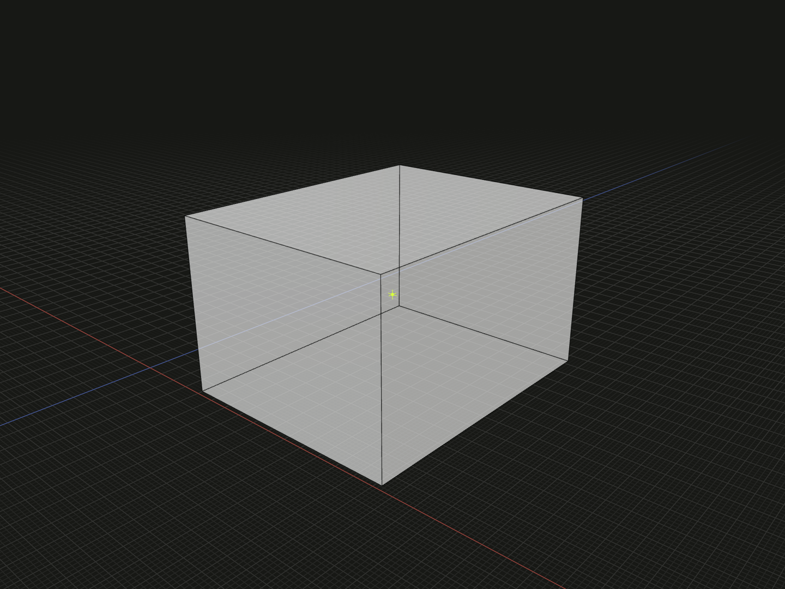

Align supporting geometry or coincide two complete coordinate frames.

## Example

```ts
import {align, box, group, point} from '@code3d/core';

const datum = point([16, 8, 0]);
const alignedPart = box(8, 6, 10).relate(self => align(self.center, datum));
export const alignedAssembly = group([point(), datum, alignedPart]);
```



Complete example: [groups and placement](../../../app/examples/constraints/placement-api.ts).

## Signature

```ts
function align(
  source: Anchor<'point' | 'line' | 'face'>,
  target: Anchor<'point' | 'line' | 'face'>,
): Constraint;
function align(source: FrameAnchor, target: FrameAnchor): Constraint;
```

Import the functions and named types from `@code3d/core`.

## Geometry alignment

The first overload works on geometric references. Point–point alignment coincides
positions; points may also lie on a supporting curve or surface. Curves can
coincide or lie wholly on a surface. Compatible surfaces coincide with matching
normal sense. The example puts the part center at `[16, 8, 0]`.

Supported underlying geometry is points, straight lines, circles, ellipses,
planes, cylinders and spheres. Other curve and surface types are unsupported.
Edges and surfaces contribute their complete supporting geometry: a point may
lie on a line beyond an edge's endpoints, and arcs may share a circle even if
their trimmed ranges differ. Aligning geometry does not pair endpoints or
parameter origins. Select vertices, start/midpoint/end or explicit origins when
those positions matter.

Directions matter for curve coincidence and face normals. Use `reverse()` on
a line or edge to reverse its positive direction, or `flip()` on a surface to
reverse normal sense. These do not rotate the reference coordinate axes.
Point membership ignores direction; a curve on a surface does not acquire an
arbitrary heading within that surface.

## Frame alignment

`align(self.frame, other.frame)` coincides origins and all three coordinate axes.
Select `.frame` explicitly: aligning models does not implicitly align their
coordinate systems. `align(self.origin, other.origin)` is point coincidence
and leaves orientation free. Mixing a frame and geometric reference is invalid.

## Solving and errors

Use the returned `Constraint` in [relate](relate.md). Either argument may contain
self, but every constraint must involve that new value. Geometry alignment can
rotate self as well as translate it. Unconstrained freedom follows the surrounding
solve sequence; multiple solutions may remain. Joint incompatible conditions,
unsupported geometry and numerical failure have distinct diagnostics.

Add independent [offset](offset.md) or [rotate](rotate.md) steps to adjust the
joint solution. Constraints have no transform methods. Use [on](on.md) for
translation-only contact of finite directional bounds.
