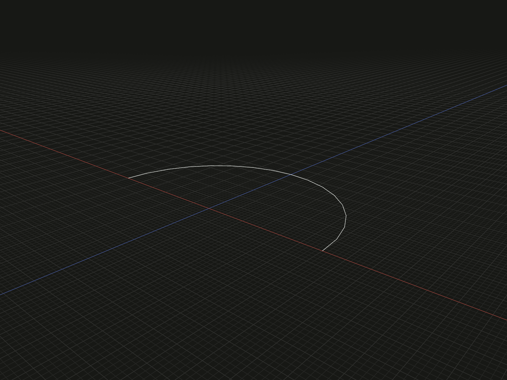

Create a circular arc from a start point, a point on the arc and an end point. The three positions determine the circle, its plane and which arc to keep.

## Example

```ts
import {arc} from '@code3d/core';

export const circularArc = arc([-6, 0, 0], [0, 0, -6], [6, 0, 0]);
```



Select `circularArc` in the App to inspect the geometry.

Complete example: [basic shapes](../../../app/examples/primitives/primitives.ts).

## Signature

```ts
function arc(start: Vec3, middle: Vec3, end: Vec3): EdgeModel;
```

Import the function and any named types above from `@code3d/core`.
The same call works in the App and Node; Node initializes the kernel automatically.

## Parameters

| Parameter | Meaning                                    |
| --------- | ------------------------------------------ |
| `start`   | First endpoint                             |
| `middle`  | A point the circular arc must pass through |
| `end`     | Last endpoint                              |

All three parameters are required `readonly [x, y, z]` tuples of finite numbers.
The positions must define a nondegenerate circle: use three distinct,
non-collinear points. The middle point is on the curve; it is not a control handle
or the circle center. It need not be halfway along the arc.

## Result and coordinates

The result is an `EdgeModel<CurveElements>` with a circular edge and two endpoint
vertices. `middle` does not create a third topology vertex. Coordinates remain in
the returned model's local XYZ frame; the model origin stays at zero.
The points may lie in any 3D plane, not only XZ.

The example creates the radius-6 semicircle through `[0, 0, -6]`. Its `.length`
is `6 * Math.PI`, approximately `18.849556`. Bounds run from `[-6, 0, -6]` to
`[6, 0, 0]`, within kernel tolerance.

`.start` and `.end` reference the endpoints. `.midpoint` references the middle
of the arc's parameter interval; on a circle, it also bisects the arc length.
It equals the supplied `middle` only if that point was halfway along the arc.
`.center` is the bounding-box center, `[0, 0, -3]` in this example, not the circle
center or the point on the arc at half length.

Point order chooses the path from `start` through `middle` to `end`, so a major
arc is possible. Reversing start and end reverses traversal. An arc remains open;
use [circle](circle.md) for a filled circular profile.

## Validation and use

The constructor checks finite coordinates and rejects an all-identical point set.
The modeling kernel rejects configurations that cannot define a circular arc,
such as collinear points or repeated endpoints. Nearly coincident or nearly
collinear inputs can also fail at kernel tolerance. There are no omitted-point
or editing defaults.

The edge supports vertex/edge selection, `.length`, transforms, materials and
relations, but has no filled area or volume. Use it as a curved
[sweep path](../api.md#path-sweeps) with an appropriately positioned profile.
A curved arc cannot serve as a straight rotation axis.
See [model values](../values.md) and [local coordinates](../local-coordinates.md).

## Related APIs

- [line](line.md) connects just the endpoints.
- [bezier](bezier.md) uses control points rather than a point on a circle.
- [spline](spline.md) fits a curve to a list of sample positions.
