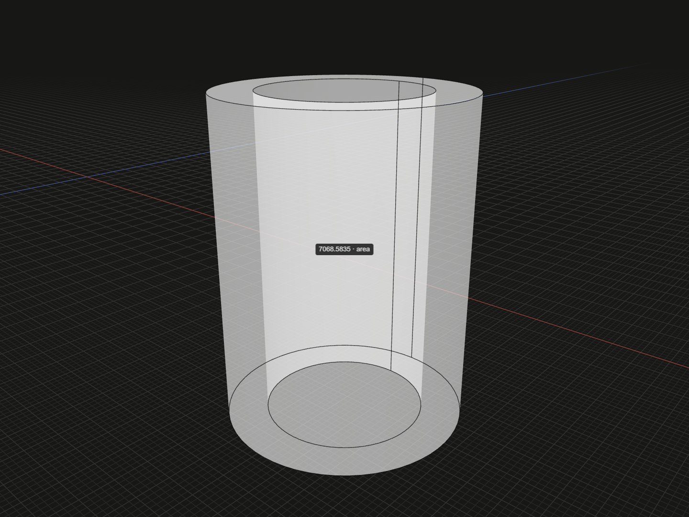

Read the trimmed area of a face or the total boundary area of a solid.

## Example

```ts
import {group, rectangle, tube} from '@code3d/core';

const sheet = rectangle(30, 20);
const pipe = tube(15, 10, 40).originOffset(-60, 0, 0);

// Select .area to inspect a finite face or every boundary face of a solid.
const sheetArea = sheet.area; // 600
const pipeSurfaceArea = pipe.area; // Includes inner wall and annular ends.
const selectedFaceArea = pipe.surfaces()[0].area;
const enlargedArea = sheet.scaled(2).area; // 2400

export default group([sheet, pipe]);
```



Complete example: [measurement example](../../../app/examples/operations/area.ts).

## Signature

```ts
faceModel.area: number;
surfaceReference.area: number;
solidModel.area: number;
solidReference.area: number;
```

Import the functions and named types from `@code3d/core`.

## Receivers and units

`FaceModel`, [Surface](surface.md), `SolidModel` and exposed `Solid` references
provide readonly `area` in square model units. A finite face includes its curved
surface and excludes trimming holes. A solid includes every boundary face,
including inner walls, cavity faces and hole walls. It is not a projected area.

The example's rectangle has area 600; scaling it by 2 produces area 2400.
The pipe's total surface includes outer and inner cylindrical walls and both
annular ends: `2250 * Math.PI` for radii 15/10 and height 40. Selecting one
surface measures only that finite face.

Groups, edge/vertex models and generic `FaceAnchor` references have no area
getter. For an assembly sum member areas only when you want separate boundaries;
a fused [union](union.md) measures the resulting boundary instead.

## Value semantics and inspection

Rotation, origin edits, placement and [flip](flip-reverse.md) preserve area.
Positive uniform [scaled](scaled.md) multiplies it by the square of the factor;
exposed references include their actual geometry scale. The getter returns an
ordinary number at the time of reading, without adding a relation or updating
older results after subsequent modeling operations.

Select `.area` in App to highlight the finite face or complete solid and show
its measured area. It is read-only. Use floating-point tolerance when comparing
results. For solid material occupancy use [volume](volume.md); for overall
axis-aligned dimensions use [bounds](bounds.md).
