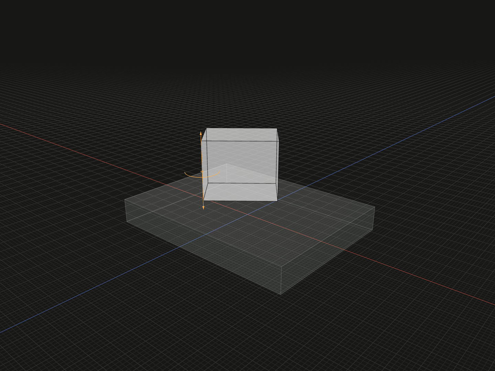

Rotate a placed model about one of its own straight topology edges.

## Example

```ts
import {axisEdge, box, group, on} from '@code3d/core';

const edgeBase = box(32, 4, 24);
const edgePart = box(12, 10, 8).relate(() => [
  on(edgeBase.up),
  axisEdge(2).rotate(40),
]);
export const edgeAxisAssembly = group([edgeBase, edgePart]);
```



Complete example: [groups and placement](../../../app/examples/constraints/placement-api.ts).

## Signature

```ts
function axisEdge(id: EdgeId): AxisChain;
chain.axisOffset(x: number, y: number, z: number): AxisRotation;
chain.rotate(angle: number): Transformation;
```

Import the functions and named types from `@code3d/core`.

## Edge selection

`id` selects an edge belonging to the callback's self. Use a positive integer or
an inherited path of at least two positive integers. Unknown, retired or malformed
IDs fail. The edge must be straight: a curved edge does not define one rotation
axis. The supporting line extends beyond the finite edge's endpoints.

The example turns around the input box's E2. Edge direction determines the
positive angular sense. To explicitly reverse a chosen reference, use
[axisLine](axis-line.md) with `self.edge(id).reverse()`.

A group or sketch has no aggregate model edge IDs. Use `axisLine` with a member's
straight edge or another positioned line reference. For self-local XYZ rotation
about a point, use [pivotVertex](pivot-vertex.md).

## Offset and rotate

`AxisChain` provides `.rotate(angle)` directly, or one `.axisOffset(x, y, z)`
followed by `.rotate(angle)`. The offset returns `AxisRotation`, which supports
the final rotation but no further axisOffset. Components are finite distances
in the selected axis's reference frame. Moving along the axis itself does not
change the rotation. Offset changes the selected line's position while retaining
its direction; it does not directly translate self.

`angle` is a finite signed degree value, positive by the right-hand rule about
the directed axis. Negative and multi-turn values are allowed. Required numeric
arguments use zero defaults only while the App edits incomplete calls.
The final result is one complete `Transformation` for [relate](relate.md).
Finish selectors before returning them from the callback. Later transformations
are separate entries; the chosen axis applies to this rotation only.
