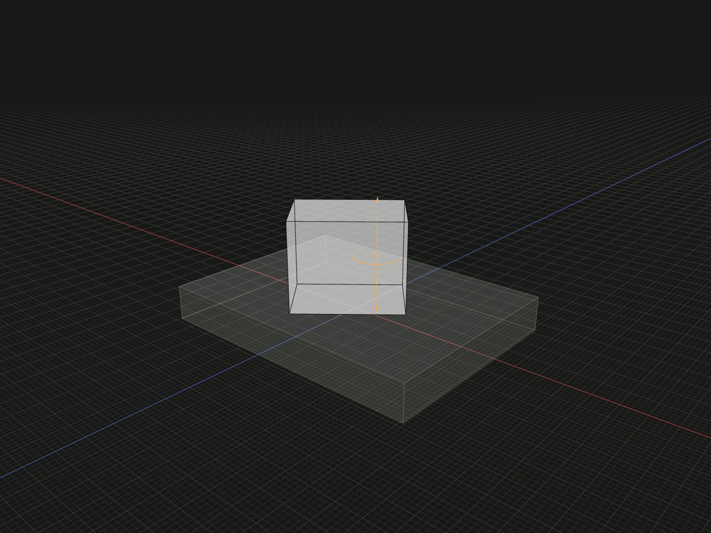

Rotate a placement about a self or external straight line reference.

## Example

```ts
import {axisLine, box, group, on} from '@code3d/core';

const axisBase = box(32, 4, 24);
const axisPart = box(12, 10, 8).relate(self => [
  on(axisBase.up),
  axisLine(self.axis).axisOffset(3, 0, 0).rotate(40),
]);
export const lineAxisAssembly = group([axisBase, axisPart]);
```



Complete example: [groups and placement](../../../app/examples/constraints/placement-api.ts).

## Signature

```ts
function axisLine(axis: LineAnchor): AxisChain;
chain.axisOffset(x: number, y: number, z: number): AxisRotation;
chain.rotate(angle: number): Transformation;
```

Import the functions and named types from `@code3d/core`.

## Line and placement

`axis` accepts a line anchor such as a model's `axis`, a straight edge or a line
model. A curved edge is rejected. The supporting line defines the axis regardless
of its finite endpoints. Reversing the reference reverses the positive rotation
sense without changing the reference coordinate axes.

A self reference uses the current placement of self. An external axis is resolved
from its owner's placement in the composition. These are different choices:
`axisLine(self.axis)` refers to the returned new part; `axisLine(original.axis)`
keeps the original model's identity. Use the actual occurrence for nested or
repeated members.

The example offsets self's axis 3 units along that axis frame's X direction before
turning. An external fixed axis can make transformation order particularly visible:
translating first then rotating can differ from rotating first then translating.

## Offset and rotate

`AxisChain` provides `.rotate(angle)` directly, or one `.axisOffset(x, y, z)`
followed by `.rotate(angle)`. The offset returns `AxisRotation`, which supports
the final rotation but no further axisOffset. Components are finite distances
in the selected axis's reference frame. Moving along the axis itself does not
change the rotation. Offset changes the selected line's position while retaining
its direction; it does not directly translate self.

`angle` is a finite signed degree value, positive by the right-hand rule about
the directed axis. Negative and multi-turn values are allowed. Required numeric
arguments use zero defaults only while the App edits incomplete calls.
The final result is one complete `Transformation` for [relate](relate.md).
Finish selectors before returning them from the callback. Later transformations
are separate entries; the chosen axis applies to this rotation only.
