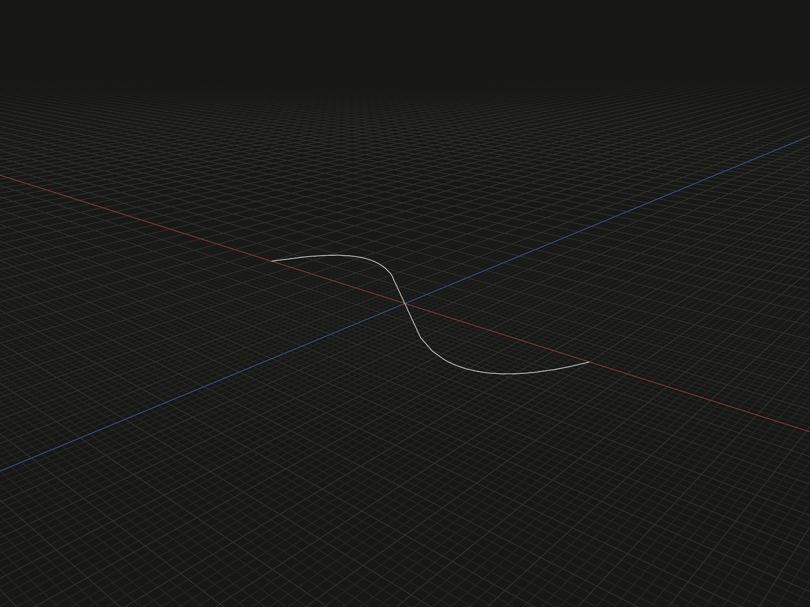

Create a single Bézier edge shaped by an ordered list of control points. Use it for smooth paths whose endpoint positions and tangent directions you want to control.

## Example

```ts
import {bezier} from '@code3d/core';

export const bezierCurve = bezier([
  [-6, 0, 0],
  [-3, 0, -8],
  [3, 0, 8],
  [6, 0, 0],
]);
```



Select `bezierCurve` in the App to inspect the geometry.

Complete example: [basic shapes](../../../app/examples/primitives/primitives.ts).

## Signature

```ts
function bezier(points: readonly Vec3[]): EdgeModel;
```

Import the function and any named types above from `@code3d/core`.
The same call works in the App and Node; Node initializes the kernel automatically.

## Parameters

`points` is a required ordered array of at least two `readonly [x, y, z]` tuples.
Every coordinate must be finite, and at least two control positions must differ.
All positions use the returned model's local coordinates and common length units.

Two control points define a straight segment, three define a quadratic curve,
and four define a cubic curve. The example is cubic. Interior control points
shape the curve without generally lying on it; they are not interpolation samples.
The first and last control points define the endpoints. For nondegenerate end
handles, the adjacent control points determine the endpoint tangent directions.

## Result and coordinates

The result is an `EdgeModel<CurveElements>` containing one Bézier edge. Its
origin remains local zero; the control points are not recentered. Controls may
vary along all three axes, so the curve need not be planar.

`.start` and `.end` are endpoint references. `.midpoint` is the point at normalized
parameter `0.5`, not necessarily halfway along the curve's length.
`.center` is the bounding-box center; it is a separate geometric reference.
For this symmetric example, midpoint and center happen to coincide at zero.

The curve stays inside its control points' convex hull, but its `.bounds()`
measures the curve itself, not the full control-point box. For example, its Z
extrema do not reach the control points at `-8` and `8`. `.length` measures
actual curve length, not the length of the control polygon.
The model exposes no filled `.area` or `.volume`.

## Validation and use

Too few controls report `bezier requires at least 2 points.` An all-identical
set reports `bezier requires at least two distinct points.` Nonfinite coordinates
are rejected. The kernel has additional degree and degeneracy limits; control
sets that cannot yield a usable edge or tangent can fail during construction.
There are no control-point defaults, weights or knot options in this API.

Use the result as a [sweep path](../api.md#path-sweeps) or a
[loft spine](../api.md#profiles-and-curves). Sweeps require the profile origin
and normal to match the path start and tangent. An arbitrary curved Bézier edge
is not a straight rotation axis.
The model also supports topology selection, materials, relations and local
transforms; see [model values](../values.md) and [local coordinates](../local-coordinates.md).

## Related APIs

- [spline](spline.md) treats its input positions as fitting samples.
- [arc](arc.md) creates a circular arc through a specified middle point.
- [line](line.md) gives a direct two-endpoint form for straight edges.
