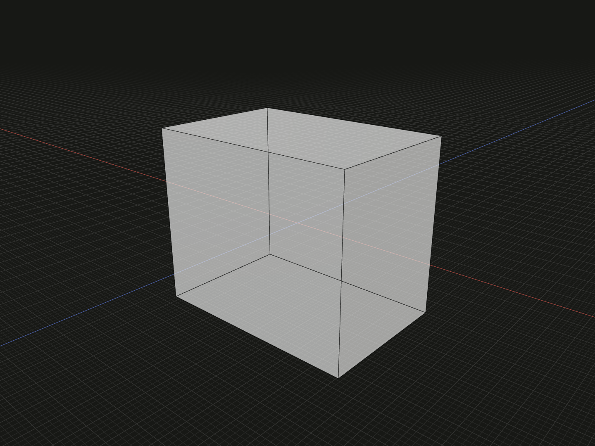

Create a solid rectangular block with independent sizes along X, Y and Z.
Use it as the starting shape for a plate, enclosure or Boolean cutting tool.
Equal sizes produce a cube.

## Example

Create a block measuring 12 × 10 × 8 model units:

```ts
import {box} from '@code3d/core';

export const cuboid = box(12, 10, 8);
```



The block is centered at the local origin. In the App, select a dimension
argument and press Tab to edit that size. Select `cuboid` to inspect the whole
solid.

Complete example: [basic shapes](../../../app/examples/primitives/primitives.ts).

## Signature

```ts
function box(x: number, y: number, z: number): SolidModel;
```

Import `box` and, when needed, `type SolidModel` from `@code3d/core`.
The same call works in the App and Node; Node initializes the modeling kernel
automatically.

## Parameters

| Parameter | Meaning                          | Accepted values                   |
| --------- | -------------------------------- | --------------------------------- |
| `x`       | Full size along the local X axis | A finite number greater than zero |
| `y`       | Full size along the local Y axis | A finite number greater than zero |
| `z`       | Full size along the local Z axis | A finite number greater than zero |

All three parameters are required in TypeScript. Sizes use the same model
units as other Core geometry; the [export scale](../../../web/src/content/docs/docs/guides/exporting.md#scale-and-orientation)
determines how those units map to millimetres in an exported file.

Use `box(10, 10, 10)` for a cube or `box(40, 3, 25)` for a thin plate.
For a flat face with no thickness, use [`rectangle`](rectangle.md).

## Result and coordinates

Returns a new `SolidModel<CanonicalElements>` with six planar faces, twelve
edges and eight vertices. Its initial local axes match X, Y and Z, with these
geometric extents:

| Axis | Minimum  | Maximum |
| ---- | -------- | ------- |
| X    | `-x / 2` | `x / 2` |
| Y    | `-y / 2` | `y / 2` |
| Z    | `-z / 2` | `z / 2` |

For the example, the corners span `[-6, -5, -4]` to `[6, 5, 4]`.
The initial origin and center are both at `[0, 0, 0]`. The box extends on both
sides of each coordinate plane; its bottom is at `y = -5`.

The result supports solid operations such as `.cut()`, `.fillet()`, `.chamfer()`
and `.shell()`, as well as materials, origin changes and relations. These
operations return new model values. See [model values](../values.md) and
[local coordinates](../local-coordinates.md) for how derived models retain
their own geometry and frame.

### Reference elements

| Reference                  | Meaning on the newly created box                       |
| -------------------------- | ------------------------------------------------------ |
| `.origin`, `.frame.origin` | The local zero point                                   |
| `.frame`                   | The local origin and XYZ axes                          |
| `.center`                  | The box's geometric center, initially at local zero    |
| `.axis`                    | A reference line through the center, directed along +Y |
| `.up`, `.down`             | Directional bounds facing +Y and −Y                    |
| `.right`, `.left`          | Directional bounds facing +X and −X                    |
| `.front`, `.back`          | Directional bounds facing +Z and −Z                    |

Use bounds with [`on`](../api.md#anchors-and-relations) to place another part
against the block. To select actual topology for rounding or openings, use
`.edge(id)`, `.surface(id)` or the corresponding collection methods. Directional
bounds and topology faces are different kinds of references; see
[topology selection](../topology.md).

### Measurements

The initial box has volume `x * y * z` and surface area
`2 * (x * y + y * z + z * x)`. For `box(12, 10, 8)`, these are 960 cubic model
units and 592 square model units.

Read `.volume` and `.area` for geometry measurements, or call `.bounds()` to
query the dimensions and extents. Use `.bounds(reference)` when measuring a
placed box in another model's frame. See [geometry measurements](../values.md#geometry-measurements).

## Validation and editing defaults

Zero, negative dimensions, `NaN` and infinities are rejected. Each invalid
dimension reports its name, for example `x must be a positive finite number.`
JavaScript values such as `null` and numeric strings are also rejected.
Very small dimensions remain subject to the geometry kernel's tolerances.

While editing an incomplete call, each omitted or `undefined` dimension uses
the runtime default `10`: `box(12)` previews a 12 × 10 × 10 block. These
defaults also apply in JavaScript. They do not make the TypeScript parameters
optional or replace invalid values. Write all three dimensions in finished
TypeScript models; see [editing incomplete calls](../values.md#editing-incomplete-calls).

## Related APIs

- [Solid primitives](../api.md#solid-primitives): cylinders, spheres, tubes and other starting shapes.
- [Extrusion](../api.md#profiles-and-curves): build a solid from a planar profile.
- [Boolean operations](../api.md#composition-and-boolean-operations): combine a block with other solids.
- [Shells](../shells.mdx): hollow the block and choose faces to leave open.
- [Relations](../relations.mdx): place the block in an assembly.
