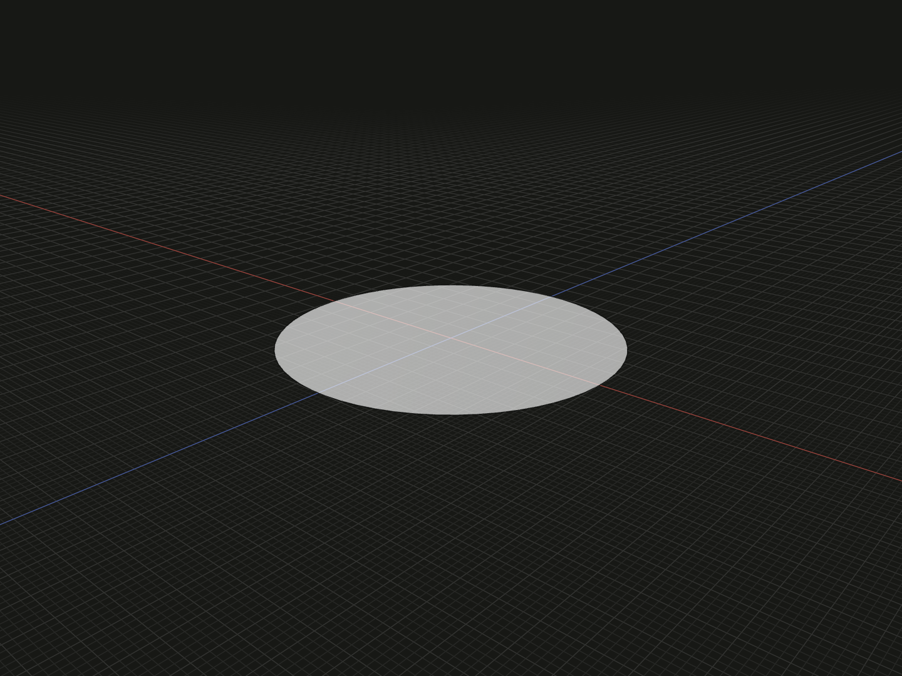

Create a filled circular profile for extrusion, a loft section or a sweep section. Its radius controls the face boundary; it has no thickness until a solid operation is applied.

## Example

```ts
import {circle} from '@code3d/core';

export const circularFace = circle(6);
```



Select `circularFace` in the App to inspect the geometry.

Complete example: [basic shapes](../../../app/examples/primitives/primitives.ts).

## Signature

```ts
function circle(radius: number): FaceModel;
```

Import the function and any named types above from `@code3d/core`.
The same call works in the App and Node; Node initializes the kernel automatically.

## Parameters

`radius` is a required positive finite number in the model's common length units.
It is half the diameter: `circle(6)` has diameter 12. Zero does not create a point;
use [point](point.md) for that geometry.

## Result and coordinates

The result is a `FaceModel<PlanarElements>` with one filled circular face in the
XZ plane at `y = 0`, facing +Y. Its origin and `.center` begin at local zero;
`.plane` is a reference to the supporting plane. The boundary is a closed circular
edge, accessible through [topology selection](../topology.md).

Bounds run from `[-radius, 0, -radius]` to `[radius, 0, radius]`.
For the example, `.bounds().size` is `[12, 0, 12]` and `.area` is
`36 * Math.PI`, approximately `113.097336`. The area formula is
`Math.PI * radius ** 2`. A face has no solid `.volume`.

`.extrude(distance)` creates a solid along the oriented normal. Positive distance
extends from `y = 0` toward +Y; it does not center the solid around the starting
plane. For example, `circle(6).extrude(4)` spans Y from 0 to 4.
[`cylinder`](cylinder.md) instead centers its height around zero.
Rotating the profile also rotates its extrusion direction; see
[profile operations](../api.md#profiles-and-curves).

The face supports surface/edge/vertex selection, materials, relations and local
transforms. `.flip()` returns a `Surface` reference with reversed facing, not a
new profile model. See [model values](../values.md) and
[local coordinates](../local-coordinates.md).

## Validation and editing defaults

Zero, negative, nonfinite and nonnumeric radii are rejected with
`radius must be a positive finite number.` Very small radii may encounter the
modeling kernel's tolerance.

While editing an incomplete call, an omitted or `undefined` radius uses 5.
The TypeScript argument remains required. Select the radius in the App and
press Tab to edit it with the numeric parameter tool.

## Related APIs

- [ellipse](ellipse.md) uses independent X and Z radii.
- [arc](arc.md) creates an unfilled circular edge segment.
- [cylinder](cylinder.md) creates a centered circular solid directly.
