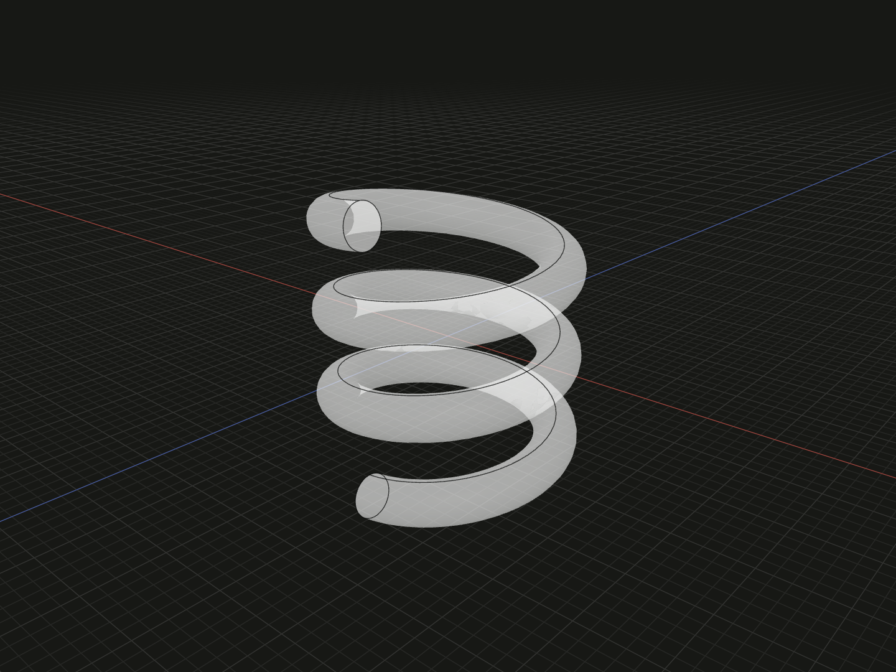

Create a right-handed helical solid with a circular wire section. Use it for a spring-shaped part or helical wire path with constant radius and pitch.

## Example

```ts
import {coil} from '@code3d/core';

export const helicalCoil = coil(5, 1, 4, 3);
```



Select `helicalCoil` in the App to inspect this solid. Select a numeric argument
and press Tab to edit it.

Complete example: [basic shapes](../../../app/examples/primitives/primitives.ts).

## Signature

```ts
function coil(
  coilRadius: number,
  wireRadius: number,
  pitch: number,
  turns: number,
): SolidModel;
```

Import `coil` and, when needed, `type SolidModel` from `@code3d/core`.
The same call works in the App and Node; Node initializes the kernel automatically.

## Parameters

| Parameter    | Meaning                                                 | Accepted values                                                           |
| ------------ | ------------------------------------------------------- | ------------------------------------------------------------------------- |
| `coilRadius` | Distance from the central Y axis to the wire centerline | Finite and greater than `wireRadius`                                      |
| `wireRadius` | Radius of the circular wire section                     | Finite and greater than zero                                              |
| `pitch`      | Centerline advance along +Y for one full turn           | Finite and greater than `2 * wireRadius`; additional clearance is checked |
| `turns`      | Number of turns; fractional values are allowed          | Finite and greater than zero                                              |

All parameters are required in TypeScript. Lengths use the model's common units;
see [export scale](../../../web/src/content/docs/docs/guides/exporting.md#scale-and-orientation).

## Result and coordinates

Returns a `SolidModel<CanonicalElements>` made by sweeping a circular
section along a helix. `coilRadius` is measured to the center of the wire,
not to its outer surface. The example uses a centerline radius of 5 and a
wire diameter of 2.

The centerline height is `pitch * turns`. Its Y interval is centered about
zero, from `-pitch * turns / 2` to `pitch * turns / 2`. The example advances
12 units over three turns, with centerline ends at `Y = -6` and `Y = 6`.

The solid extends beyond that interval because each wire end is a circular
section perpendicular to the helix tangent. Its full axial height is

```text
pitch * turns + 2 * wireRadius * (2π * coilRadius) / hypot(2π * coilRadius, pitch)
```

For the example, this is approximately 13.984 units, not 12.
The ends are plain cut sections: this API adds no closed, ground or flattened
spring-end treatment.

The initial `.axis` is the central +Y line through `[0, 0, 0]`. The origin
is midway along the centerline's axial span. The `.center` reference comes
from the solid's actual bounding box; fractional turns can make its X/Z
position differ from the origin. `.up` and `.down` bound the wire's full
height, not just the centerline interval.

The solid provides frame, origin, center, axis and directional bound references.
It supports Boolean operations, fillets, chamfers, shelling, materials and relations.
Derived operations return new model values; see [model values](../values.md)
and [local coordinates](../local-coordinates.md).

## Measurements

The ideal centerline length is
`turns * Math.hypot(2 * Math.PI * coilRadius, pitch)`.
Multiplying by `Math.PI * wireRadius ** 2` gives the swept wire volume.
Use `.volume` for the kernel measurement and `.bounds()` for the actual
outer dimensions, especially with a fractional number of turns.

For a short arc of wire, `coil(5, 1, 4, 0.25)` produces a quarter-turn with
the same pitch and section size.

## Validation and editing defaults

All four inputs must be positive finite numbers. The product `pitch * turns`
must also remain finite. Numeric strings and `null` are rejected.

| Condition                          | Error                                                                          |
| ---------------------------------- | ------------------------------------------------------------------------------ |
| A nonpositive or non-finite input  | The parameter name followed by `must be a positive finite number.`             |
| `wireRadius >= coilRadius`         | `wireRadius must be smaller than coilRadius.`                                  |
| `pitch <= 2 * wireRadius`          | `pitch must be greater than the wire diameter.`                                |
| Neighboring turns touch or overlap | `Coil turns must not touch or overlap; increase pitch or decrease wireRadius.` |
| The centerline height overflows    | `pitch * turns must be a positive finite number.`                              |

Pitch greater than the wire diameter is necessary but is not sufficient:
neighboring turns approach each other obliquely. For example,
`coil(5, 1, 2.001, 2)` is rejected even though its pitch exceeds 2.
The clearance check accounts for the supplied turn count.

Only positive pitch and right-handed winding are supported by this constructor.
For a different profile or more control over the path, use
[helical revolve](../api.md#rotational-solids) or a
[path sweep](../api.md#path-sweeps).

While an incomplete call is being edited, omitted or `undefined` arguments use
`coilRadius = 5`, `wireRadius = 1`, `pitch = 3` and `turns = 3`. These runtime defaults let the editor
complete a call; they do not remove the required TypeScript arguments.
The resulting dimensions must still satisfy all constraints.
Very small dimensions or clearances can also encounter the modeling kernel's tolerance.

## Related APIs

- [Helical revolve](../api.md#rotational-solids) rotates a profile while advancing along an axis.
- [Path sweeps](../api.md#path-sweeps) carry a profile along an explicit curve.
- [Standard fasteners](../../../screws/docs/assembly.mdx) provide nominal screw threads; a round-wire coil is not a thread profile.
- [Solid primitives](../api.md#solid-primitives) compares the available starting shapes.
