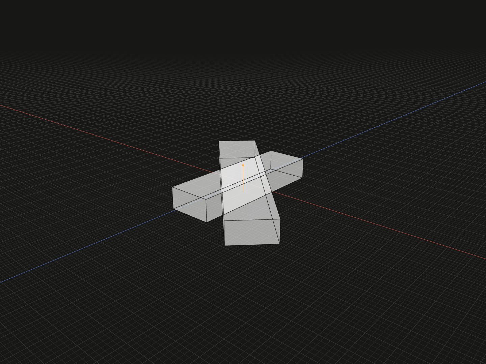

Drive one model’s cumulative placement angle from another model’s fixed axis.

## Example

```ts
import {
  align,
  axisLine,
  box,
  coupleRotation,
  group,
  offset,
} from '@code3d/core';

const couplingBase = box(2, 2, 2);
const crank = box(20, 3, 6).relate(self => [
  align(self.frame, couplingBase.frame),
  axisLine(self.axis).rotate(90),
]);
const follower = box(30, 3, 6).relate(self => [
  align(self.origin, crank.origin),
  coupleRotation(crank, {ratio: -0.5}),
  offset(40, 0, 0),
]);
export const transmission = group([couplingBase, crank, follower]);
```



Complete example: [groups and placement](../../../app/examples/constraints/placement-api.ts).

## Signature

```ts
function coupleRotation(
  other: Model<Readonly<{axis: LineAnchor}>>,
  config: RotationCouplingConfig,
): Constraint;

type RotationCouplingConfig = Readonly<{
  ratio: number;
  phase?: number;
}>;
```

Import the functions and named types from `@code3d/core`.

## Ratio and phase

Call inside a [relate](relate.md) callback. Both the current self and `other`
must be models with a straight `.axis`. Pass a model, not an axis reference.
There is no separate axis override; a group needs an exposed axis to participate.
The returned value is a complete `Constraint` and is used as its own array entry.

The relationship is `selfAngle = ratio * otherAngle + phase`. `ratio` is required,
finite and nonzero; a negative ratio reverses direction. `phase` is a finite
angle in degrees, defaulting to zero. In the example the driver has 90° and the
follower has -45°, translated 40 units along composition X.

## Angular coordinate

Each axis frame's X direction supplies its angular datum. Zero uses Core's
standard frame for that axis's positive Y direction in the solve frame: project
+X perpendicular to Y, using +Z when `abs(Y.x) >= 0.9`. The angle is measured about
Y, then signed by the reference direction. A usual +Y axis therefore uses +X as
zero. `phase` relates the two angular datums.

Full turns are retained from the authored placement sequence, including frame
attachments and upstream couplings. A driver change of 360° produces a follower
change of -180° for ratio -0.5. Results do not depend on previous App frames or
playback history. Use placement `rotate` or a selected-axis rotation to drive the
angle; [model.rotate](model-rotate.md) instead changes local geometry and its
carried axis reference.

## Placement and supported mechanisms

Coupling leaves translation free and does not coincide the axes. Add origin
alignment, contact or independent offsets to position shafts. It follows the
same immutable identity rule as other relations: an external original receiver
passed as `other` remains that earlier value. Helpers inside the callback use
current self; nested callbacks use their own self.

The supported driving graph is acyclic, with one fixed material-axis direction
per participating body. Axes may point in arbitrary directions. A selected-axis
rotation supports those directions; XYZ rotations can drive axes parallel to
the corresponding local X, Y or Z. Frame alignment, point coincidence and `on`
may participate, but other geometric alignments cannot drive this coordinate.

Cycles, conflicting angles and rotations about incompatible directions report
errors. Moving carriers are outside this subset; place a completed mechanism as
a group. For tooth ratios and engagement phase, see the
[gears API](../../../gears/docs/api.md#drive-through-connected-parts).
