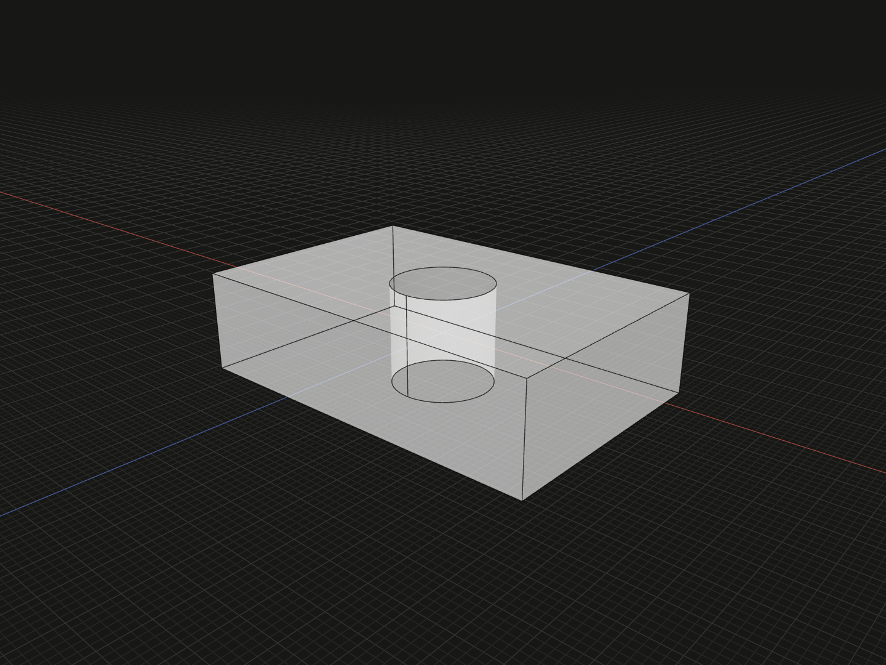

Subtract one or more solid tools from a stock model.

## Example

```ts
import {box, cylinder, cut} from '@code3d/core';

const blank = box(30, 8, 20);
const drill = cylinder(4, 12);
export const drilled = cut(blank, [drill]);
```



Complete example: [solid operations](../../../app/examples/operations/solid-operations.ts).

## Signature

```ts
function cut(
  stock: SolidModel<{}>,
  tools: readonly SolidModel<{}>[],
): SolidModel;
// Equivalent method:
stock.cut(tools);
```

Import the functions and named types from `@code3d/core`.

## Parameters and result

| Parameter | Meaning                                                |
| --------- | ------------------------------------------------------ |
| `stock`   | Solid model whose volume is retained outside the tools |
| `tools`   | Nonempty readonly array of solid models to subtract    |

All tools must be solids. Empty tool arrays throw. Tools may extend outside the
stock; only their overlap removes material. A tool that does not overlap removes
nothing. The example drills through the full height and leaves volume
`4800 - 128 * Math.PI`.

The inputs are immutable. Relations between operands are solved together before
geometry is combined. The result retains the first input's local frame,
placement, material and origin; for `cut`, that input is the stock. The result
is a new `SolidModel` with canonical references, not a group with named members.
Use [group](../api.md#composition-and-boolean-operations) to retain separate parts.

Input arrays describe one operation. They do not apply the operation independently
to each element. Topology inherited one-to-one from an input is prefixed by its
one-based operand position, for example `[1, 4]`; split, merged and newly generated
topology receives new IDs. Inspect the result before using its edge or surface IDs
in a later operation. See [topology IDs](../topology.md#ids-belong-to-a-model).

## Using the result

`blank.cut([drill])` has the same modeling behavior as the free function. Neither
form changes the blank or drill. Keep tool definitions available if you need to
change the cut later; they are not exposed as named members on the result.

Boolean construction can fail on coincident or degenerate geometry. Avoid
removing the entire stock when subsequent operations require a nonempty solid.
Do not assume the output remains connected: a tool can split the stock into parts.
For adding volume see [union](union.md); for keeping shared volume see
[intersect](intersect.md).
