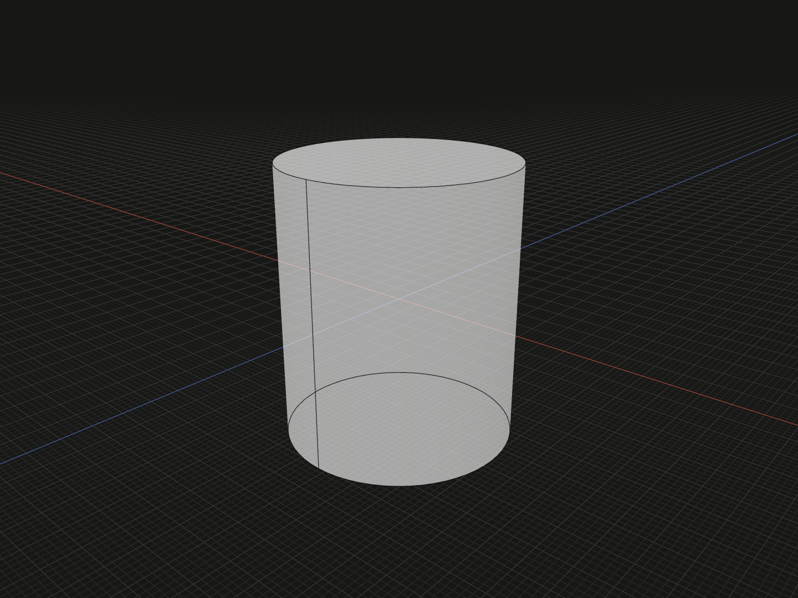

Create a solid circular cylinder for a pin, post, spacer blank or round cutting tool. The radius controls the circular section; `y` controls its full height.

## Example

```ts
import {cylinder} from '@code3d/core';

export const roundCylinder = cylinder(5, 12);
```



Select `roundCylinder` in the App to inspect this solid. Select a numeric argument
and press Tab to edit it.

Complete example: [basic shapes](../../../app/examples/primitives/primitives.ts).

## Signature

```ts
function cylinder(radius: number, y: number): SolidModel;
```

Import `cylinder` and, when needed, `type SolidModel` from `@code3d/core`.
The same call works in the App and Node; Node initializes the kernel automatically.

## Parameters

| Parameter | Meaning                        | Accepted values              |
| --------- | ------------------------------ | ---------------------------- |
| `radius`  | Radius of the circular section | Finite and greater than zero |
| `y`       | Full height along local Y      | Finite and greater than zero |

All parameters are required in TypeScript. Lengths use the model's common units;
see [export scale](../../../web/src/content/docs/docs/guides/exporting.md#scale-and-orientation).

## Result and coordinates

The result is a `SolidModel<CanonicalElements>` with two circular planar end
faces and one cylindrical side face. Its geometric extents are:

| Axis | Minimum   | Maximum  |
| ---- | --------- | -------- |
| X    | `-radius` | `radius` |
| Y    | `-y / 2`  | `y / 2`  |
| Z    | `-radius` | `radius` |

For the example, the bounds run from `[-5, -6, -5]` to `[5, 6, 5]`.
The origin and bounding-box center start at `[0, 0, 0]`; the +Y axis passes
through both end centers. The cylinder does not start on the XZ plane:
its lower end is at `-y / 2`.

`radius` is half the diameter. Use `cylinder(4, 12)` for an 8-unit-diameter
pin. To put the lower end at the local origin, apply `.originOffset(0, -6, 0)`
to the example; see [origin changes](../local-coordinates.md).

The solid provides frame, origin, center, axis and directional bound references.
It supports Boolean operations, fillets, chamfers, shelling, materials and relations.
Derived operations return new model values; see [model values](../values.md)
and [local coordinates](../local-coordinates.md).

## Measurements

Volume is `Math.PI * radius ** 2 * y`; total surface area is
`2 * Math.PI * radius * (radius + y)`, including both ends.
The example's `.volume` is approximately `942.477796`, and `.area` is
approximately `534.070751`.

## Validation and editing defaults

Both arguments must be positive finite numbers. Zero, negative values,
`NaN`, infinities, `null` and numeric strings are rejected. A failed argument
reports `radius must be a positive finite number.` or the corresponding
message for `y`.

While an incomplete call is being edited, omitted or `undefined` arguments use
`radius = 5` and `y = 10`. These runtime defaults let the editor
complete a call; they do not remove the required TypeScript arguments.
The resulting dimensions must still satisfy all constraints.
Very small dimensions or clearances can also encounter the modeling kernel's tolerance.

## Related APIs

- [tube](tube.md) creates a circular wall around a through bore.
- [frustum](frustum.md) gives the two ends different radii.
- [circle](circle.md) and [extrude](../api.md#profiles-and-curves) build a cylinder from a face, preserving that face's starting plane.
- [Solid primitives](../api.md#solid-primitives) compares the available starting shapes.
