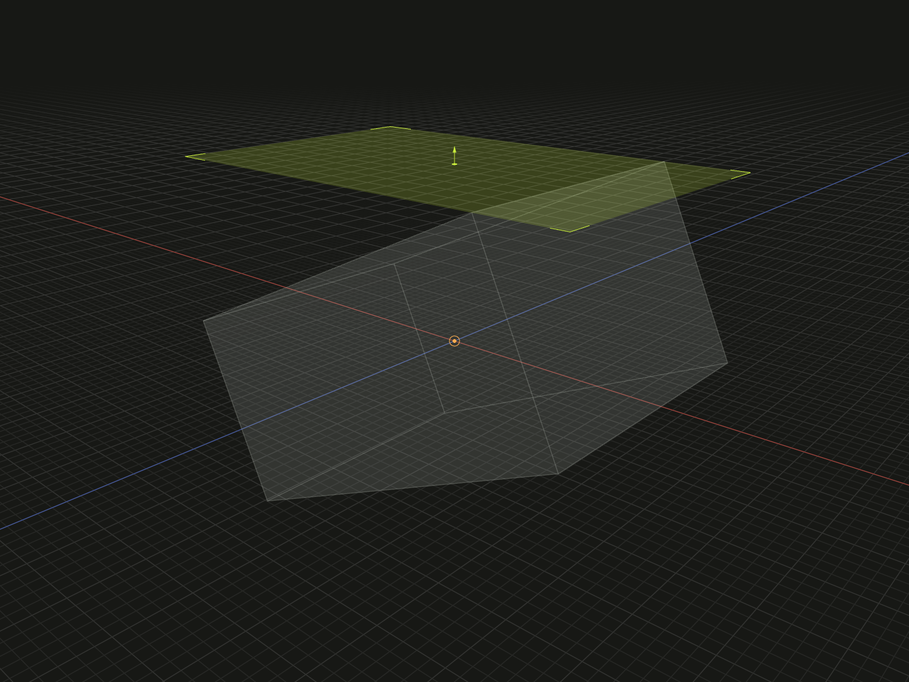

Select finite directional boundaries for contact and measurement.

## Example

```ts
import {box} from '@code3d/core';

export const bodyB = box(20, 10, 14).rotate(0, 0, 25);
export const upperBound = bodyB.up;
export const reversedBound = upperBound.flip();
```



Complete example: [topology and references](../../../app/examples/operations/topology-api.ts).

## Signature

```ts
receiver.up: Bound;
receiver.down: Bound;
receiver.left: Bound;
receiver.right: Bound;
receiver.front: Bound;
receiver.back: Bound;
bound.flip(): Bound;
```

Import the functions and named types from `@code3d/core`.

## Six directions

| Property | Positive outward direction |
| -------- | -------------------------- |
| `up`     | +Y                         |
| `down`   | -Y                         |
| `left`   | -X                         |
| `right`  | +X                         |
| `front`  | +Z                         |
| `back`   | -Z                         |

All models provide these properties, including groups with finite geometry.
Finite `Solid`, `Surface`, `Edge` and `Vertex` references also provide bounds of
their selected geometry. Empty groups have no finite bounds and a query fails.

A `Bound` is a directed finite boundary reference at the selected extent, with
its own reference frame. These properties measure geometry along the receiver's
fixed local axes. Rotating geometry with [model.rotate](model-rotate.md) does not
make `up` follow a former face normal. For a placed or exposed member, its
reference is carried through its solved occurrence in the composition.

## Contact and measurement

Use a bound as the target of [on](on.md). `on(base.up)` contacts the moving
part's matching extent with that upper boundary. It does not promise that the
boundary coincides with a single BRep surface; a rounded or rotated body can have
an extreme point or edge instead of a flat top face.

A bound can also participate in distance measurements as a finite boundary.
It is not the numeric `ModelBounds` object returned by `model.bounds()` and has
no public minimum/maximum/size properties. Use [bounds](../api.md#geometry-measurements)
for numeric extents.

## Reversing the contact sense

`flip()` returns a new bound with reversed facing. It preserves the boundary's
position, extent and reference axes. `body.up.flip()` is therefore not the same
as `body.down`: the former remains at the top, while the latter selects the bottom.
The input reference is unchanged. See [flip and reverse](flip-reverse.md).

The `Bound` interface extends `FaceAnchor`; `DirectionalBounds` is the shared
interface containing all six getters. Bounds are references, not face models,
and cannot be independently extruded or added as group geometry.
