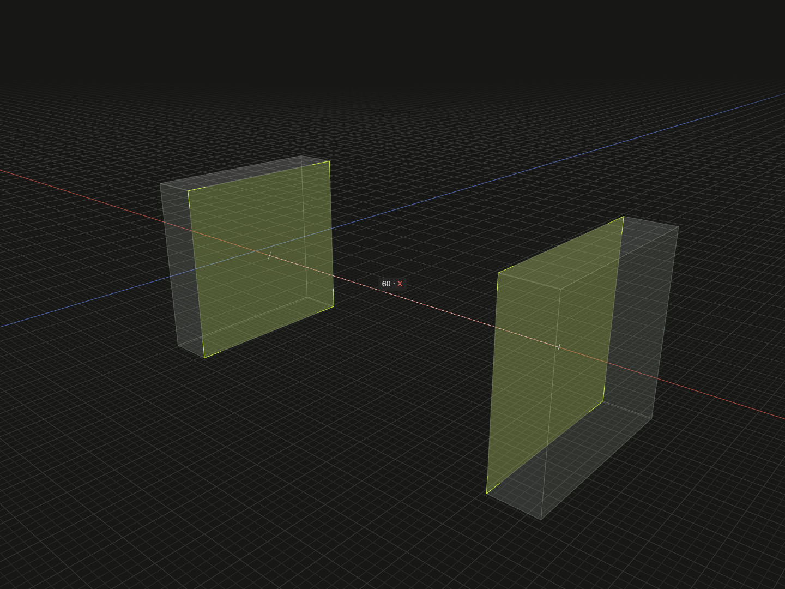

Measure shortest distance or projected clearance between finite references.

## Example

```ts
import {on, box, distance, group, offset} from '@code3d/core';

/**
 * A beam fills the measured opening without changing its cross-section.
 * @code3d.param gap {kind: 'length', default: 60, constraints: {exclusiveMin: 0}}
 * @code3d.param depth {kind: 'length', default: 32, constraints: {exclusiveMin: 8}}
 * @code3d.arguments [60, 32]
 * @code3d.arguments [95, 48]
 */
export function fittedBeam(gap = 60, depth = 32) {
  const left = box(8, 30, depth).material('#708090');
  const right = box(8, 30, depth)
    .relate(() => [on(left.right), offset(gap, 0, 0)])
    .material('#708090');

  // Queries solve the existing placement even before group().
  const length = distance(left.right, right.left, 'x');
  const beamDepth = distance(left.front, left.back, 'z') - 8;
  const beam = box(length, 10, beamDepth)
    .relate(() => on(left.right))
    .material('#d99d47');

  // The numbers above stay fixed if more relations are added later.
  return group([left, right, beam]).expose({
    supportA: left,
    supportB: right,
    beam,
  });
}

export default fittedBeam();
```



Complete example: [measurement example](../../../app/examples/operations/distance.ts).

## Signature

```ts
function distance(a: Anchor, b: Anchor, axis?: DistanceAxis): number;
type DistanceAxis = 'x' | 'y' | 'z' | Vec3 | LineAnchor;
```

Import the functions and named types from `@code3d/core`.

## Operands and projection axes

`distance(a, b, axis?)` returns a non-negative `number` from the models and
relations available at the call. It accepts vertex, edge, face and solid models,
non-empty groups, finite topology references, directional bounds, and point
anchors such as `center`, `start` and exposed mounting points.

| Axis                            | Result                                                                                      |
| ------------------------------- | ------------------------------------------------------------------------------------------- |
| Omitted                         | Shortest distance between the actual finite geometries                                      |
| `'x'`, `'y'`, `'z'`             | Gap between the geometries' projection intervals along a fixed solve-frame axis             |
| `[x, y, z]`                     | The same projection gap along a finite, non-zero direction vector, normalized automatically |
| Straight edge or axis reference | Projection gap along that reference's solved direction                                      |

Intersecting or touching geometries have zero shortest distance, including a
point inside a solid. A face measures its trimmed surface, including holes;
it does not represent the volume enclosed by its parent solid. Projected intervals
that overlap have zero gap, even if the geometries do not touch in space.
Groups measure their actual members; their projected interval spans the full
group, including spaces between disconnected members. Exchanging operands or
reversing an axis does not change the non-negative result. An axis's position
does not affect the measurement.

Queries solve the inputs' existing relationship closure without requiring
`group()`. Unrelated models use coincident origins and matching axes. String
and vector axes belong to that common solve frame, not the camera or implicitly
the first operand's local frame. A referenced axis carries its owning model's
solved orientation. For a specific assembled occurrence, expose its geometry
through the containing group and measure those references.

The result is an ordinary number. Later relations and derived model values do
not update an earlier measurement, and no reverse dependency is solved. Arrange
measurement and construction in source order; re-running the source computes
fresh values. Relations returned by a `relate` callback are attached only after
that callback returns. The query does not see constraints still being built in it.

Infinite reference planes and axes cannot be distance operands: select a finite
face or edge instead. A straight infinite axis is supported as the third argument.
An empty group, zero direction or curved axis reports an error. Geometric query
results reuse the shared computation cache; point-to-point measurements use
ordinary arithmetic.

Try the [fitted beam example](/examples/distance/) and
[measurement workflow](../relations.mdx#measure-before-building-a-part).

## Example result and inspection

The default example measures a gap of 60 and a beam depth of 24. Changing the
function's `gap` or `depth` rebuilds the matching beam on the next evaluation.
The beam is a normal solid; the measured numbers do not create a driven constraint.

Select the distance call in App to see the measured references and dimension.
This is a read-only query. Use the original dimensions or placement relations
to change the geometry. Results use model units and floating-point geometry
calculations; compare computed values with a suitable tolerance.
