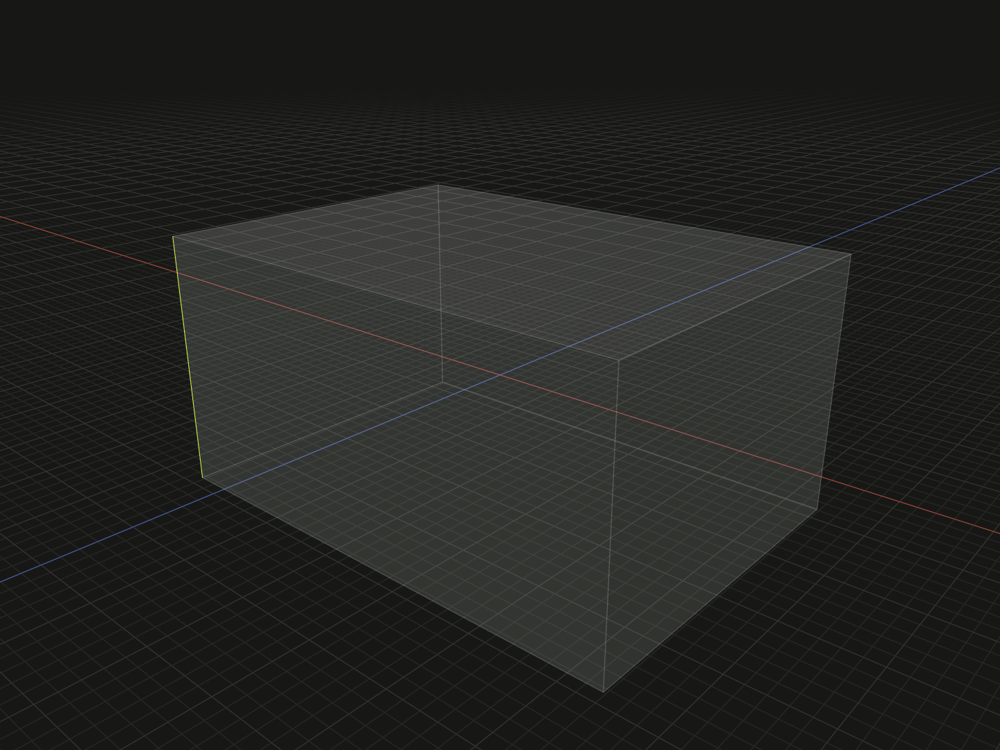

Select finite edge references for topology, measurement and relations.

## Example

```ts
import {box} from '@code3d/core';

export const bodyE = box(20, 10, 14);
export const upright = bodyE.edge(2);
export const selectedEdges = bodyE.edges([2, 4]);
```



Complete example: [topology and references](../../../app/examples/operations/topology-api.ts).

## Signature

```ts
receiver.edge(id: EdgeId): Edge;
receiver.edges(ids?: readonly EdgeId[]): readonly Edge[];
```

Import the functions and named types from `@code3d/core`.

## Receivers and result

Solid, face and edge models provide edge selection. `Solid`, `Surface` and `Edge`
references provide their contained edges. Vertex models and groups do not have
aggregate edge selection; choose a geometric member where appropriate.

An `Edge` is a finite reference to existing geometry, not a new `EdgeModel`.
It can be used in relations and measurement, but has no modeling operations such
as scaling or placement. The example's E2 is a straight edge parallel to Y with
length 10. Use its `id` in the input solid's [fillet](fillet.md) or
[chamfer](chamfer.md) selection, or the reference in [axisLine](axis-line.md).

## Edge properties

| Member                          | Meaning                                                         |
| ------------------------------- | --------------------------------------------------------------- |
| `kind`, `id`                    | Literal `edge` and its `EdgeId`                                 |
| `center`                        | A bounding-box center reference carried through transformations |
| `start`, `midpoint`, `end`      | Points at curve parameters 0, 0.5 and 1                         |
| `length`                        | Actual finite arc length in model units                         |
| `reverse()`                     | A reference with the opposite direction sense                   |
| `vertex(s)`, `edge(s)`          | Contained topology using the original namespace                 |
| `up/down/left/right/front/back` | Finite directional bounds                                       |

The parameter midpoint need not be half the arc length or the bounding-box center.
A closed curve's start and end may coincide. `reverse()` changes direction metadata
without swapping these parameter point properties, changing length or changing
the reference axes. See [flip and reverse](flip-reverse.md).

An `Edge` extends `LineAnchor`, but it may be curved. [align](align.md) examines its
supporting curve; [axisLine](axis-line.md) accepts only a straight one.

## IDs and selection order

IDs belong to the original geometry's topology namespace, not to an array index
or the entire application. A valid ID is a positive integer or a readonly path
of at least two positive integers. `[1, 4]` as a plural selection requests two
IDs; `[[1, 4]]` requests one inherited path. Display labels such as `E2` or
`S[1,4]` are not accepted as string IDs.

Omitting the plural argument returns all available elements in topology order.
An explicit ID array preserves authored order and duplicates. An empty array
returns `[]`. Malformed, unknown or retired IDs throw. Selecting through a child
reference also checks membership: an ID elsewhere on the body cannot be selected
through an unrelated surface or edge.

Child queries retain the original namespace rather than renumbering from one.
Booleans and other construction operations may prefix inherited IDs with their
input position; local edits preserve surviving IDs and retire replaced ones.
Use the current result's topology after an edit. See
[topology lineage](../topology.md#ids-belong-to-a-model).
