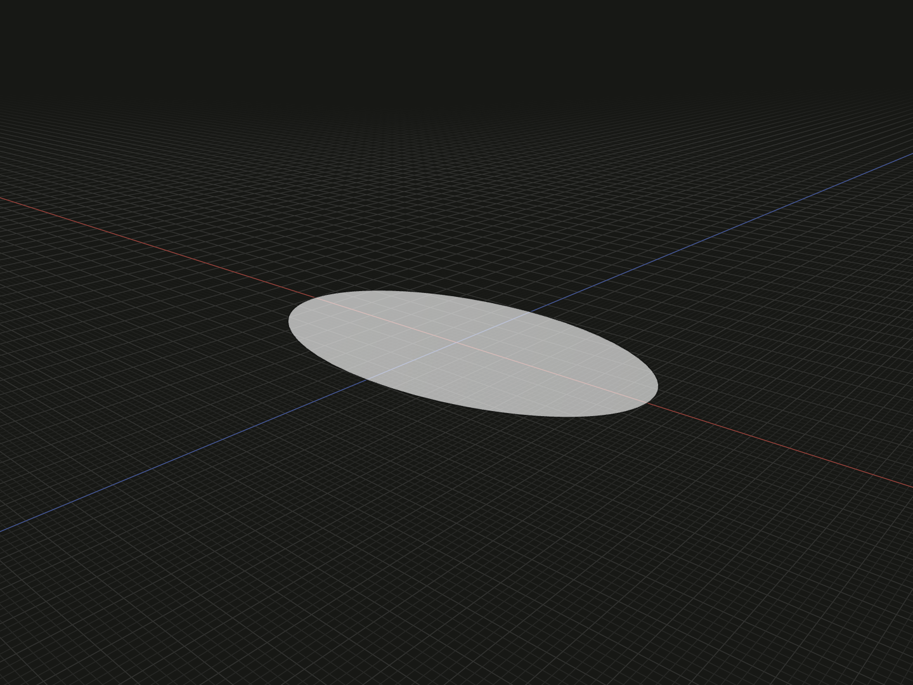

Create a filled elliptical face with independent X and Z radii. Use it as a flat profile for an oval extrusion, a loft or a sweep.

## Example

```ts
import {ellipse} from '@code3d/core';

export const ellipticalFace = ellipse(7, 4);
```



Select `ellipticalFace` in the App to inspect the geometry.

Complete example: [basic shapes](../../../app/examples/primitives/primitives.ts).

## Signature

```ts
function ellipse(xRadius: number, zRadius: number): FaceModel;
```

Import the function and any named types above from `@code3d/core`.
The same call works in the App and Node; Node initializes the kernel automatically.

## Parameters

| Parameter | Meaning          | Accepted values              |
| --------- | ---------------- | ---------------------------- |
| `xRadius` | Semiaxis along X | Finite and greater than zero |
| `zRadius` | Semiaxis along Z | Finite and greater than zero |

Both arguments are required in TypeScript and use the model's common length units.
They are radii, not full widths. Either can be the larger radius; equal values
produce circular geometry. The names always specify axes, not major/minor ordering.

## Result and coordinates

The result is a `FaceModel<PlanarElements>` with one filled face in the XZ plane
at `y = 0`, facing +Y. The origin and `.center` start at local zero, and `.plane`
is the supporting-plane reference. Its bounds are
`[-xRadius, 0, -zRadius]` to `[xRadius, 0, zRadius]`.

The example has dimensions `[14, 0, 8]` and area `28 * Math.PI`, approximately
`87.964594`. In general, `.area` is `Math.PI * xRadius * zRadius`.
This is a flat face, not an ellipsoid or a solid; it has no `.volume`.
Its bounding box may include small kernel-tolerance padding.

`.extrude(distance)` extends from the starting face along its oriented normal,
which is initially +Y for positive distances. The result retains the profile's
local coordinates. To change the starting plane, rotate or rebase the profile;
see [profile operations](../api.md#profiles-and-curves) and
[local coordinates](../local-coordinates.md).

The face supports topology selection, materials, relations and other face
operations. See [model values](../values.md) for those capabilities.

## Validation and editing defaults

Both radii must be positive finite numbers. A failure reports
`xRadius must be a positive finite number.` or the equivalent message for
`zRadius`. Zero, negative, nonfinite and nonnumeric values are rejected.
Very small or extreme proportions can encounter kernel limits.

Omitted or `undefined` arguments use `xRadius = 5` and `zRadius = 3` during
incomplete-call editing. These runtime defaults do not make the TypeScript
arguments optional. Select a radius and press Tab to edit it in the App.

## Related APIs

- [circle](circle.md) uses one radius for a circular face.
- [ellipsoid](ellipsoid.md) creates a curved solid with three semiaxes.
- [rectangle](rectangle.md) creates a profile from full X and Z dimensions.
