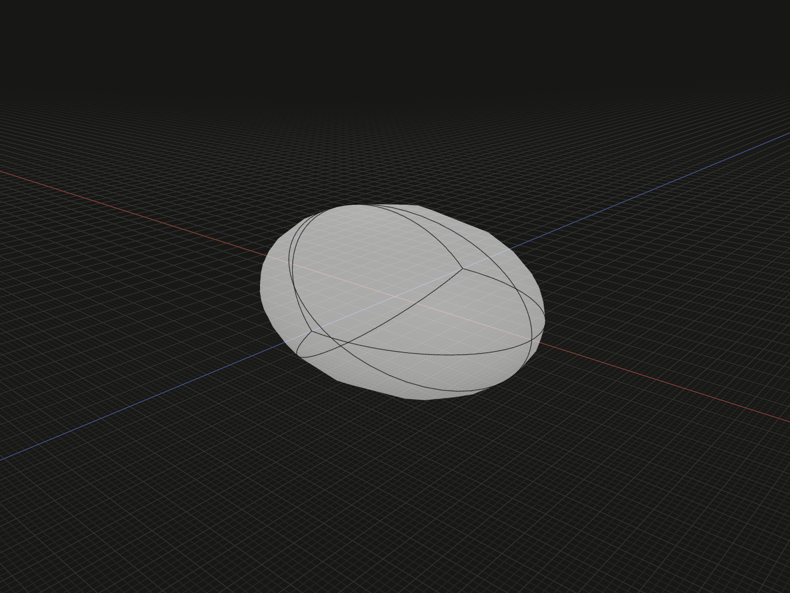

Create a smooth solid with a separate radius along each local axis. Use it for an oval body, flattened ball or curved target for surface wrapping.

## Example

```ts
import {ellipsoid} from '@code3d/core';

export const oval = ellipsoid(7, 4, 5);
```



Select `oval` in the App to inspect this solid. Select a numeric argument
and press Tab to edit it.

Complete example: [basic shapes](../../../app/examples/primitives/primitives.ts).

## Signature

```ts
function ellipsoid(
  xRadius: number,
  yRadius: number,
  zRadius: number,
): SolidModel;
```

Import `ellipsoid` and, when needed, `type SolidModel` from `@code3d/core`.
The same call works in the App and Node; Node initializes the kernel automatically.

## Parameters

| Parameter | Meaning                        | Accepted values              |
| --------- | ------------------------------ | ---------------------------- |
| `xRadius` | Semi-axis length along local X | Finite and greater than zero |
| `yRadius` | Semi-axis length along local Y | Finite and greater than zero |
| `zRadius` | Semi-axis length along local Z | Finite and greater than zero |

All parameters are required in TypeScript. Lengths use the model's common units;
see [export scale](../../../web/src/content/docs/docs/guides/exporting.md#scale-and-orientation).

## Result and coordinates

Returns a `SolidModel<CanonicalElements>` centered at `[0, 0, 0]`. Each
parameter is a radius, so the full sizes are `2 * xRadius`, `2 * yRadius`
and `2 * zRadius`. The example spans 14 × 8 × 10 units:

| Axis | Minimum | Maximum |
| ---- | ------- | ------- |
| X    | `-7`    | `7`     |
| Y    | `-4`    | `4`     |
| Z    | `-5`    | `5`     |

Its initial `.origin` and `.center` coincide. The `.axis` reference points
along +Y, even if X or Z is the longest semi-axis. Directional bounds are
support references on the curved shape, not six planar faces.

Equal radii give a spherical shape; [`sphere`](sphere.md) is the dedicated
constructor when only one radius is needed. This constructor creates a smooth
ellipsoidal surface rather than a faceted approximation.

The solid provides frame, origin, center, axis and directional bound references.
It supports Boolean operations, fillets, chamfers, shelling, materials and relations.
Derived operations return new model values; see [model values](../values.md)
and [local coordinates](../local-coordinates.md).

## Measurements

Volume is `(4 / 3) * Math.PI * xRadius * yRadius * zRadius`.
The example's `.volume` is approximately `586.430629`.
Use `.area` to measure its curved surface; the sphere's area formula does not
apply when the three radii differ.

## Validation and editing defaults

All three radii must be positive finite numbers. A zero semi-axis does not
produce a flat face; use an [ellipse](ellipse.md) for that.
Invalid values report the parameter name followed by
`must be a positive finite number.`. Numeric strings and `null` are not converted.

While an incomplete call is being edited, omitted or `undefined` arguments use
`xRadius = 5`, `yRadius = 3` and `zRadius = 4`. These runtime defaults let the editor
complete a call; they do not remove the required TypeScript arguments.
The resulting dimensions must still satisfy all constraints.
Very small dimensions or clearances can also encounter the modeling kernel's tolerance.

## Related APIs

- [sphere](sphere.md) uses one radius in every direction.
- [ellipse](ellipse.md) creates a planar elliptical face.
- [Surface wrapping](../api.md#curved-surface-wrapping) maps a flat layout onto a curved target; see the [wrapping example](../../../app/examples/operations/wrap.ts).
- [Solid primitives](../api.md#solid-primitives) compares the available starting shapes.
