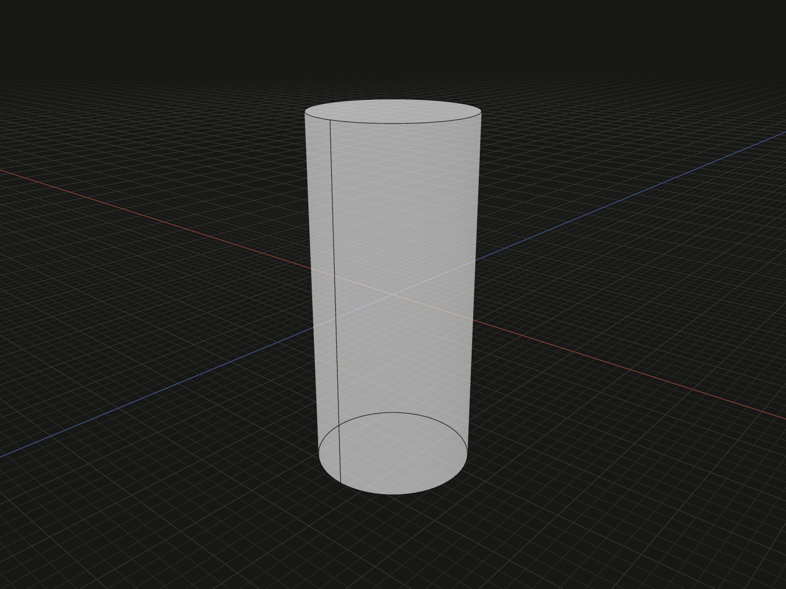

Publish named geometry and reference members on a new model value.

## Example

```ts
import {cylinder} from '@code3d/core';

const pin = cylinder(4, 18);
export const mountingPin = pin.expose({
  seat: pin.down,
  tip: pin.up,
  shaft: pin.axis,
});
```



Complete example: [groups and placement](../../../app/examples/constraints/placement-api.ts).

## Signature

```ts
model.expose<const Sources extends ElementSources>(sources: Sources):
  ModelForKind<MergedElements<Elements, ExposedElements<Sources>>, Kind>;
```

Import the functions and named types from `@code3d/core`.

## Named sources

`sources` maps property names to anchors or model references. The return keeps
the receiver's geometry and model kind, with typed properties for those names.
Existing exposed names are retained unless replaced by a new source with the
same name. Names that conflict with the model or topology API are rejected.
The input model remains unchanged.

The example publishes three mounting references. Use `mountingPin.seat` as a
bound, `mountingPin.tip` as another bound and `mountingPin.shaft` as a line anchor
in later relations. These names express a reusable part interface without
requiring callers to know its construction or topology IDs.

## Referenced values are not new models

Exposing a solid produces a `Solid` reference with topology and measurements;
a face becomes a `Surface`, an edge an `Edge`, and a vertex a `Vertex`.
Their exposed members are carried too. They support reference queries and
relations, not modeling operations such as `.fillet()` or independent export as
new solids. An exposed group supplies a frame reference and directional bounds
with its named members, without flattening its hierarchy.

A frame retains its `.origin`; an ordinary point remains a `PointAnchor`.
Sources are expressed in the receiver's local coordinates and follow that
specific occurrence through group nesting, transformations and queries.

## Instance identity and lifetime

For repeated parts, expose or select the actual instance needed by the design.
A bare source appearing more than once in an assembly can be ambiguous and is
not silently assigned to one occurrence. Exposing an existing model does not
make a mutable alias: subsequent modeling calls return separate values.

Topology references remain valid only while their selected IDs survive a
geometry edit. A preserved TypeScript member name does not guarantee that a
fillet or boolean kept the referenced topology. See [topology lineage](../topology.md#ids-belong-to-a-model).

## Related types

`ElementSources` and `NamedElements` are readonly name-to-anchor maps.
`ExposedValue<Value>` converts one source to its exposed reference type;
`ExposedElements<Sources>` applies that conversion to each property.
`MergedElements<Existing, Added>` replaces matching old keys with the new types.
`ModelForKind` preserves the receiver's geometric or group kind. Import these
types from `@code3d/core` when writing generic part libraries.

Independent [frames](frame.md) can be exposed as `FrameAnchor` references. Their
transformed origin and axes follow the containing model; the exposed reference
does not promise the original `Frame.relate()` authoring method.
