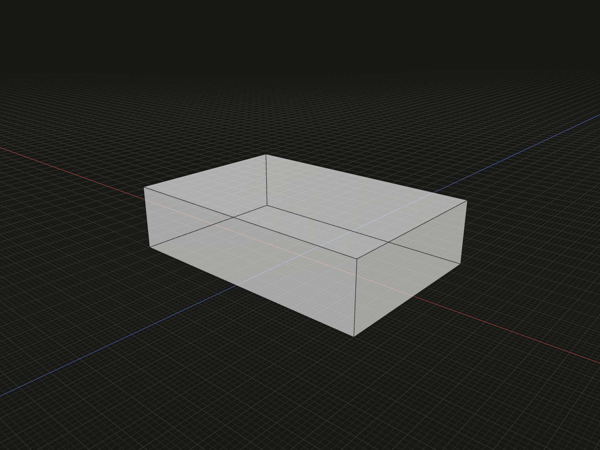

Create solids by extending planar profiles along their oriented normals. A single face produces one solid; an array produces a matching array.

## Example

```ts
import {extrude, rectangle} from '@code3d/core';

export const plate = extrude(rectangle(12, 8), 3);
```



Complete example: [shape construction](../../../app/examples/operations/shape-construction.ts).

## Signature

```ts
function extrude(face: FaceModel<{}>, distance: number): SolidModel;
function extrude(
  faces: readonly FaceModel<{}>[],
  distance: number,
): readonly SolidModel[];
// Equivalent method on a face:
face.extrude(distance);
```

Import the functions and named types from `@code3d/core`.

## Parameters and results

| Parameter        | Meaning                                                                 |
| ---------------- | ----------------------------------------------------------------------- |
| `face` / `faces` | One planar face model or a readonly array of planar face models         |
| `distance`       | Finite, non-zero signed distance in model units; required in TypeScript |

Positive distance follows each face's oriented normal; negative distance extends
in the opposite direction. A default [rectangle](rectangle.md) faces +Y, so the
example spans `[-6, 0, -4]` to `[6, 3, 4]` and has volume 288.
Unlike [box](box.md), extrusion does not center the new solid around the starting
plane. Rotating the input rotates the extrusion direction; changing its origin
does not recenter the result. Each result retains its input frame and placement.

The array overload preserves order and extrudes each face independently. It does
not fuse the results. Empty arrays return `[]`; use [union](../api.md#composition-and-boolean-operations)
when solids should be combined. Profile holes become through holes in the solid.

## Validation and editing

Non-face inputs and curved faces are rejected. Use [thicken](thicken.md) for a
curved face. Zero, nonfinite and nonnumeric distances fail; very small or invalid
geometry can also fail in the kernel.

The distance defaults to 10 only when a call is incomplete or receives `undefined`
at runtime; the TypeScript distance remains required for both function and method.
Select the distance in the App to inspect and edit its dimension along the actual
face normal. Batch inspection retains all input faces if one member fails.

## Coordinates and model values

The operation creates new geometry without modifying its inputs. References and
measurements belong to the returned model's local frame; relations participate
where the operation combines inputs. See [local coordinates](../local-coordinates.md)
and [model values](../values.md). A solid supports `.area`, `.volume`, topology
selection, Booleans and finishing operations.

## Related APIs

- [revolve](revolve.md) rotates a profile about a directed axis.
- [sweep](sweep.md) follows a path; [loft](loft.md) joins multiple sections.
