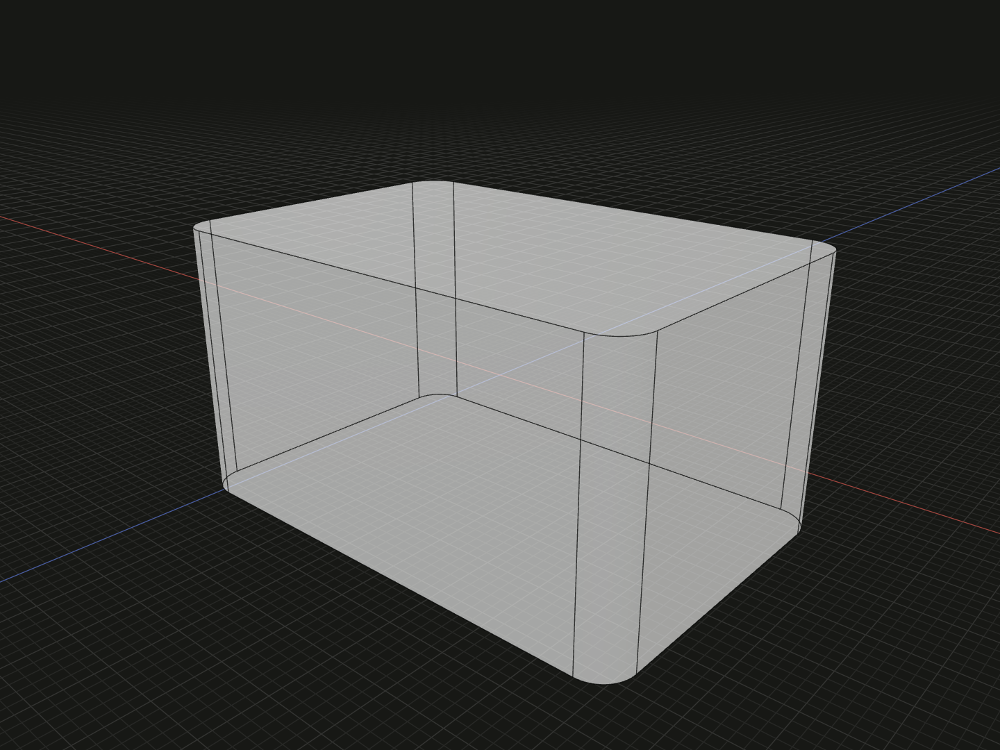

Round selected edges of a solid with a constant radius.

## Example

```ts
import {box} from '@code3d/core';

export const rounded = box(30, 16, 20).fillet(2, [2, 4, 6, 8]);
```



Complete example: [solid operations](../../../app/examples/operations/solid-operations.ts).

## Signature

```ts
model.fillet(radius: number, edgeIds?: readonly EdgeId[]): SolidModel<Elements>;
```

Import the functions and named types from `@code3d/core`.

## Parameters and result

| Parameter | Meaning                                                         |
| --------- | --------------------------------------------------------------- |
| `radius`  | Positive finite distance in model units; required in TypeScript |
| `edgeIds` | Optional readonly array of IDs from the input solid             |

Omit `edgeIds` to round all edges. An explicit empty array is rejected. Duplicate
IDs are accepted and resolved once, in the input topology's order. IDs must be
positive integers or paths of at least two positive integers; for example
`[2, 4]` selects two edges, while `[[2, 4]]` selects one inherited edge. Unknown
or retired IDs throw rather than silently selecting another edge.

The App can supply `radius = 1` while editing an incomplete call. Completed
TypeScript calls should specify the value. In the example, IDs 2, 4, 6 and 8
select the four edges parallel to Y on the input box.

## Frame, members and topology

The method returns a new `SolidModel<Elements>` and keeps the input local frame,
placement, material and exposed interface. It does not mutate the input.
Surviving one-to-one topology retains its full ID; replaced edges are retired and
new faces or edges receive fresh IDs. A preserved TypeScript interface does not
guarantee that every exposed topology reference survives the edit.

Pick the next operation's IDs from the current result. See
[topology lineage](../topology.md#ids-belong-to-a-model). The method is available
on solids only; it is not a free function and cannot round a standalone curve.

## Geometry limits

A positive value is not enough to guarantee a buildable result. Small faces,
tight corners, interacting modifications and excessive `radius` can cause
degenerate or self-intersecting geometry. The kernel may propagate an edge
selection along tangent contours. Failures identify the requested edges and
amount, and may report that contour expansion.

Try a different amount or a smaller edge selection when construction fails.
A chamfer creates a flat bevel instead of a rounded transition; see [chamfer](chamfer.md).
Use [shell](shell.md) to create hollow walls.
