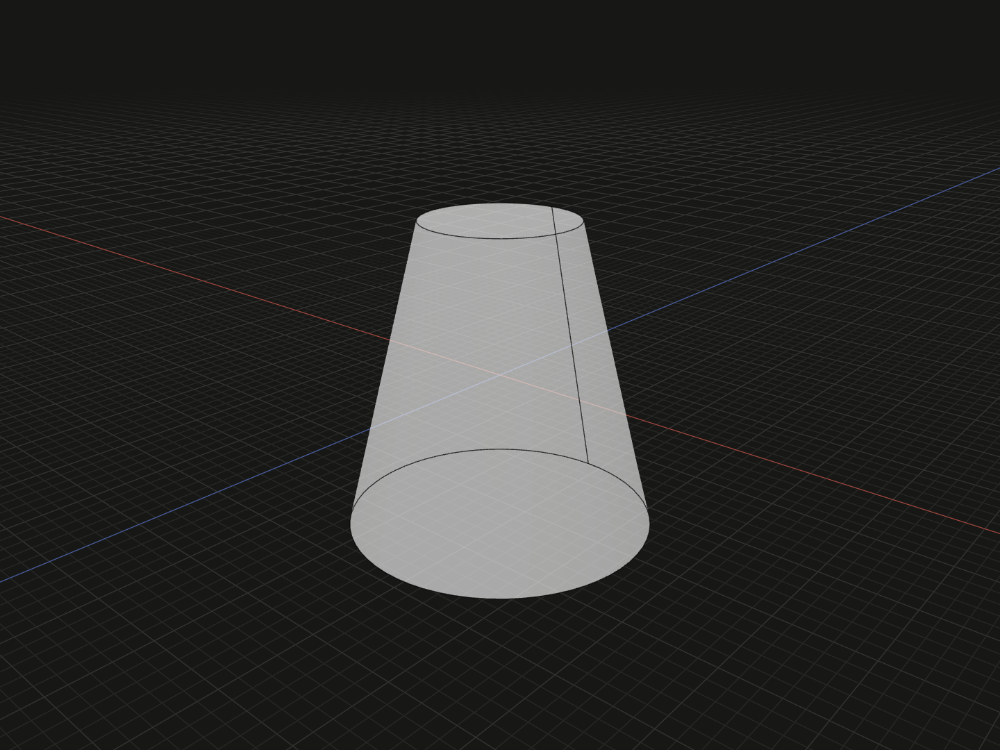

Create a solid circular taper between two parallel ends. Use it for a tapered boss, funnel blank or draft-shaped cutting tool.

## Example

```ts
import {frustum} from '@code3d/core';

export const taperedCylinder = frustum(6, 3, 12);
```



Select `taperedCylinder` in the App to inspect this solid. Select a numeric argument
and press Tab to edit it.

Complete example: [basic shapes](../../../app/examples/primitives/primitives.ts).

## Signature

```ts
function frustum(
  bottomRadius: number,
  topRadius: number,
  y: number,
): SolidModel;
```

Import `frustum` and, when needed, `type SolidModel` from `@code3d/core`.
The same call works in the App and Node; Node initializes the kernel automatically.

## Parameters

| Parameter      | Meaning                                  | Accepted values              |
| -------------- | ---------------------------------------- | ---------------------------- |
| `bottomRadius` | Radius at the lower end, `Y = -y / 2`    | Finite and greater than zero |
| `topRadius`    | Radius at the upper end, `Y = y / 2`     | Finite and greater than zero |
| `y`            | Full distance between the two end planes | Finite and greater than zero |

All parameters are required in TypeScript. Lengths use the model's common units;
see [export scale](../../../web/src/content/docs/docs/guides/exporting.md#scale-and-orientation).

## Result and coordinates

Returns a `SolidModel<CanonicalElements>` whose axis runs along +Y. Both
end centers lie on this axis; the local origin is halfway between their planes.
For the example, the bottom end has radius 6 at `Y = -6` and the top end has
radius 3 at `Y = 6`.

With `r = Math.max(bottomRadius, topRadius)`, X and Z span `-r` to `r`,
and Y spans `-y / 2` to `y / 2`. The example bounds are
`[-6, -6, -6]` to `[6, 6, 6]`. The initial `.center` is the bounding-box
center at the origin; it is not the tapered solid's center of mass.

The usual tapered result has two circular planar end faces and one conical
side face. `topRadius` may be larger than `bottomRadius`, creating a taper
that widens toward +Y. Equal radii produce a cylindrical shape; use
[`cylinder`](cylinder.md) when no taper is needed.

The solid provides frame, origin, center, axis and directional bound references.
It supports Boolean operations, fillets, chamfers, shelling, materials and relations.
Derived operations return new model values; see [model values](../values.md)
and [local coordinates](../local-coordinates.md).

## Measurements

Volume is
`Math.PI * y * (bottomRadius ** 2 + bottomRadius * topRadius + topRadius ** 2) / 3`.
The example has volume `252 * Math.PI`, approximately `791.681349`.
Use `.area` for the complete surface, including both circular ends.

## Validation and editing defaults

Both radii and the height must be positive finite numbers. In particular,
`topRadius = 0` and `bottomRadius = 0` are rejected: this API does not accept
a pointed cone. Invalid dimensions report the parameter name followed by
`must be a positive finite number.`. Numeric strings and `null` are not converted.

For more than two planar sections, use [loft](../api.md#profiles-and-curves).
For a pointed cone, define a [custom primitive](../custom-primitives.mdx).

While an incomplete call is being edited, omitted or `undefined` arguments use
`bottomRadius = 5`, `topRadius = 3` and `y = 10`. These runtime defaults let the editor
complete a call; they do not remove the required TypeScript arguments.
The resulting dimensions must still satisfy all constraints.
Very small dimensions or clearances can also encounter the modeling kernel's tolerance.

## Related APIs

- [cylinder](cylinder.md) has a constant circular radius.
- [tube](tube.md) creates an open straight bore.
- [loft](../api.md#profiles-and-curves) joins multiple planar sections.
- [Solid primitives](../api.md#solid-primitives) compares the available starting shapes.
