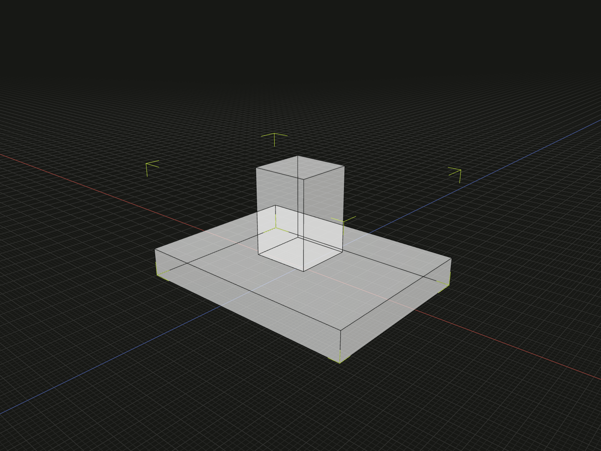

Compose models into an assembly while preserving separate members and their hierarchy.

## Example

```ts
import {box, group, on} from '@code3d/core';

const standBase = box(32, 4, 24);
const standPost = box(8, 12, 8).relate(() => on(standBase.up));
export const stand = group([standBase, standPost], 'Stand');
```



Complete example: [groups and placement](../../../app/examples/constraints/placement-api.ts).

## Signature

```ts
function group(children: readonly Model[], name?: string): GroupModel;
```

Import the functions and named types from `@code3d/core`.

## Members and result

`children` is a readonly array of models: solids, faces, curves, points or nested
groups. An empty array is valid. A topology or anchor reference is not a model
and cannot be added as an independent child. `name` is an optional display name,
defaulting to `Group`.

Relations are solved at the composition boundary. The resulting `GroupModel`
retains each separate part, material and nested hierarchy. This does not fuse
geometry or remove internal overlaps; use [union](union.md) for a boolean solid.
The example contains two solids and puts the post's bottom against the base's top.

## Coordinate frame

A nonempty group inherits its first member's solved local frame, including its
origin and axes. Reordering members can therefore change the result coordinates
without changing the intended relative placement. A nested group is one complete
member; its children are not flattened to choose the outer origin. An empty group
has the default frame and no finite geometric bounds.

## Group capabilities

Groups provide `origin`, `frame`, directional bounds, [bounds](../api.md#geometry-measurements),
`position`, [relate](relate.md), [expose](expose.md), material, originOffset,
originPoint and [model.rotate](model-rotate.md). Origin edits and rotation act on
the already assembled layout, preserving member relationships. Groups do not
provide aggregate topology IDs, geometric `center`, `axis`, area, volume,
originVertex, originCenter, scaling or solid modifications.

Use `expose({name: member})` to publish typed member references. Merely naming a
local variable does not add it to the group interface. Repeated use of one source
requires a specific instance reference when later queries would be ambiguous.

The constructor returns a new value; it does not alter its members. Invalid
children or unsatisfiable member relations report errors during composition.
See [local group coordinates](../local-coordinates.md#group-origins).
