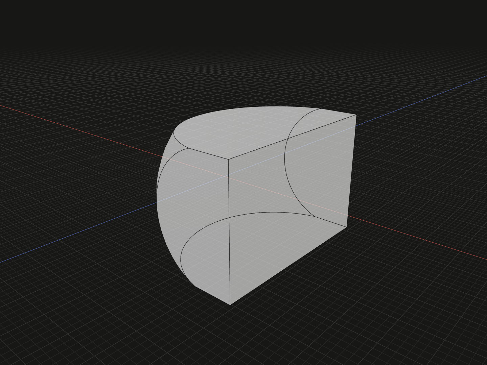

Keep the solid volume shared by all operands.

## Example

```ts
import {box, intersect, sphere} from '@code3d/core';

const block = box(18, 12, 18);
const ball = sphere(11).originOffset(-7, 0, 0);
export const shared = intersect([block, ball]);
```



Complete example: [solid operations](../../../app/examples/operations/solid-operations.ts).

## Signature

```ts
function intersect(operands: readonly SolidModel<{}>[]): SolidModel;

// SolidModel method:
solid.intersect(operands: SolidModel<{}> | readonly SolidModel<{}>[]): SolidModel;
```

Import the functions and named types from `@code3d/core`.

`block.intersect(ball)` and `block.intersect([ball])` are equivalent to
`intersect([block, ball])`. The method accepts one solid or a nonempty array of
additional solids, with the receiver as the first operand. The free function
continues to take an array containing all operands.

## Operands and result

The free function's `operands` array must contain at least two solid models. All inputs participate in the
same intersection: with three operands, only volume inside all three survives.
The result is not a list of pairwise intersections.

The inputs are immutable. Relations between operands are solved together before
geometry is combined. The result retains the first input's local frame,
placement, material and origin; for `cut`, that input is the stock. The result
is a new `SolidModel` with canonical references, not a group with named members.
Use [group](../api.md#composition-and-boolean-operations) to retain separate parts.

Input arrays describe one operation. They do not apply the operation independently
to each element. Topology inherited one-to-one from an input is prefixed by its
one-based operand position, for example `[1, 4]`; split, merged and newly generated
topology receives new IDs. Inspect the result before using its edge or surface IDs
in a later operation. See [topology IDs](../topology.md#ids-belong-to-a-model).

## A common volume is required

Disjoint solids, or solids touching only at a face, edge or point, have no common
solid volume. These cases throw a diagnostic rather than returning an empty model.
For more than two operands, overlap must survive each additional input.
Coincident or degenerate features can also prevent the kernel from completing
an intersection.

Use [cut](cut.md) to remove shared volume,
or [union](union.md) to keep every operand's volume. Select the operands argument
or the method receiver in the App to inspect the positioned inputs and
highlighted common region. An empty array of method operands throws.
