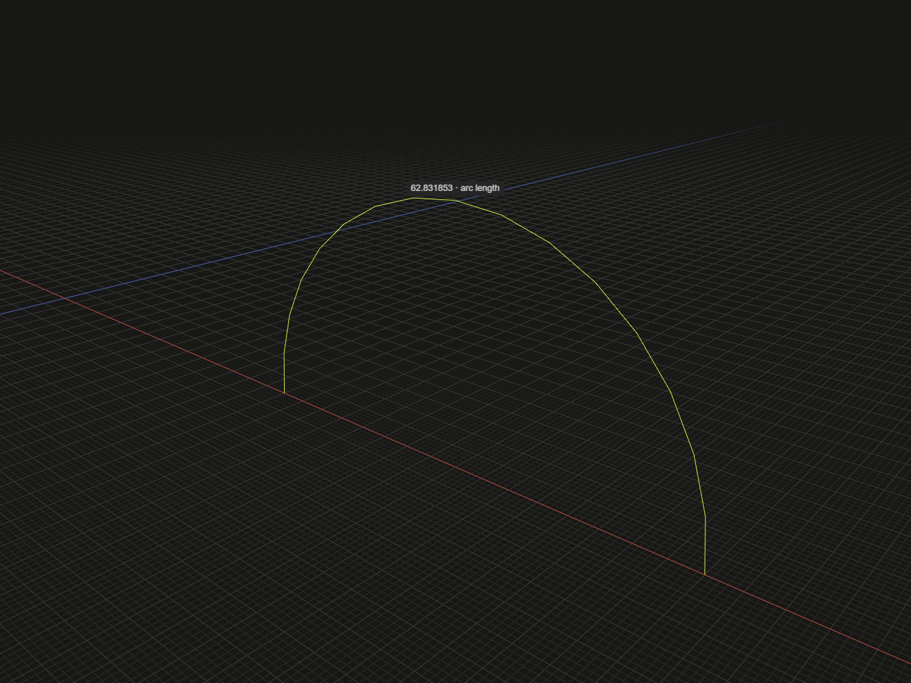

Read the actual arc length of an edge model or finite edge reference.

## Example

```ts
import {arc, circle, group, line} from '@code3d/core';

const straight = line([0, 0, 0], [30, 40, 0]);
const curved = arc([20, 0, 0], [0, 20, 0], [-20, 0, 0]).originOffset(-60, 0, 0);
const ring = circle(18).originOffset(-115, 0, 0);

// Select each .length to inspect the measured edge and its read-only value.
const straightLength = straight.length; // 50
const arcLength = curved.length; // 20 * Math.PI, not the endpoint distance
const circumference = ring.edges()[0].length; // 36 * Math.PI

export default group([straight, curved, ring]);
```



Complete example: [measurement example](../../../app/examples/operations/length.ts).

## Signature

```ts
edgeModel.length: number;
edgeReference.length: number;
```

Import the functions and named types from `@code3d/core`.

## Receivers and units

`EdgeModel` and [Edge](edge.md) expose a readonly `length`. The value is a plain
number in model units. A straight edge measures its endpoint distance; curves
measure their actual path, including the whole circumference of a closed edge.
For the example: straight length is 50, semicircle length is `20 * Math.PI`, and
the ring's single edge length is `36 * Math.PI`.

A face model does not have a perimeter getter. Select its edges and sum their
lengths when that is the desired measurement. Groups and generic `LineAnchor`
references do not provide length: the latter may represent an infinite axis.
Select finite edge geometry instead.

## Transforms and references

Origin edits, rotations and placement preserve length. Positive uniform
[scaled](scaled.md) multiplies it by the scale factor. Exposed edge references
include the scale of their actual geometry. [reverse](flip-reverse.md) changes
reference direction without changing the length.

The result is computed when read; it does not update a previously assigned number
when a new model value is constructed. Re-evaluating source reads the current
value. Numerical measurements can differ from an analytic value by floating-point
tolerance. No editable constraint is created by this getter.

## Inspection

Select `.length` in App to highlight the measured finite path. Straight edges
show an endpoint dimension; curves show an arc-length label. A curve's parameter
midpoint need not be its half-length point. Use [distance](distance.md) between
`start` and `end` for the endpoint chord instead of the path length.
