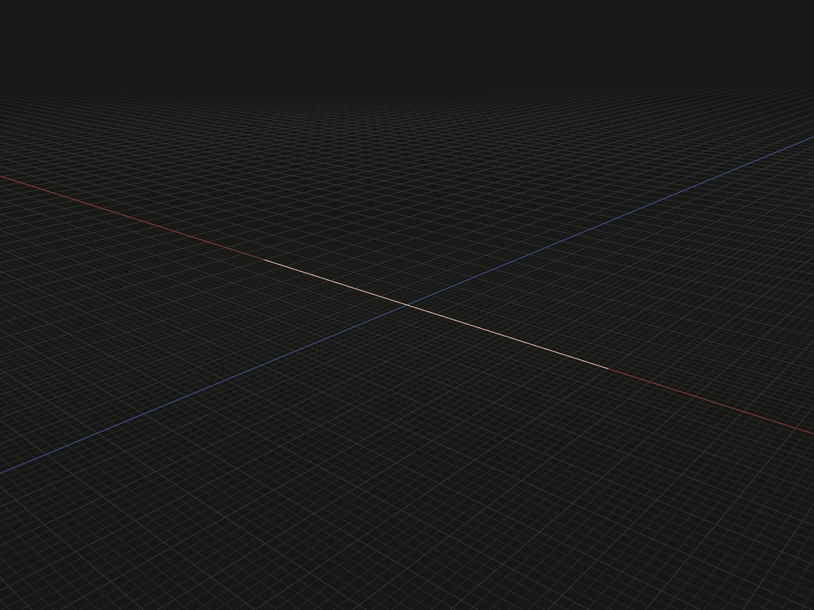

Connect two local positions with a finite straight edge. Use a line as geometry, a straight sweep path or a directed axis for a rotational operation.

## Example

```ts
import {line} from '@code3d/core';

export const straightLine = line([-6, 0, 0], [6, 0, 0]);
```



Select `straightLine` in the App to inspect the geometry.

Complete example: [basic shapes](../../../app/examples/primitives/primitives.ts).

## Signature

```ts
function line(end: Vec3): EdgeModel;
function line(start: Vec3, end: Vec3): EdgeModel;
```

Import the function and any named types above from `@code3d/core`.
The same call works in the App and Node; Node initializes the kernel automatically.

## Parameters

| Call               | Meaning                              |
| ------------------ | ------------------------------------ |
| `line(end)`        | Connect `[0, 0, 0]` to `end`         |
| `line(start, end)` | Connect the two supplied coordinates |

Each coordinate is a `readonly [x, y, z]` tuple of finite numbers. The endpoints
must differ. There is no zero-argument overload and no implicit endpoint.
Lengths use the model's common units.

## Result and coordinates

The result is an `EdgeModel<CurveElements>`. It has one finite edge, two endpoint
vertices and no filled area or solid volume. The example is 12 units long.
Its `.bounds()` runs from `[-6, 0, 0]` to `[6, 0, 0]`.

The model origin stays at `[0, 0, 0]`, including when both endpoints are away
from zero. `line([10, 0, 0])` has `.center` at `[5, 0, 0]`; its origin is still
zero. Rotating that model by `.rotate(0, 90, 0)` sends its end to `[0, 0, -10]`.
The line's tangent does not replace the model's local XYZ axes.
See [local coordinates](../local-coordinates.md).

`.start`, `.midpoint` and `.end` are point references. For a straight line,
`.midpoint` is the arithmetic midpoint of the endpoints and coincides with
`.center`, its bounding-box center. `.length` is the Euclidean endpoint distance.
References are used for placement, not read as coordinate arrays.

The directed line runs from `start` to `end` and may be used directly where a
straight `LineAnchor` is accepted, such as a revolution axis. `.reverse()` returns
an `Edge` reference with reversed direction; it does not construct a new edge model.
The finite length does not limit the extent of an axis used by another operation.
For a sweep, the profile's origin and normal must already match the path's start
and direction; see [path sweeps](../api.md#path-sweeps).

## Validation and editing

All coordinates must be finite. Coincident endpoints are rejected with
`line requires at least two distinct points.` Very short edges may also encounter
the modeling kernel's tolerance. Both overloads require their coordinate tuples
in TypeScript; no runtime default supplies a missing endpoint.

The App can edit coordinate components through the numeric parameter tool.
The model supports edge and vertex selection, transforms, materials and relations;
see [model values](../values.md).

## Related APIs

- [point](point.md) creates a single vertex.
- [arc](arc.md) passes a circular edge through three positions.
- [bezier](bezier.md) and [spline](spline.md) create curved paths.
- [Rotational solids](../api.md#rotational-solids) explains directed-axis use.
