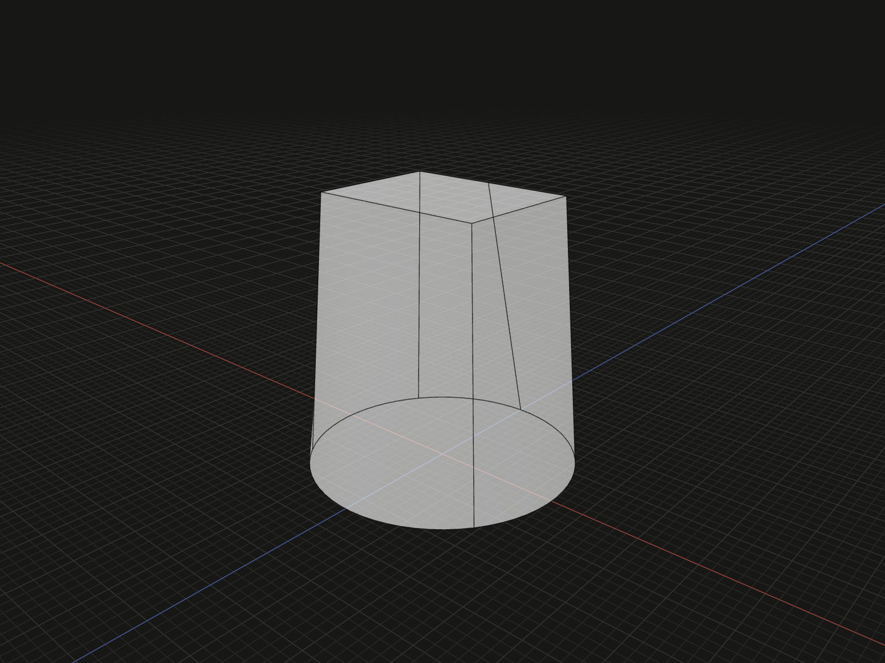

Build one solid through an ordered sequence of planar sections. A loft can change the profile shape, size, position and orientation along its length.

## Example

```ts
import {circle, loft, rectangle} from '@code3d/core';

const lower = circle(6);
const upper = rectangle(8, 6).originOffset(0, -12, 0);
export const transition = loft([lower, upper]);
```



Complete example: [shape construction](../../../app/examples/operations/shape-construction.ts).

## Signature

```ts
function loft(
  sections: readonly FaceModel<{}>[],
  options?: LoftOptions,
): SolidModel;
type LoftOptions = Readonly<{spine?: EdgeModel<{}>; ruled?: boolean}>;
```

Import the functions and named types from `@code3d/core`.

## Parameters and options

| Input           | Meaning                                                                                    |
| --------------- | ------------------------------------------------------------------------------------------ |
| `sections`      | At least two planar filled face models, in loft order                                      |
| `options.spine` | Optional curve guiding how the sections are associated along a path                        |
| `options.ruled` | Defaults to `false`; without a spine, use ruled rather than smooth transitions when `true` |

With a spine, the pipe-shell construction follows that spine; `ruled` does not
alter this branch. There is no equivalent `face.loft()` method.

The example joins a radius-6 circular face at Y = 0 to an 8-by-6 rectangular face
at Y = 12. Profiles need not have identical outlines or lie in parallel planes.
Their actual positions and orientations are inputs, not merely a list of shapes
to be automatically stacked. See the [bent three-section example](../../../app/examples/operations/loft.ts).

## Coordinates, holes and topology

All sections and the optional spine participate in the same placement solve.
The result inherits the **first section's** local frame and placement; reordering
sections can therefore change the result coordinates as well as the loft path.

Sections must have matching hole counts. Zero or one hole per section is supported;
multiple holes require explicit contour correspondence that is not exposed here.
The operation closes the end sections to produce a solid. Generated topology
retains available section provenance; inspect the result instead of assuming
that its surface numbering matches one input. See [topology selection](../topology.md).

## Validation and inspection

Fewer than two sections report `loft requires at least two planar sections.`
Each section must be a face model; a supplied spine must be an edge model.
Invalid geometry, incompatible section placement or a failed spine association
can prevent the kernel from making a solid. The API has no automatic fallback
that repositions failed sections.

App inspection distinguishes the sections from the spine and preserves their
editable context when construction fails. Numeric profile and placement controls
remain on the expressions that define those inputs.

## Coordinates and model values

The operation creates new geometry without modifying its inputs. References and
measurements belong to the returned model's local frame; relations participate
where the operation combines inputs. See [local coordinates](../local-coordinates.md)
and [model values](../values.md). A solid supports `.area`, `.volume`, topology
selection, Booleans and finishing operations.

## Related APIs

- [sweep](sweep.md) keeps one section along a path.
- [extrude](extrude.md) extends one planar profile along its normal.
