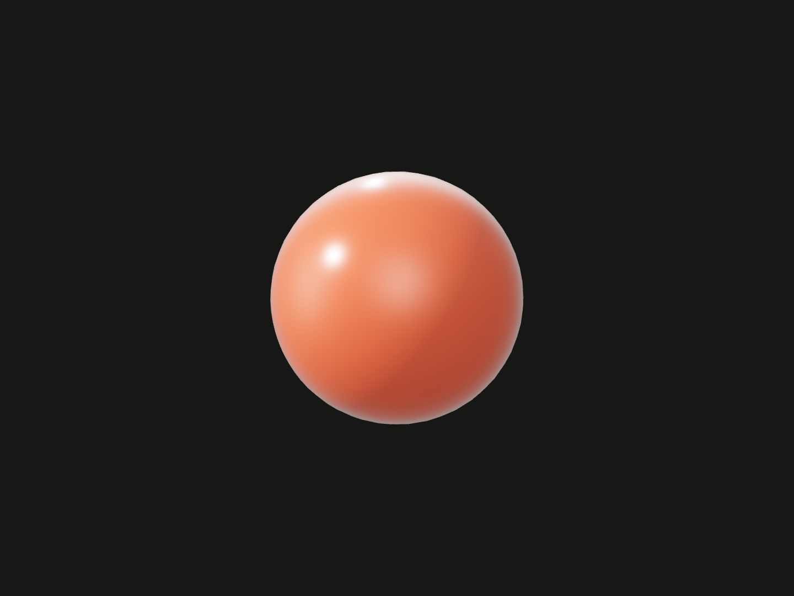

Capture a color or native Three.js material on a new model value.

## Example

```ts
import {box, sphere} from '@code3d/core';
import {MeshPhysicalMaterial} from '@code3d/core/three';

export const plain = box(16, 16, 16).material('#8ed5d1');
export const lacquered = sphere(9).material(
  new MeshPhysicalMaterial({
    color: '#eb633e',
    roughness: 0.25,
    metalness: 0.1,
    clearcoat: 1,
    clearcoatRoughness: 0.12,
  }),
);
```



Complete example: [appearance example](../../../app/examples/materials.ts).

## Signature

```ts
model.material(value: Material | string): ModelForKind<Elements, Kind>;
```

Import model constructors from `@code3d/core`; import `Material` and native material classes from `@code3d/core/three`.

## Receivers and result

Every model kind, including groups, provides `material`. It returns a new model
with the same geometry, model kind and named references. It does not change the
receiver's shape, topology, origin or placement. The argument is a color string
or a native Three.js `Material` from [@code3d/core/three](three.md), not an arbitrary
options object. Invalid colors and unsupported material data throw.

A call captures the complete material and loaded texture pixels at that moment.
Later mutation of the Three.js object, uniforms or image buffers does not update
the model. Assigning again replaces the whole previous material; fields are not
merged. Construct the desired material first, then apply it.

## Groups and inheritance

Assigning to an outer group replaces appearance throughout its subtree, including
nested members with earlier materials. Parts used elsewhere remain unchanged.
A color string selects each geometry kind's default material, so it can uniformly
color a mixed group of solids, curves and points. A native material should match
the geometry being rendered: mesh materials for solids/faces, line materials for
curves and `PointsMaterial` for vertices.

This is a model-level assignment, not a topology-face paint operation. A selected
`Surface` or `Edge` reference does not expose `material`. See [union](union.md),
[cut](cut.md) and [intersect](intersect.md) for material inheritance when creating
new boolean results.

## Color strings

Common forms include CSS color names, `transparent`, `#RGB`, `#RGBA`, `#RRGGBB`,
`#RRGGBBAA` and RGB/RGBA strings. Alpha hex is last, so `#f008` equals
`#ff000088`. `rgba(255, 0, 0, 0.5)` and `rgb(100% 0% 0% / 50%)` both express
half-opaque red; RGB/RGBA alpha is clamped to 0–1. `transparent` means fully
transparent black.

Legacy comma-separated HSL/HSLA also works, for example `hsl(0, 100%, 50%)`
and `hsla(0, 100%, 50%, 0.5)`. Use a numeric HSLA alpha between 0 and 1.
Modern HSL slash-alpha and percentage-alpha forms are not supported: the current
parser can accept them while ignoring their intended transparency. These are
parsed color values, not CSS expressions; do not pass variables such as
`var(--color)` or expect a DOM theme.

A string replaces the complete material using the appropriate default material;
it is not shorthand for changing only the color field of an earlier native
material. Native materials use their `opacity` and `transparent` settings.
Use both when authoring ordinary transparency, for example
`new MeshStandardMaterial({color: '#ff0000', opacity: 0.5, transparent: true})`.

## Preview and exported appearance

App Modeling mode uses preview copies for selection/emphasis. Render mode and
PNG output show the authored material under the scene's lighting. The same color
can look different under different lighting or roughness; geometry dimensions
and physical material properties are not changed by appearance.

STEP and 3MF carry base color and opacity; STL carries geometry only. Shaders
and textures are displayed in PNG rather than encoded as those CAD/mesh material
representations. See the [exporting guide](../../../web/src/content/docs/docs/guides/exporting.md).

For texture mapping, loaded images and unsupported serialization features, see
[Three.js integration](three.md). For common plastic, rubber, metal, glass,
ceramic and paint surfaces, use [@code3d/materials presets](../../../materials/docs/presets.md).
They produce native materials accepted by the same method.
