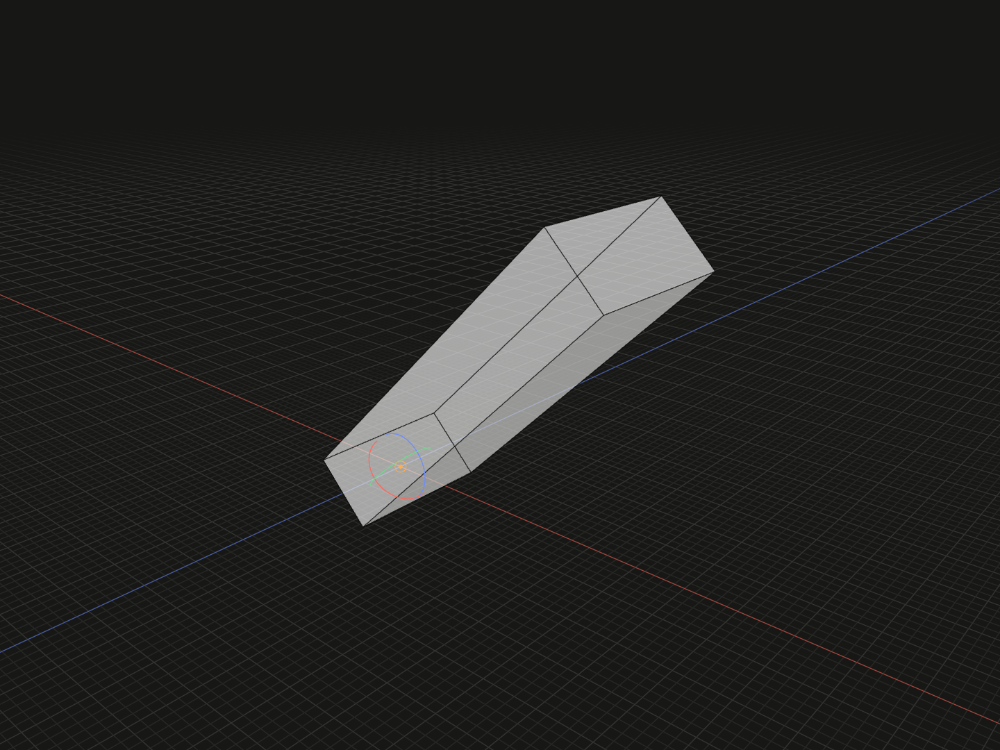

Rotate model geometry around its current local zero, preserving its model coordinate axes.

## Example

```ts
import {box} from '@code3d/core';

export const rotated = box(20, 4, 8).originOffset(-10, 0, 0).rotate(0, 0, 45);
```



Complete example: [origins and local transforms](../../../app/examples/operations/local-transforms.ts).

## Signature

```ts
model.rotate(x: number, y: number, z: number): ModelForKind<Elements, Kind>;
```

Import the functions and named types from `@code3d/core`.

## Angles and order

`x`, `y` and `z` are finite angles in degrees. All three are required in
TypeScript; the App can use zero for missing components in an incomplete call.
Negative and multi-turn angles are accepted.

Within one call, rotations act in fixed local X, then Y, then Z order. Positive
angles follow the right-hand rule. For example, rotating `[10, 0, 0]` by
`(0, 90, 0)` gives `[0, 0, -10]`. Successive method calls apply in written order;
rotations around different axes generally do not commute.

## Pivot and coordinates

The pivot is current local `[0, 0, 0]`. First choose a different zero with
[originPoint](origin-point.md), [originVertex](origin-vertex.md),
[originOffset](origin-offset.md) or [originCenter](origin-center.md) if needed.
In the example, rebasing puts the box's left-end center at zero before the 45°
rotation.

The geometry, geometric references and exposed members rotate together. The
model frame's local XYZ axes do not rotate; its `up` bound still means local +Y.
A face normal or an edge tangent can point in a different direction. Length,
area and volume stay the same, while axis-aligned bounds may change.

## Groups and value behavior

All models, including groups, support this method. A group rotates its assembled
layout as a whole, retaining nested membership and internal relative placement.
The method returns a new model of the same kind and exposed interface. The input
is unchanged, and topology IDs are preserved.

Use the standalone [rotate transformation](../api.md#independent-placement-transformations)
inside `relate` to rotate a placed part. Pivot and axis selection chains belong
to that placement API; they are not methods chained from `model.rotate()`.
