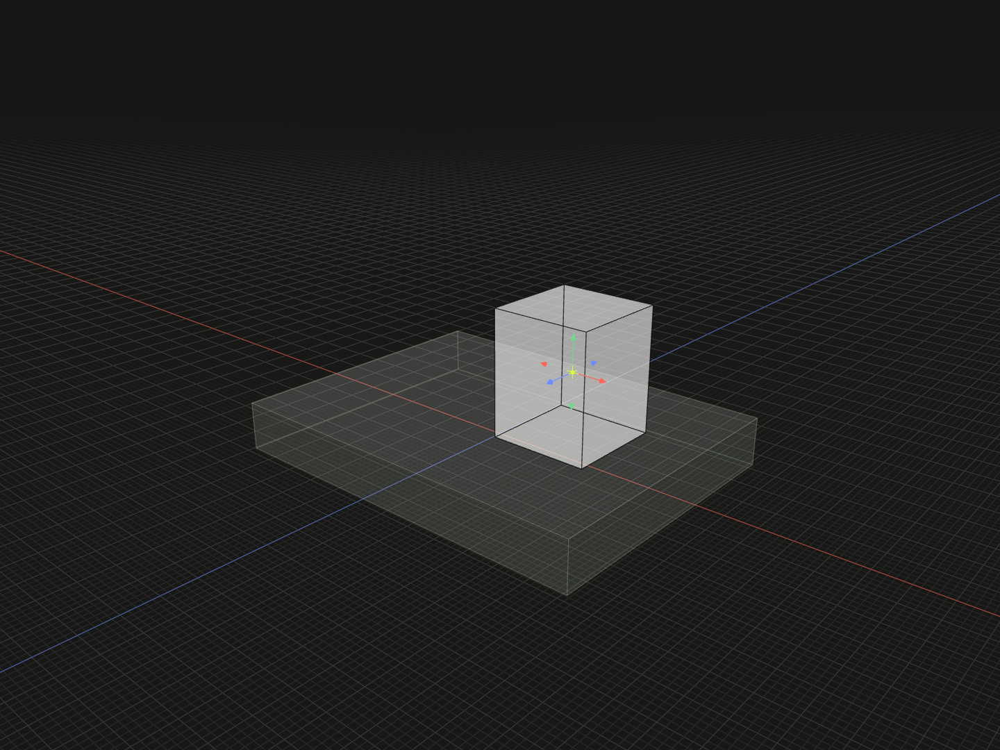

Translate a placement result along fixed composition axes.

## Example

```ts
import {box, group, offset, on} from '@code3d/core';

const shiftBase = box(32, 4, 24);
const shiftPart = box(8, 10, 8).relate(() => [
  on(shiftBase.up),
  offset(7, 0, 0),
]);
export const shiftedAssembly = group([shiftBase, shiftPart]);
```



Complete example: [groups and placement](../../../app/examples/constraints/placement-api.ts).

## Signature

```ts
function offset(x: number, y: number, z: number): Transformation;
```

Import the functions and named types from `@code3d/core`.

## Fixed axes

`x`, `y` and `z` are signed distances in model units along the fixed axes of the
composition's solve frame. They do not follow the moving part's orientation and
are not necessarily the viewport's world axes. The same convention applies
regardless of which argument of an `on` or `align` constraint names self.

The example first places the part on the base, then moves it 7 units along the
composition's +X direction. An offset in Y could leave a gap or move the part
into the base; previous contact conditions are not re-enforced after the step.
A nested group carries its placement frame into the enclosing composition.

There is no `model.offset()` method. To change local geometry coordinates, use
[originOffset](origin-offset.md); to place a part, use this transformation inside
`relate`.

## Placement value and sequence

The constructor returns a complete `Transformation` for [relate](relate.md).
It describes placement and does not change standalone model geometry. Place it
after an intended contact or alignment. Array entries execute in order; a later
constraint starts another solve segment. A zero value leaves the preceding pose
unchanged and does not add a condition.

A completed transformation has no chained offset, rotate or pivot methods.
Write separate entries such as `[on(...), offset(...), rotate(...)]`. Groups
transform as complete rigid assemblies. Angles and displacements are finite;
TypeScript requires the numeric arguments, while the App editing defaults are
zero for missing components.
