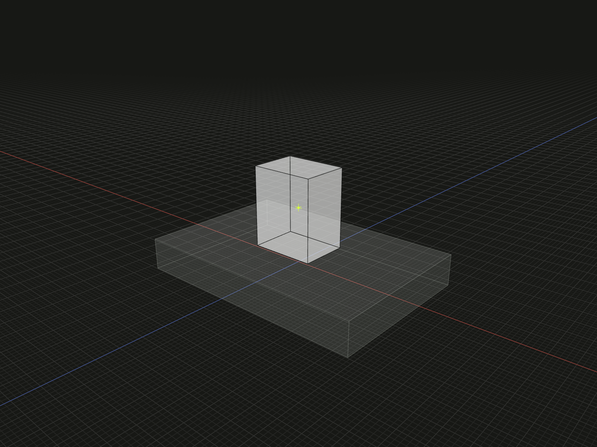

Translate finite geometry into contact with a directed bound without changing its orientation.

## Example

```ts
import {box, group, on} from '@code3d/core';

const bed = box(30, 4, 20);
const contactPart = box(8, 10, 6).relate(() => on(bed.up));
export const contactAssembly = group([bed, contactPart]);
```



Complete example: [groups and placement](../../../app/examples/constraints/placement-api.ts).

## Signature

```ts
function on(target: Bound): Constraint;
function on(source: Anchor, target: Bound): Constraint;
```

Import the functions and named types from `@code3d/core`.

## Overloads and target bounds

`on(target)` uses the whole current model as source and must run inside a model
[relate](relate.md) callback. The explicit form chooses a finite model, vertex,
edge, surface or other finite geometric reference as source. The target must
be a directional `Bound`, such as `up`, `down`, `left`, `right`, `front` or `back`.
A plain plane or line anchor is not a target bound.

The source's matching extent is translated into contact with the target bound.
For `on(base.up)`, the moving part's lower extent meets the base's upper bound.
The example places the part center at Y = 7: base top is 2 and part half-height
is 5. Contact does not fuse the two solids.

## Translation only

`on` constrains translation along the target bound direction; it does not rotate
self or center it on the target in the other directions. Add other bounds for
additional translation conditions or [align](align.md) for geometric orientation.
Finite extents are evaluated in the bound's directed frame. Flipping the target
bound reverses the directed contact sense while retaining the boundary.

Either side may refer to self: `on(base, self.up)` is meaningful too. The solver
still places the callback's self. Each constraint returned by `relate` must
involve self; external variables keep their old identity. A source without finite
geometry or a target without a bound produces an error.

## Joint constraints and adjustments

Multiple consecutive contacts solve together; contradictory positions fail.
An [offset](offset.md) after the joint solve moves along fixed composition axes,
regardless of which side names self. It can create a gap or move away from contact.
Return `[on(...), offset(...)]`; `Constraint` has no chained offset or rotate
methods. For touching actual supporting curves or surfaces, use [align](align.md).
