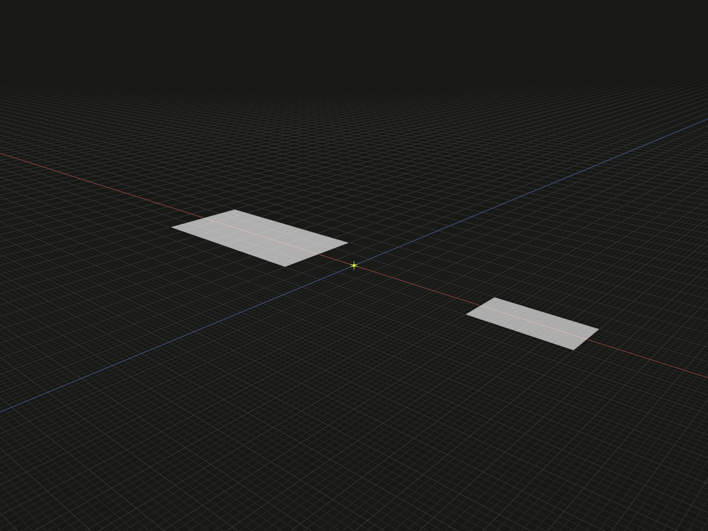

Put the current geometric bounding-box center at local zero, for one model or a complete array layout.

## Example

```ts
import {originCenter, rectangle} from '@code3d/core';

const left = rectangle(8, 4);
const right = rectangle(4, 2).originOffset(-14, 0, 0);
export const centeredLayout = originCenter([left, right]);
```



Complete example: [origins and local transforms](../../../app/examples/operations/local-transforms.ts).

## Signature

```ts
// CenterableModel means a geometric model with originCenter(); groups are excluded.
function originCenter<T extends CenterableModel>(model: T): T;
function originCenter<const T extends readonly CenterableModel[]>(
  models: T,
): {readonly [Index in keyof T]: T[Index]};
// Equivalent single-model method:
model.originCenter(): ModelForKind<Elements, Kind>;
```

Import the functions and named types from `@code3d/core`.

## One model

The single argument may be a solid, face, edge or vertex model. The free function
and instance method have the same behavior: recompute the center of the current
local axis-aligned geometric bounds and shift it to zero. The method has no
parameters. It is not a center-of-mass calculation.

A geometry edit or rotation can change the bounding-box center. The carried
`model.center` reference does not get replaced by that newly computed point.
Use [originPoint(model.center)](origin-point.md) when the stable center reference
is the intended origin.

## An array is one layout

For multiple models, relations and member frames are solved together. Bounds are
computed for the complete layout in the first member's frame, then every member
is expressed in a common frame centered on that box. Order, shape kinds, exposed
types and spacing are retained. The return is a readonly array, not a group.

The example has total X bounds `[-4, 16]` before centering. Both rectangles shift
by -6 along X, giving combined bounds `[-10, 10]`; they remain separated. Calling
`.originCenter()` on each item separately would lose that layout.

The solved member placements are already represented in the resulting geometry;
the input relations are not applied a second time. This is useful for centering
all faces of a [text layout](../text.md) without centering each letter separately.
A one-element array behaves like the instance method. Empty arrays return `[]`.

## Supported values

Groups are excluded because they do not provide geometric `originCenter()`.
Use a geometric array before grouping, or choose an explicit group origin with
[originPoint](origin-point.md) or [originOffset](origin-offset.md).
`CenterableModel` above is an explanatory local alias, not an exported Core type.

## Value and reference behavior

The operation returns a new model with the same kind and exposed member types.
The original value and previously selected references keep their meaning.
Topology IDs are preserved. Geometry and named references are transformed
together; `model.origin` and `model.frame.origin` on the result still refer to
its local zero. Origin changes preserve directions, lengths, areas and volumes.

These operations work in the receiver's local coordinates. A relation's
[offset](../api.md#independent-placement-transformations) places a part in a
composition; it is a separate operation. For an already related model, its own
geometry references in stored placement conditions are transformed consistently.
See [local coordinates](../local-coordinates.md) for assembly frame rules.
