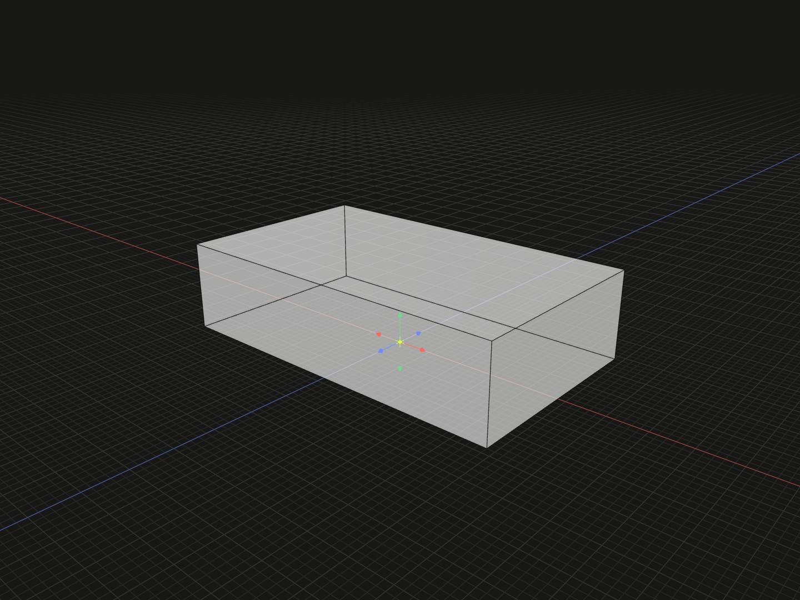

Choose a new local zero by a displacement in the input model coordinates.

## Example

```ts
import {box} from '@code3d/core';

export const bottomZero = box(24, 6, 14).originOffset(0, -3, 0);
```



Complete example: [origins and local transforms](../../../app/examples/operations/local-transforms.ts).

## Signature

```ts
model.originOffset(dx: number, dy: number, dz: number): ModelForKind<Elements, Kind>;
```

Import the functions and named types from `@code3d/core`.

## Displacement and coordinates

`dx`, `dy` and `dz` are finite distances in model units. TypeScript requires all
three; the App can fill omitted components with zero while editing.

If the chosen displacement is `d`, each point changes from `p` to `p - d`.
A positive origin displacement therefore reduces geometry coordinates on that
axis. The example chooses the center of the box's bottom as zero: its Y range
changes from `[-3, 3]` to `[0, 6]`.

Successive offsets add; opposite offsets cancel. The shape and distances between
its points do not change. Use [originPoint](origin-point.md) when the desired zero
is an existing point reference, or [originCenter](origin-center.md) for the current
geometric bounding-box center.

## Groups

All models support `originOffset`, including empty and nested groups. A group is
rebased as one already assembled layout. Member spacing and internal placement
are retained; the operation does not recenter each member independently.

## Value and reference behavior

The operation returns a new model with the same kind and exposed member types.
The original value and previously selected references keep their meaning.
Topology IDs are preserved. Geometry and named references are transformed
together; `model.origin` and `model.frame.origin` on the result still refer to
its local zero. Origin changes preserve directions, lengths, areas and volumes.

These operations work in the receiver's local coordinates. A relation's
[offset](../api.md#independent-placement-transformations) places a part in a
composition; it is a separate operation. For an already related model, its own
geometry references in stored placement conditions are transformed consistently.
See [local coordinates](../local-coordinates.md) for assembly frame rules.
