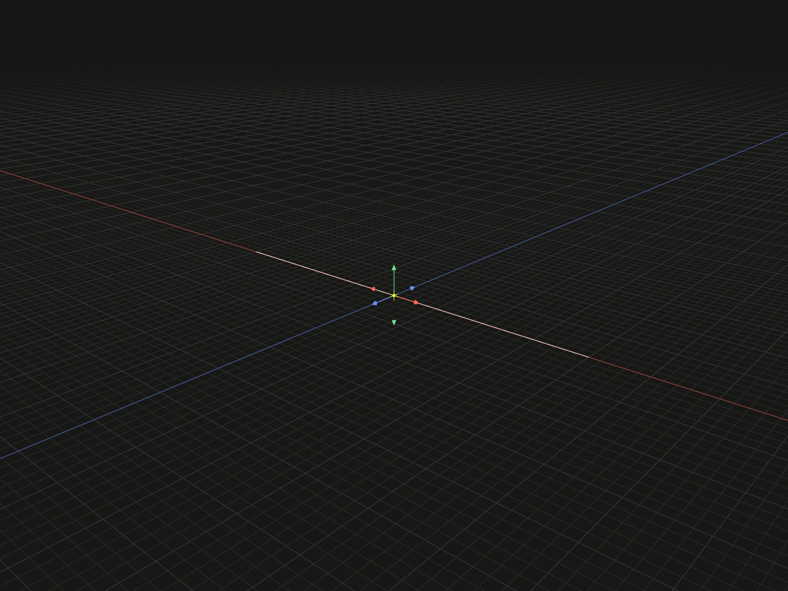

Make an existing point reference the local zero of a model or group.

## Example

```ts
import {line} from '@code3d/core';

const path = line([10, 0, 0], [30, 0, 0]);
export const midpointZero = path.originPoint(path.midpoint);
```



Complete example: [origins and local transforms](../../../app/examples/operations/local-transforms.ts).

## Signature

```ts
model.originPoint(point: PointAnchor): ModelForKind<Elements, Kind>;
```

Import the functions and named types from `@code3d/core`.

## Selecting the point

`point` must be a point reference: a model's `origin` or `center`, a vertex,
a curve's `start`, `midpoint` or `end`, an exposed point, or a point model.
Raw coordinate arrays are not accepted; use [originOffset](origin-offset.md)
for a numeric displacement. A non-point reference throws.

The reference is resolved into the receiver's local coordinates. The example's
midpoint is `[20, 0, 0]`, so the resulting endpoints are `[-10, 0, 0]` and
`[10, 0, 0]`. Curve length remains 20.

A carried `center` is a stable reference transformed with the model; it may differ
from the current axis-aligned bounding-box center after rotation or geometry
editing. Select `model.center` deliberately, or use
[originCenter](origin-center.md) to recompute the bounding-box center.

## Selecting inside groups

Groups support this method without inventing an aggregate vertex numbering
scheme. Use a member's actual instance point, or an exposed point reference.
Nested instances are resolved in the group frame. Repeated use of the same source
can make a bare reference ambiguous; select a specific occurrence. The whole
assembled layout is rebased together.

## Value and reference behavior

The operation returns a new model with the same kind and exposed member types.
The original value and previously selected references keep their meaning.
Topology IDs are preserved. Geometry and named references are transformed
together; `model.origin` and `model.frame.origin` on the result still refer to
its local zero. Origin changes preserve directions, lengths, areas and volumes.

These operations work in the receiver's local coordinates. A relation's
[offset](../api.md#independent-placement-transformations) places a part in a
composition; it is a separate operation. For an already related model, its own
geometry references in stored placement conditions are transformed consistently.
See [local coordinates](../local-coordinates.md) for assembly frame rules.
