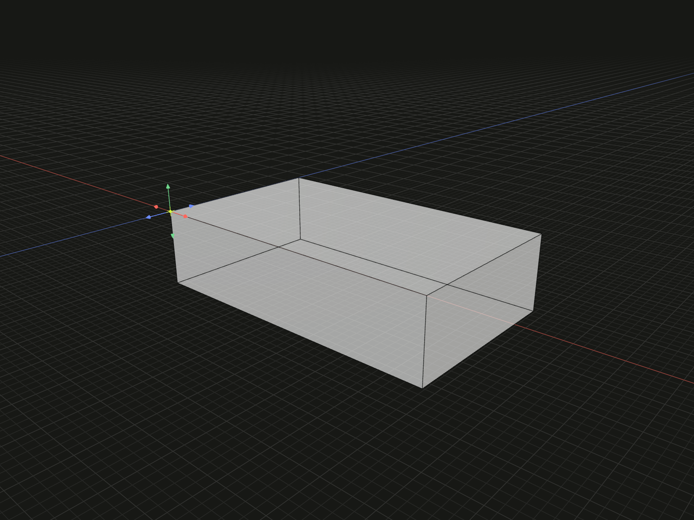

Choose one of a geometric model’s own topology vertices as local zero.

## Example

```ts
import {box} from '@code3d/core';

export const cornerZero = box(24, 6, 14).originVertex(3);
```



Complete example: [origins and local transforms](../../../app/examples/operations/local-transforms.ts).

## Signature

```ts
model.originVertex(id: VertexId): ModelForKind<Elements, Kind>;
```

Import the functions and named types from `@code3d/core`.

## Vertex IDs

`id` selects a vertex from the current input model. Use a positive integer, or a
path containing at least two positive integers for inherited topology. The ID
must exist; malformed, unknown and retired IDs throw. See
[topology IDs](../topology.md#ids-belong-to-a-model).

The chosen vertex becomes `[0, 0, 0]`; all other geometry shifts by the opposite
of that vertex's old position. The operation is equivalent to
`model.originPoint(model.vertex(id))` and preserves the vertex's ID in the result.

This method is available on solid, face, edge and vertex models. Groups do not
have aggregate topology IDs. For a group, use
[originPoint](origin-point.md) with a member's vertex instead.

## Choosing a rotation pivot

After selecting the corner, [model.rotate](model-rotate.md) rotates geometry
around that corner. Setting a new origin is explicit; filleting, chamfering,
cutting or constructing a loft does not automatically recenter the result.

## Value and reference behavior

The operation returns a new model with the same kind and exposed member types.
The original value and previously selected references keep their meaning.
Topology IDs are preserved. Geometry and named references are transformed
together; `model.origin` and `model.frame.origin` on the result still refer to
its local zero. Origin changes preserve directions, lengths, areas and volumes.

These operations work in the receiver's local coordinates. A relation's
[offset](../api.md#independent-placement-transformations) places a part in a
composition; it is a separate operation. For an already related model, its own
geometry references in stored placement conditions are transformed consistently.
See [local coordinates](../local-coordinates.md) for assembly frame rules.
