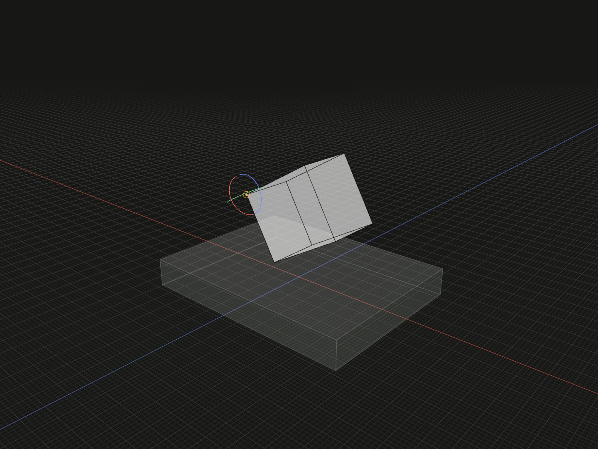

Use a positioned point reference as a placement rotation center.

## Example

```ts
import {box, group, on, pivotPoint} from '@code3d/core';

const pointBase = box(32, 4, 24);
const pointPart = box(12, 10, 8).relate(self => [
  on(pointBase.up),
  pivotPoint(self.vertex(3)).rotate(0, 0, 30),
]);
export const pointPivotAssembly = group([pointBase, pointPart]);
```



Complete example: [groups and placement](../../../app/examples/constraints/placement-api.ts).

## Signature

```ts
function pivotPoint(point: PointAnchor): PivotChain;
chain.pivotOffset(x: number, y: number, z: number): PivotRotation;
chain.rotate(x: number, y: number, z: number): Transformation;
```

Import the functions and named types from `@code3d/core`.

## Point identity

`point` is a point reference: a vertex, origin, center, curve endpoint, exposed
point or point model. A raw tuple is not accepted; use [pivot](pivot.md) for
coordinates. Non-point references are rejected.

The referenced point may belong to self or an external model. External points
use that model's solved placement. `pivotPoint(self.center)` follows the new
part; a reference selected from the original receiver keeps the original owner's
identity. Nested and repeated members require an unambiguous occurrence.

Only the rotation center comes from the point. Rotation axes remain self's
local XYZ axes, not the point owner's axes. The example uses the new part's own
vertex; changing its dimensions moves the pivot with that vertex.

## Complete the rotation

The returned `PivotChain` has two choices: call `.rotate(x, y, z)` directly, or
call `.pivotOffset(dx, dy, dz)` once and then `.rotate(x, y, z)`. The offset returns
`PivotRotation`, which supports the final rotation but no further pivotOffset.
All offset components and angles must be finite. Angles are degrees, applied
around fixed self-local X, then Y, then Z axes with right-hand positive sense.
The App uses zero defaults during editing; TypeScript requires every component.

`pivotOffset` moves the selected center along self's local axes while retaining
the chosen reference. It does not translate the model by itself. The final
`rotate` returns a `Transformation` for [relate](relate.md). The selector applies
to that one rotation; return a completed transformation, not an unfinished chain.
Subsequent transformations are separate array entries. Use [axisLine](axis-line.md)
for rotation about an arbitrary directed line instead of self's XYZ axes.
