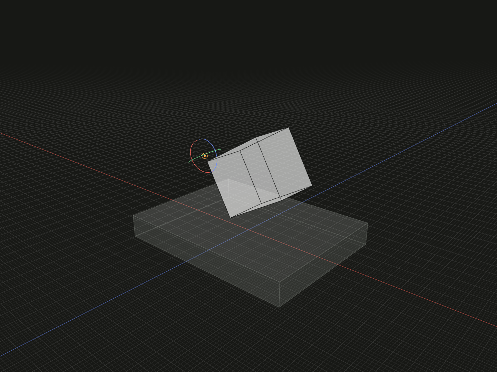

Choose one of self’s vertices as a placement rotation center.

## Example

```ts
import {box, group, on, pivotVertex} from '@code3d/core';

const cornerBase = box(32, 4, 24);
const cornerPart = box(12, 10, 8).relate(() => [
  on(cornerBase.up),
  pivotVertex(3).pivotOffset(0, 1, 0).rotate(0, 0, 30),
]);
export const cornerAssembly = group([cornerBase, cornerPart]);
```



Complete example: [groups and placement](../../../app/examples/constraints/placement-api.ts).

## Signature

```ts
function pivotVertex(id: VertexId): PivotChain;
chain.pivotOffset(x: number, y: number, z: number): PivotRotation;
chain.rotate(x: number, y: number, z: number): Transformation;
```

Import the functions and named types from `@code3d/core`.

## Vertex selection

`id` belongs to the callback's self, not an external model. IDs are positive
integers or inherited paths of at least two positive integers. Malformed or
missing/retired IDs fail; select from the current input topology. The example
keeps vertex 3 as its reference and moves the pivot 1 unit along self's +Y before
rotating.

This requires model topology. Groups and sketches do not provide aggregate
vertex IDs; select a point reference with [pivotPoint](pivot-point.md), or explicit
local coordinates with [pivot](pivot.md). Choosing a pivot changes only this
placement rotation, unlike [originVertex](origin-vertex.md), which rebases local
geometry coordinates.

## Complete the rotation

The returned `PivotChain` has two choices: call `.rotate(x, y, z)` directly, or
call `.pivotOffset(dx, dy, dz)` once and then `.rotate(x, y, z)`. The offset returns
`PivotRotation`, which supports the final rotation but no further pivotOffset.
All offset components and angles must be finite. Angles are degrees, applied
around fixed self-local X, then Y, then Z axes with right-hand positive sense.
The App uses zero defaults during editing; TypeScript requires every component.

`pivotOffset` moves the selected center along self's local axes while retaining
the chosen reference. It does not translate the model by itself. The final
`rotate` returns a `Transformation` for [relate](relate.md). The selector applies
to that one rotation; return a completed transformation, not an unfinished chain.
Subsequent transformations are separate array entries. Use [axisLine](axis-line.md)
for rotation about an arbitrary directed line instead of self's XYZ axes.
