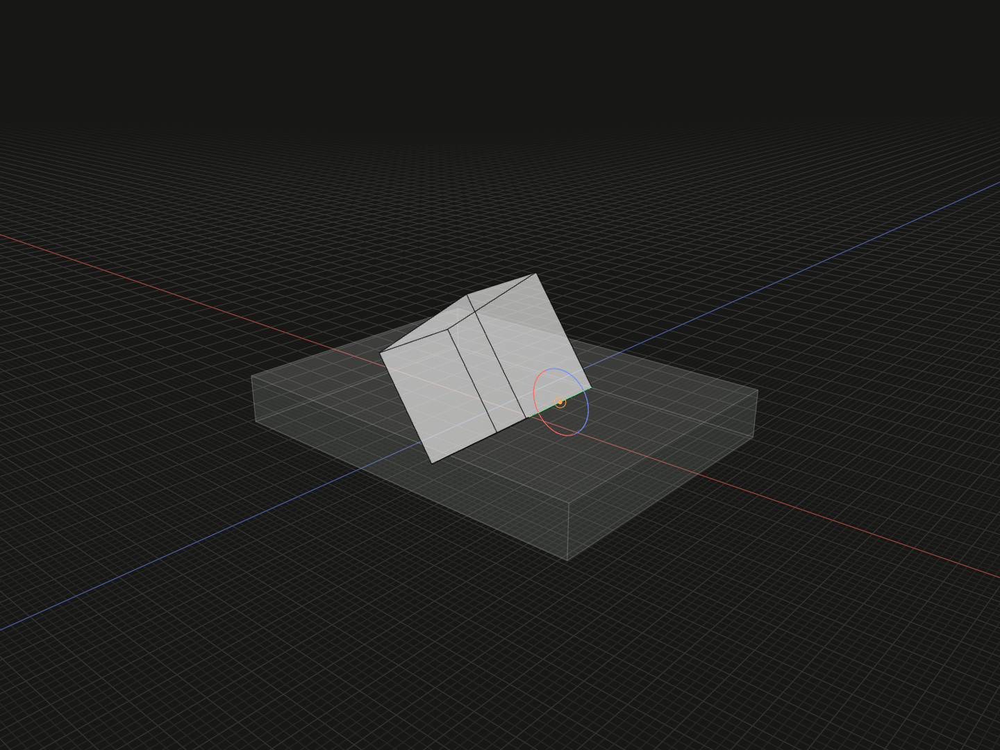

Choose a self-local point as the center of a placement rotation.

## Example

```ts
import {box, group, on, pivot} from '@code3d/core';

const pivotBase = box(32, 4, 24);
const pivotPart = box(12, 10, 8).relate(() => [
  on(pivotBase.up),
  pivot([6, -5, 0]).rotate(0, 0, 35),
]);
export const pivotedAssembly = group([pivotBase, pivotPart]);
```



Complete example: [groups and placement](../../../app/examples/constraints/placement-api.ts).

## Signature

```ts
function pivot(point: Vec3): PivotChain;
chain.pivotOffset(x: number, y: number, z: number): PivotRotation;
chain.rotate(x: number, y: number, z: number): Transformation;
```

Import the functions and named types from `@code3d/core`.

## Point coordinates

`point` is a three-component finite coordinate tuple in self's local frame.
It is a position, not a displacement in composition axes. The example chooses
the center of the part's right-bottom edge and turns about that center after
placing the part on the base. The model's authored origin is unchanged.

TypeScript requires the coordinate tuple. The App can complete a missing point
or tuple component with zero. Use [pivotPoint](pivot-point.md) to retain an
existing point reference, or [pivotVertex](pivot-vertex.md) for a topology ID.

## Complete the rotation

The returned `PivotChain` has two choices: call `.rotate(x, y, z)` directly, or
call `.pivotOffset(dx, dy, dz)` once and then `.rotate(x, y, z)`. The offset returns
`PivotRotation`, which supports the final rotation but no further pivotOffset.
All offset components and angles must be finite. Angles are degrees, applied
around fixed self-local X, then Y, then Z axes with right-hand positive sense.
The App uses zero defaults during editing; TypeScript requires every component.

`pivotOffset` moves the selected center along self's local axes while retaining
the chosen reference. It does not translate the model by itself. The final
`rotate` returns a `Transformation` for [relate](relate.md). The selector applies
to that one rotation; return a completed transformation, not an unfinished chain.
Subsequent transformations are separate array entries. Use [axisLine](axis-line.md)
for rotation about an arbitrary directed line instead of self's XYZ axes.
