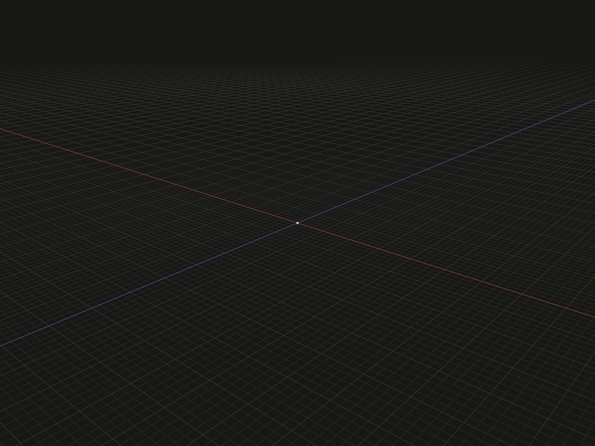

Create a vertex model at a chosen local position. Use it as visible point geometry or as a positional reference when placing other models.

## Example

```ts
import {point} from '@code3d/core';

export const vertex = point([0, 0, 0]);
```



The small white vertex is at the intersection of the coordinate axes.
Select `vertex` in the App to inspect it.

Complete example: [basic shapes](../../../app/examples/primitives/primitives.ts).

## Signature

```ts
function point(position?: Vec3): VertexModel;
```

Import the function and any named types above from `@code3d/core`.
The same call works in the App and Node; Node initializes the kernel automatically.

## Parameters

`position` is an optional `readonly [x, y, z]` tuple. Each component must be a
finite number in the model's common length units; negative values and zero are
valid. Omitting the tuple uses `[0, 0, 0]`. Pass an array, not three scalar arguments.

## Result and coordinates

The result is a `VertexModel` with one geometric vertex, no edges and no faces.
`point([2, 3, 4])` puts that vertex at `[2, 3, 4]` in the returned model's local
coordinates. It does not move the model's coordinate origin: `.origin` and
`.frame.origin` still refer to local zero.

The geometric `.center` and `.vertex(1)` refer to the supplied position.
These are references, not readable coordinate arrays. Use `.bounds()` to read
the finite geometry's minimum, maximum and size; for this point, minimum and
maximum are both `[2, 3, 4]`, and size is `[0, 0, 0]`.
`.position(otherModel)` instead reports the model origin in another model's frame.

`point([x, y, z])` has the same geometric meaning as
`point().originOffset(-x, -y, -z)`. A rotation acts about the current model origin,
so rotating a point away from zero can change its local position.
See [local coordinates and origin changes](../local-coordinates.md).

The point supports vertex selection, transforms, materials and relations.
It has no public `.length`, `.area` or `.volume`. See [model values](../values.md)
for the capabilities shared by different model kinds.

## Validation and editing

`NaN`, infinities and nonnumeric components are rejected with
`point must be a finite number.` Supply all three components when passing a tuple;
only omission of the entire tuple defaults to local zero. TypeScript enforces
its three-component shape.

Select a coordinate in the App and press Tab to edit it. An omitted tuple is a
valid call, and the editor can insert its coordinates. Changes and transforms
produce new model values without changing an existing point.

## Related APIs

- [line](line.md) connects two local coordinates with a straight edge.
- [Sketch point references](../sketches.md) belong to a constraint-driven sketch.
- [Topology and references](../topology.md) explains vertex selection.
