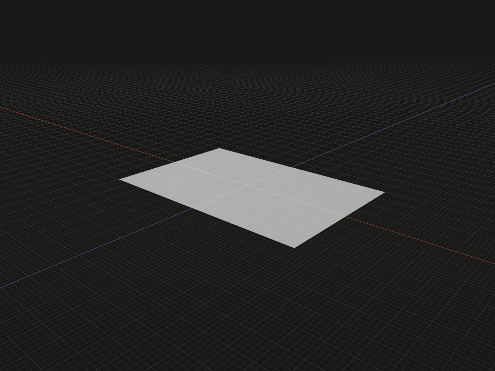

Create a filled rectangular profile for a plate, extrusion or loft section. Supply its full X and Z dimensions; the face starts centered at local zero.

## Example

```ts
import {rectangle} from '@code3d/core';

export const rectangularFace = rectangle(12, 8);
```



Select `rectangularFace` in the App to inspect the geometry.

Complete example: [basic shapes](../../../app/examples/primitives/primitives.ts).

## Signature

```ts
function rectangle(x: number, z: number): FaceModel;
```

Import the function and any named types above from `@code3d/core`.
The same call works in the App and Node; Node initializes the kernel automatically.

## Parameters

| Parameter | Meaning                  | Accepted values              |
| --------- | ------------------------ | ---------------------------- |
| `x`       | Full width along local X | Finite and greater than zero |
| `z`       | Full depth along local Z | Finite and greater than zero |

Both arguments are required in TypeScript. They use the model's common length
units and represent full dimensions, not half-extents.

## Result and coordinates

The result is a `FaceModel<PlanarElements>` with one filled planar face, four
straight boundary edges and four vertices. It lies at `y = 0` in the XZ plane
with a +Y normal. Its origin and `.center` begin at `[0, 0, 0]`; `.plane`
references the supporting plane.

The bounds run from `[-x / 2, 0, -z / 2]` to `[x / 2, 0, z / 2]`.
For the example, that is `[-6, 0, -4]` to `[6, 0, 4]`.
Its `.area` is `x * z`, or 96 in the example. The face has no solid `.volume`.

`.extrude(3)` gives the example a thickness of 3, extending from Y = 0 to Y = 3.
A negative extrusion extends toward -Y. The result is not centered on the
starting plane; [`box`](box.md) provides a centered solid constructor.
See [profile operations](../api.md#profiles-and-curves).

To place one corner at local zero, apply `.originOffset(-x / 2, 0, -z / 2)`.
This re-expresses the existing geometry relative to that corner. Rotations act
about the current origin. See [local coordinates](../local-coordinates.md).

The face supports topology selection, materials, relations, transforms and other
face operations; see [model values](../values.md).

## Validation and editing defaults

Zero, negative, nonfinite and nonnumeric dimensions are rejected with
`x must be a positive finite number.` or the corresponding message for `z`.
The kernel's tolerance also limits extremely small geometry.

During incomplete-call editing, omitted or `undefined` dimensions use
`x = 10` and `z = 10`. Both remain required in TypeScript.
Select a dimension and press Tab to edit it in the App.

## Related APIs

- [box](box.md) constructs a rectangular solid with three full dimensions.
- [regularPolygon](regular-polygon.md) creates an equal-sided polygonal face.
- [Sketches](../sketches.md) build constrained profiles with custom outlines.
