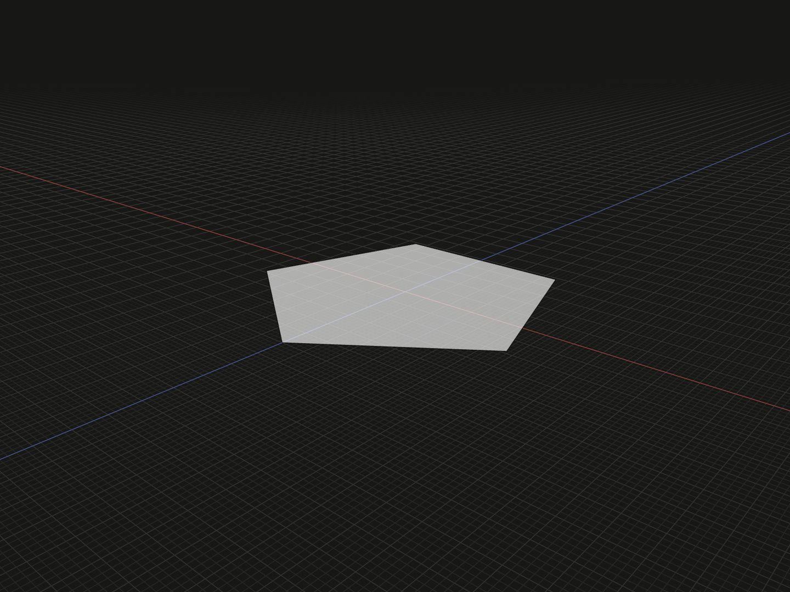

Create a filled regular polygonal face with a chosen number of equal sides. Use it as a cross-section for polygonal parts, lofts or extrusions.

## Example

```ts
import {regularPolygon} from '@code3d/core';

export const pentagonalFace = regularPolygon(6, 5);
```



Select `pentagonalFace` in the App to inspect the geometry.

Complete example: [basic shapes](../../../app/examples/primitives/primitives.ts).

## Signature

```ts
function regularPolygon(
  radius: number,
  sides: number,
  rotation?: number,
): FaceModel;
```

Import the function and any named types above from `@code3d/core`.
The same call works in the App and Node; Node initializes the kernel automatically.

## Parameters

| Parameter  | Meaning                                       | Accepted values              |
| ---------- | --------------------------------------------- | ---------------------------- |
| `radius`   | Circumradius, from polygon center to a vertex | Positive finite number       |
| `sides`    | Number of equal sides                         | Integer at least 3           |
| `rotation` | Rotation about local +Y, in degrees           | Finite number; defaults to 0 |

Radius uses the model's common length units. It is not the inradius or the full
width across flats. Only `rotation` is optional in TypeScript; signed angles
and angles beyond one turn are accepted.

## Result and coordinates

The result is a `FaceModel<PlanarElements>` in the XZ plane at `y = 0`, facing
+Y. It has `sides` straight boundary edges and vertices. The model origin is the
polygon center. At zero rotation, one vertex is `[0, 0, radius]`; positive rotation
about +Y turns that vertex toward +X.

`.plane` references the supporting plane. `.center` is the bounding-box center,
which can differ from the polygon center for odd side counts. For the example,
the bounds are approximately `[-5.706339, 0, -4.854102]` to
`[5.706339, 0, 6]`, so `.center` has Z approximately `0.572949` while the origin
remains zero. A rotation changes the axis-aligned bounding box.

`.originCenter()` chooses the current bounding-box center as the new origin;
it does not mean "put the circumcenter at zero". See
[local coordinates](../local-coordinates.md).

## Measurements and extrusion

For `n = sides` and `r = radius`:

| Quantity    | Formula                                      |
| ----------- | -------------------------------------------- |
| Side length | `2 * r * Math.sin(Math.PI / n)`              |
| Inradius    | `r * Math.cos(Math.PI / n)`                  |
| Area        | `n * r ** 2 * Math.sin(2 * Math.PI / n) / 2` |

For even side counts, the distance across opposite parallel sides is twice the
inradius. Odd polygons have no opposite parallel side pairs; do not use that
formula as their axis-aligned width.

The example's `.area` is approximately `85.595086`. The face has no `.volume`.
`.extrude(distance)` builds a solid from the starting plane along its normal;
[`regularPrism`](regular-prism.md) directly constructs a prism whose height is
centered around zero. See [profile operations](../api.md#profiles-and-curves).

## Validation and editing defaults

A nonpositive or nonfinite radius is rejected. Noninteger side counts or values
below 3 report `sides must be an integer greater than or equal to 3.` Nonfinite
angles report `rotation must be a finite number.` Extremely small features can
also encounter the modeling kernel's tolerance.

Incomplete calls use `radius = 5`, `sides = 6` and `rotation = 0` for omitted or
`undefined` arguments. This does not remove the two required TypeScript arguments.
Select an argument and press Tab to edit it in the App.

## Related APIs

- [regularPrism](regular-prism.md) creates a centered polygonal solid.
- [circle](circle.md) creates a smooth circular profile.
- [rectangle](rectangle.md) uses full X and Z dimensions.
- [Model values](../values.md) covers shared face capabilities.
