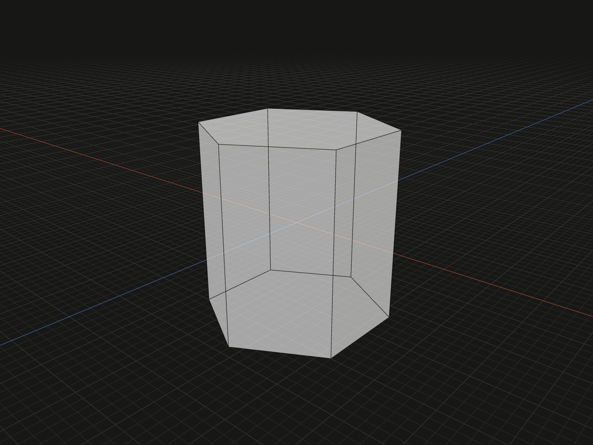

Create a straight solid with a regular polygonal section. Use it for triangular or hexagonal stock, a faceted post, or a polygonal cutting tool.

## Example

```ts
import {regularPrism} from '@code3d/core';

export const hexagonalPrism = regularPrism(6, 12, 6);
```



Select `hexagonalPrism` in the App to inspect this solid. Select a numeric argument
and press Tab to edit it.

Complete example: [basic shapes](../../../app/examples/primitives/primitives.ts).

## Signature

```ts
function regularPrism(
  radius: number,
  y: number,
  sides: number,
  rotation?: number,
): SolidModel;
```

Import `regularPrism` and, when needed, `type SolidModel` from `@code3d/core`.
The same call works in the App and Node; Node initializes the kernel automatically.

## Parameters

| Parameter  | Meaning                                     | Accepted values                            |
| ---------- | ------------------------------------------- | ------------------------------------------ |
| `radius`   | Circumradius: section center to a corner    | Finite and greater than zero               |
| `y`        | Full height along local Y                   | Finite and greater than zero               |
| `sides`    | Number of equal polygon edges               | Integer greater than or equal to 3         |
| `rotation` | Section rotation about local +Y, in degrees | Any finite number; optional, defaults to 0 |

The first three parameters are required in TypeScript; `rotation` is optional. Lengths use the model's common units;
see [export scale](../../../web/src/content/docs/docs/guides/exporting.md#scale-and-orientation).

## Result and coordinates

Returns a `SolidModel<CanonicalElements>` with `sides` rectangular side
faces and two polygonal end faces. The origin is midway along the polygon's
central Y axis; the ends are at `-y / 2` and `y / 2`.

The radius reaches the corners, not the flats. The section's inradius is
`radius * Math.cos(Math.PI / sides)`. For an even-sided polygon, the distance
between opposite flats is twice that value. To specify a desired across-flats
size `a`, pass `a / (2 * Math.cos(Math.PI / sides))` as the radius.

For the unrotated hexagonal example, the full X, Y and Z sizes are
approximately `10.392305`, `12` and `12`. Its across-flats size is
`6 * Math.sqrt(3)`, approximately `10.392305`.

`rotation` changes the section orientation and its X/Z bounding box. Positive
angles follow the right-hand rule about +Y. Negative angles and angles beyond
one full turn are accepted. The initial `.axis` remains the central +Y line.
The `.center` reference is the bounding-box center; for an odd number of
sides it can differ from the origin on that line.

The solid provides frame, origin, center, axis and directional bound references.
It supports Boolean operations, fillets, chamfers, shelling, materials and relations.
Derived operations return new model values; see [model values](../values.md)
and [local coordinates](../local-coordinates.md).

## Measurements

Section area is
`(sides / 2) * radius ** 2 * Math.sin(2 * Math.PI / sides)`.
Multiply by `y` for volume. The example's `.volume` is
`648 * Math.sqrt(3)`, approximately `1122.368923`.
Rotation changes the bounds but preserves this volume.

## Validation and editing defaults

`radius` and `y` must be positive finite numbers. Invalid sizes report the
parameter name followed by `must be a positive finite number.`.
`sides = 2`, fractional counts and non-finite counts throw
`sides must be an integer greater than or equal to 3.`.
A non-finite rotation throws `rotation must be a finite number.`.
Numeric strings and `null` do not substitute for valid dimensions, counts or angles.

While an incomplete call is being edited, omitted or `undefined` arguments use
`radius = 5`, `y = 10`, `sides = 6` and `rotation = 0`. These runtime defaults let the editor
complete a call; they do not remove the required TypeScript arguments.
The resulting dimensions must still satisfy all constraints.
Very small dimensions or clearances can also encounter the modeling kernel's tolerance.

## Related APIs

- [regularPolygon](regular-polygon.md) creates the corresponding flat face.
- [cylinder](cylinder.md) has a smooth circular section.
- [Standard fasteners](../../../screws/docs/assembly.mdx) provide nominal screw and nut geometry beyond a plain polygonal blank.
- [Solid primitives](../api.md#solid-primitives) compares the available starting shapes.
