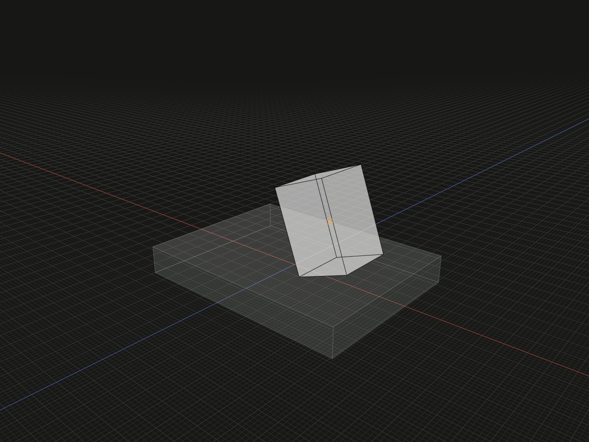

Describe placement of a new model value using constraints and ordered transformations.

## Example

```ts
import {box, group, offset, on, rotate} from '@code3d/core';

const relationBase = box(32, 4, 24);
const relationPart = box(8, 12, 8).relate(self => [
  on(self, relationBase.up),
  offset(6, 0, 0),
  rotate(0, 0, 20),
]);
export const relatedAssembly = group([relationBase, relationPart]);
```



Complete example: [groups and placement](../../../app/examples/constraints/placement-api.ts).

## Signature

```ts
model.relate(
  build: (self: ModelForKind<Elements, Kind>) => Relation | readonly Relation[],
): ModelForKind<Elements, Kind>;

type Relation = Constraint | Transformation;
```

Import the functions and named types from `@code3d/core`.

## The callback's self

`build` receives the new value that this method returns. Every constraint must
involve that value, directly or through one of its references. Select new-value
geometry through `self`, for example `self.surface(id)` or `self.frame`.

External variables keep their original identity, including the variable on which
`relate` was called. Referring to that original value does not implicitly mean
self. This allows one copy to be placed against another without changing either
source. Helpers called within a callback share its current self; a nested
callback temporarily uses its own self.

Return one complete `Constraint` or `Transformation`, or a readonly array of
them. An empty array adds no placement steps. Unfinished pivot or axis selectors
are rejected; complete each with `.rotate(...)`. Constraints unrelated to self
also throw. The result retains its model kind and exposed member types.

## Execution order

Consecutive constraints form a joint solve. Each following transformation acts
on that solution in array order and may move the part away from its former
contacts. A later constraint begins a new joint segment from the transformed
pose; earlier segment conditions are not kept as permanent constraints on it.

For example, `[align(...), on(...), offset(...), rotate(...)]` solves the two
conditions together, then translates and rotates. `[align(...), offset(...),
on(...)]` solves, translates, and starts another solve. Consecutive `relate`
calls continue that sequence. A zero offset or angle adds no positional or
orientation condition.

Remaining freedom starts from the solver's default pose in the first segment;
later segments retain unconstrained components of the incoming pose. Express the
intended contact or alignment before adding relative adjustments. Avoid using
an unconstrained default pose as an implicit layout rule.

## Placement and inspection

The method stores placement conditions; it does not change standalone local
geometry. [group](group.md), booleans, loft and explicit relative queries solve
placement at their evaluation boundaries. Inspect the composition or relation
to see the placed result. The example first contacts the base, then shifts and
rotates the part about its own origin.

Groups participate as rigid assembled parts. A Sketch also has a `relate` method
for its plane; see the [sketch guide](../sketches.md). Incompatible geometry,
conflicting conditions and numerical nonconvergence produce diagnostics rather
than an arbitrary successful placement.

See [on](on.md), [align](align.md), [offset](offset.md), [rotate](rotate.md),
[pivot](pivot.md), [axisLine](axis-line.md) and [coupleRotation](couple-rotation.md).
