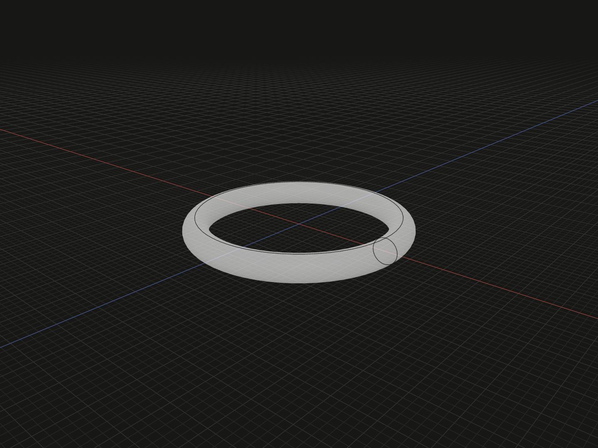

Rotate a planar profile about a straight directed axis. Optional axial advance produces screw motion over one or several turns.

## Example

```ts
import {circle, line, revolve} from '@code3d/core';

const axis = line([0, -20, 0], [0, 20, 0]);
const ringSection = circle(1).rotate(90, 0, 0).originOffset(-8, 0, 0);
export const ring = revolve(ringSection, axis, {angle: 360});
```



Complete example: [shape construction](../../../app/examples/operations/shape-construction.ts).

## Signature

```ts
function revolve(
  profile: FaceModel<{}>,
  axis: LineAnchor,
  config: RevolveConfig,
): SolidModel;
type RevolveConfig = Readonly<{angle: number; advance?: number}>;
// Equivalent method:
profile.revolve(axis, config);
```

Import the functions and named types from `@code3d/core`.

## Parameters

| Parameter        | Meaning                                                                            |
| ---------------- | ---------------------------------------------------------------------------------- |
| `profile`        | One planar filled face                                                             |
| `axis`           | A straight directed line or axis reference; a [line](line.md) model works directly |
| `config.angle`   | Required finite, non-zero signed angle, in degrees                                 |
| `config.advance` | Signed **total** distance along the axis over the entire angle; defaults to 0      |

Positive rotation follows the right-hand rule about the directed axis. A positive
advance follows that same axis; reversing it reverses both senses. Advance is not
pitch per turn: `{angle: 1800, advance: 25}` describes five turns with pitch 5.
See the [helical revolution example](../../../app/examples/operations/revolve.ts).

The ring example sweeps a radius-1 disk whose center is 8 units from the Y axis.
It produces a torus with volume `16 * Math.PI ** 2`, approximately `157.913670`.

## Placement and limits

The result retains the profile's local frame and placement. The axis and profile
are solved together, so the axis model's own relations are respected. An axis is
an infinite directed reference for this operation; the finite line's endpoints
do not clip the rotation.

Without advance, `Math.abs(angle)` must not exceed 360. With non-zero advance,
multiple turns are allowed. A helical profile must have one outer boundary and
no holes. Crossing the axis, intersecting turns or other degenerate inputs may
fail to form a valid solid. Leave clearance between turns; [coil](coil.md) is a
shorter constructor with dedicated clearance checks for circular-wire coils.

Curved profiles and curved axes are rejected. Angle must be finite and non-zero;
advance must be finite. The TypeScript configuration and its angle are required.
During incomplete-call editing, the runtime uses angle 360 and advance 0.
The App can inspect either participant and edit those numeric configuration fields.

## Coordinates and model values

The operation creates new geometry without modifying its inputs. References and
measurements belong to the returned model's local frame; relations participate
where the operation combines inputs. See [local coordinates](../local-coordinates.md)
and [model values](../values.md). A solid supports `.area`, `.volume`, topology
selection, Booleans and finishing operations.

## Related APIs

- [extrude](extrude.md) extends a profile without rotation.
- [sweep](sweep.md) carries it along an authored curve.
