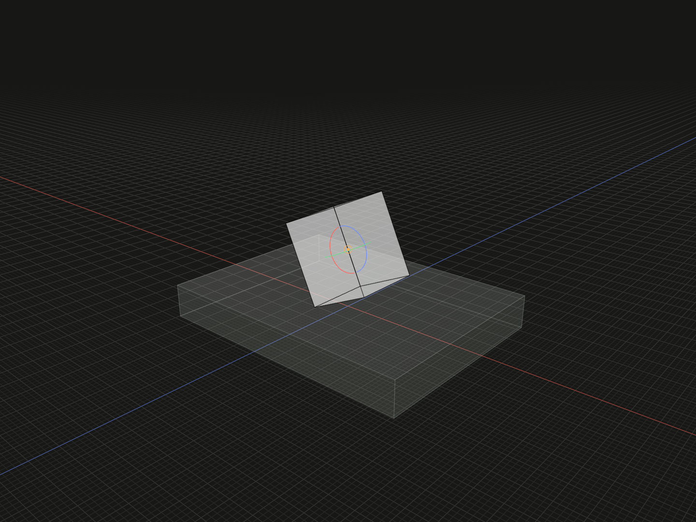

Rotate a placed model about its current origin and local XYZ axes.

## Example

```ts
import {box, group, on, rotate} from '@code3d/core';

const turnBase = box(32, 4, 24);
const turnPart = box(8, 10, 8).relate(() => [
  on(turnBase.up),
  rotate(0, 0, 25),
]);
export const turnedAssembly = group([turnBase, turnPart]);
```



Complete example: [groups and placement](../../../app/examples/constraints/placement-api.ts).

## Signature

```ts
function rotate(x: number, y: number, z: number): Transformation;
```

Import the functions and named types from `@code3d/core`.

## Angles and center

`x`, `y` and `z` are finite signed angles in degrees. They act about self's
current local origin, in fixed local X, then Y, then Z order. Positive angles
follow the right-hand rule. Negative and multi-turn values are valid.

This operates on the preceding solved placement. In the example the part first
touches the base, then turns 25° about its own origin and local Z direction.
Rotation can move it away from the previous contact. The axes are self's local
axes at this step, not the fixed composition axes used by [offset](offset.md).

Use [pivot](pivot.md), [pivotVertex](pivot-vertex.md) or
[pivotPoint](pivot-point.md) to change the center while keeping self's XYZ axes.
Use [axisEdge](axis-edge.md) or [axisLine](axis-line.md) for one directed axis.
[model.rotate](model-rotate.md) is the separate local geometry method.

## Cumulative angles

Placement rotation retains authored full turns for [coupleRotation](couple-rotation.md).
A 360° rotation can therefore matter to an angular ratio even though it has the
same final rigid orientation as 0°. This comes from the expression sequence,
not from previous animation frames.

## Placement value and sequence

The constructor returns a complete `Transformation` for [relate](relate.md).
It describes placement and does not change standalone model geometry. Place it
after an intended contact or alignment. Array entries execute in order; a later
constraint starts another solve segment. A zero value leaves the preceding pose
unchanged and does not add a condition.

A completed transformation has no chained offset, rotate or pivot methods.
Write separate entries such as `[on(...), offset(...), rotate(...)]`. Groups
transform as complete rigid assemblies. Angles and displacements are finite;
TypeScript requires the numeric arguments, while the App editing defaults are
zero for missing components.
