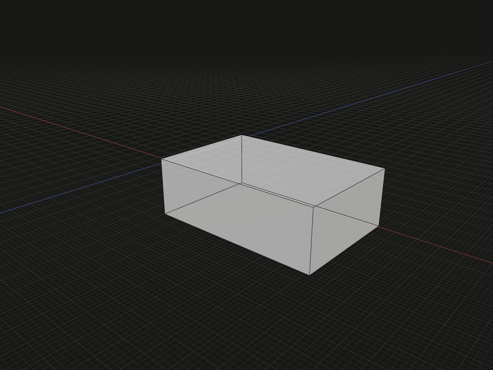

Uniformly scale a geometric model around its current local zero.

## Example

```ts
import {box} from '@code3d/core';

export const enlarged = box(12, 4, 8).originOffset(-10, 0, 0).scaled(2);
```



Complete example: [origins and local transforms](../../../app/examples/operations/local-transforms.ts).

## Signature

```ts
model.scaled(factor: number): ModelForKind<Elements, Kind>;
```

Import the functions and named types from `@code3d/core`.

## Scale factor

`factor` is a positive finite number. Values above 1 enlarge, values between 0
and 1 shrink, and 1 preserves size. Zero, negative values, NaN and infinity
throw. Negative factors are not a mirroring API. TypeScript requires the factor;
the App editing default is 1.

Scaling is uniform on all axes and acts around local zero. Every local point
coordinate is multiplied by the factor. The example's box center moves from
`[10, 0, 0]` to `[20, 0, 0]` and its size becomes `[24, 8, 16]`. Choosing a
different origin before scaling changes the point that remains fixed.

## Measurements and references

Lengths scale by `factor`, areas by `factor ** 2`, and volumes by
`factor ** 3`. The example volume is 3072. Geometric reference positions and
exposed members follow the same scale. The model origin remains zero and the
local frame axes keep their directions.

The result is a new value with the same geometric kind and exposed interface;
the input is unchanged. Topology IDs are preserved. Solid, face, edge and vertex
models support scaling; groups do not. Scale their geometric parts explicitly
before composing if that is the intended modeling operation.

## Placement and operation order

Own geometry references used by existing placement conditions are scaled
consistently; explicit relation offsets are placement values, not dimensions
of the geometry. Arrange a part with `relate` after establishing its dimensions
when that makes the design clearer.

Scaling and rebasing generally do not commute: a preceding origin offset is
part of the coordinates being scaled. For a size change about the current
bounding-box center, call [originCenter](origin-center.md) first. Use
[model.rotate](model-rotate.md) for rigid rotation.
