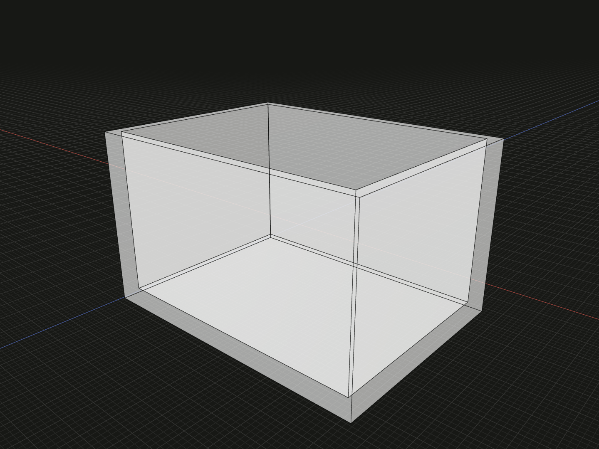

Hollow one connected solid with uniform walls. Choose input surfaces as openings, or create a fully enclosed cavity.

## Example

```ts
import {box} from '@code3d/core';

export const enclosure = box(40, 24, 30).shell(1.5, [4]);
```



Complete example: [solid operations](../../../app/examples/operations/solid-operations.ts).

## Signature

```ts
model.shell(
  thickness: number,
  removedSurfaceIds?: readonly SurfaceId[],
): SolidModel<Elements>;
```

Import the functions and named types from `@code3d/core`.

## Parameters and result

| Parameter           | Meaning                                                   |
| ------------------- | --------------------------------------------------------- |
| `thickness`         | Finite nonzero signed wall thickness in model units       |
| `removedSurfaceIds` | Optional array of input surface IDs to remove as openings |

Positive thickness offsets the walls inward, preserving the outside dimensions.
Negative thickness offsets outward, retaining the input boundary on the inside;
separating offset faces use rounded joins. Omit the second argument or pass `[]`
for a fully enclosed cavity. The App editing default is 1, but TypeScript requires
an explicit thickness.

S4 is the unmodified box's +Y face, so the example is open at the top. Its outside
bounds remain `[-20, -12, -15]` to `[20, 12, 15]`. The bottom and side walls are
1.5 units thick. The method returns a new solid without modifying the box.

## Choosing openings

Use IDs from the input solid. IDs are positive integers or paths of at least two
positive integers. `[4, 6]` lists two surfaces; `[[1, 4]]` lists one inherited
surface. Duplicates are resolved once in input order. Unknown or retired IDs throw,
and removing every face is invalid: at least one face must remain a wall.

The result retains the input local frame, placement, material and exposed
interface. One-to-one inherited topology keeps its complete ID. New offset walls
receive new IDs; pick later fillet or chamfer selections from the shell result.
Exposed topology references remain useful only while their selected topology
survives. See [topology IDs](../topology.md#ids-belong-to-a-model).

## Limits and alternatives

A shell requires exactly one connected solid. A disconnected [union](union.md)
cannot be hollowed as one body. Narrow features, tight curvature, excessive
thickness or interacting offsets can prevent a valid cavity. Failed construction
throws; errors include the thickness and selected openings.

Some mixed-profile lofts can enclose a cavity but fail when an end is opened,
even at smaller thicknesses. Reducing thickness alone does not always resolve
unsupported geometry. Change the openings or simplify the source solid. The
kernel checks for a valid solid with a cavity and, for open shells, generated
wall faces.

Use [thicken](thicken.md) to build a solid from a face rather than hollowing an
existing solid. For the App's opening selection controls, see
[making hollow parts](../shells.mdx).
