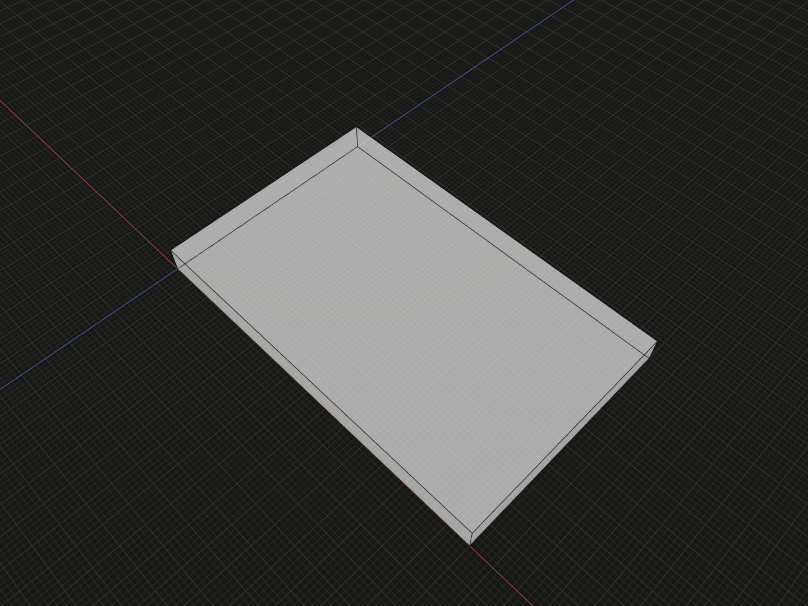

Constrain sketch points and curves while preserving explicit geometric freedom.

## Example

```ts
import {sketch} from '@code3d/core';

export const constrainedProfile = sketch(
  [
    ['point', 1, [0, 0]],
    ['point', 2, [40, 0]],
    ['point', 3, [40, 25]],
    ['point', 4, [0, 25]],
    ['line', 5, [1, 2]],
    ['line', 6, [2, 3]],
    ['line', 7, [3, 4]],
    ['line', 8, [4, 1]],
  ],
  {
    constraints: [
      ['fixed', 1],
      ['horizontal', 5],
      ['horizontal', 7],
      ['vertical', 6],
      ['vertical', 8],
      ['length', 5, 40],
    ],
  },
);
export const constrainedPart = constrainedProfile.face().extrude(3);
```



Complete example: [sketch API example](../../../app/examples/sketches/sketch-api.ts).

## Signature

```ts
type SketchOptions = Readonly<{constraints?: readonly SketchConstraint[]}>;
// P defaults to number | SketchPoint; tuples below are readonly.
type SketchConstraint<P = number | SketchPoint> =
  | readonly ['fixed', P]
  | readonly ['horizontal' | 'vertical', number]
  | readonly ['parallel' | 'perpendicular', readonly [number, number]]
  | readonly ['angle', readonly [number, number], number]
  | readonly ['coincident', readonly [P, P]]
  | readonly ['midpoint', readonly [P, P, P]]
  | readonly ['length' | 'angle' | 'radius' | 'sweep', number, number]
  | readonly ['x' | 'y', P, number];
```

Import the functions and named types from `@code3d/core`.

## Constraint tuples

Pass constraints in the second argument of [sketch](sketch.md) or
[derive](sketch-derive.md). They have no persistent IDs; an array index identifies
a condition only in the current definition. Numbers referring to points or
curves are local IDs. Point targets may also be upstream `SketchPoint` values;
curve targets must be local curves of the required kind. Construction curves
participate in the same constraint solve; the auxiliary type prefix only excludes
them from face boundaries.

| Tuple                                | Condition and allowed targets                                |
| ------------------------------------ | ------------------------------------------------------------ |
| `['fixed', point]`                   | Keep both current coordinates of one point                   |
| `['x', point, value]`                | Set the point's sketch X coordinate to a finite value        |
| `['y', point, value]`                | Set sketch Y, which maps toward model -Z                     |
| `['coincident', [a, b]]`             | Make two point positions equal without merging authored IDs  |
| `['midpoint', [middle, start, end]]` | Place middle at the arithmetic midpoint of start/end         |
| `['horizontal', line]`               | Equal endpoint Y coordinates for a local line                |
| `['vertical', line]`                 | Equal endpoint X coordinates for a local line                |
| `['length', line, value]`            | Positive finite local line length in model units             |
| `['angle', line, degrees]`           | Directed local line orientation relative to +X               |
| `['parallel', [a, b]]`               | Parallel directions for two distinct local lines             |
| `['perpendicular', [a, b]]`          | Perpendicular directions for two distinct local lines        |
| `['angle', [a, b], degrees]`         | Signed rotation from first authored line direction to second |
| `['radius', curve, value]`           | Positive finite radius of a local circle or arc              |
| `['sweep', arc, degrees]`            | Local arc sweep magnitude, strictly between 0 and 360        |

Midpoint does not require a line entity between its endpoint references. Parallel
and perpendicular constrain directions even when the finite segments do not
intersect. `length` here is a line constraint, distinct from a B-Rep edge's
[readonly length measurement](length.md).

## Angles and orientation

Angular values use degrees and must be finite. Line orientation measures from
+X toward +Y counterclockwise in sketch coordinates. Two-line angle uses authored
start-to-end directions; reversing one tuple's endpoints changes that datum.
Angles are equivalent modulo 360. Parallelism allows either direction sense;
use the signed angle form when that distinction matters.

Arc `sweep` is positive magnitude. The arc entity's `cw` or `ccw` chooses its
sense. It cannot represent a full circle; use a circle entity instead. Arc
endpoint-on-circle equations are maintained automatically, without extra authored
constraints or separate persistent angle parameters.

## Freedom, aliases and upstream points

The example fixes the lower-left point and width while leaving the rectangle's
height free. Underconstrained sketches are valid. Initial coordinates help select
a solution; they do not imply fixed positions. `fixed` captures the current point
position when constructing that definition.

Aliases already share coordinates and need no coincidence condition. Upstream
geometry in a derived layer is read-only. Constraints may refer to it but cannot
move it; a condition contradicting a locked coordinate or radius fails. Adding
redundant conditions does not add useful design information; tool snapshots
report redundant constraint indices and remaining degrees of freedom.

## Failures and editor gestures

Missing targets, wrong curve kinds, repeated line IDs in a two-line condition,
nonfinite values and invalid positive dimensions throw. Inconsistent or
numerically unsolved systems throw `SketchConstraintError` from the tooling
entry when the solver can identify the failure. Its constraint indices are
zero-based and evaluation-local; do not store them as entity IDs. Some malformed
inputs throw ordinary validation errors before solving.

Dragging uses temporary preferences in addition to these hard conditions; it
does not silently add `fixed` or `radius` tuples. Read-only upstream geometry and
hard constraints take precedence over the pointer. See the [editor workflow](../sketches.md)
for selection, dimension tools and drag behavior.

GUI constraint edits also preserve existing point-on-curve connections, including
construction geometry, by synchronizing the solved editable coordinates in the
same undo step. Ordinary source evaluation applies only the authored constraints;
coordinates that happen to lie on a circle do not define a persistent relation.
